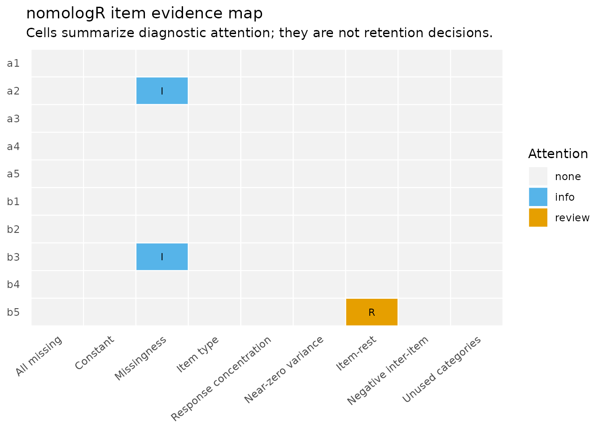
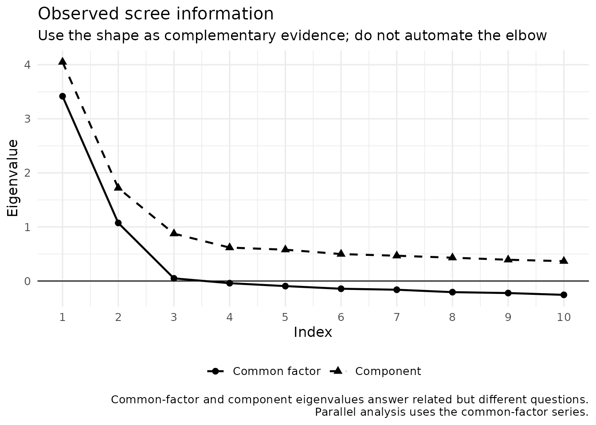

# From item audit to exploratory structure

## Why this workflow is staged

Exploratory factor analysis is not a scale-purification button. Before
interpreting an exploratory factor solution, researchers should know
what items are being analyzed, how they are coded, whether the
correlation model matches the intended measurement level, and how many
dimensions are substantively plausible.

`nomologR` therefore separates three questions:

1.  [`nomo_screen()`](https://juhalt.github.io/nomologR/reference/nomo_screen.md)
    — **What does the item and response data look like?**
2.  [`nomo_factors()`](https://juhalt.github.io/nomologR/reference/nomo_factors.md)
    — **How many latent dimensions deserve investigation?**
3.  [`nomo_efa()`](https://juhalt.github.io/nomologR/reference/nomo_efa.md)
    — **What does a requested exploratory structure look like?**

The handoff is deliberate: no stage silently deletes items, changes the
requested factor count, or treats a numerical reference value as proof.

## A teaching dataset with a known answer

`nomo_demo_continuous` was simulated from a documented population model,
so the package’s evidence can be checked against the truth:

- two factors, A and B, correlated .40;
- items `a1`–`a4` and `b1`–`b4` are ordinary indicators (population
  loadings .70 to .80);
- `a5` **cross-loads** on both factors (.45 on A and .35 on B);
- `b5` is a **weak** indicator (.30 on B);
- `a2` and `b3` contain a small amount of missing data.

``` r

str(nomo_demo_continuous)
#> 'data.frame':    500 obs. of  10 variables:
#>  $ a1: num  2.23 3.47 4.8 2.87 5.22 4.02 3.23 3.12 3.62 4.66 ...
#>  $ a2: num  1.46 3.06 4.16 2.46 3.71 6.06 4.16 3.45 NA 5.27 ...
#>  $ a3: num  2.25 4.71 4.08 3.45 5.94 4.3 3.39 3.41 3.21 5.31 ...
#>  $ a4: num  2.59 3.39 4.59 3.85 4.01 3.65 4.09 3.81 4.77 5.16 ...
#>  $ a5: num  1.85 3.23 4.54 4.22 3.62 4.67 4.14 3.46 4.95 3.08 ...
#>  $ b1: num  2.67 4.05 5.31 4.6 3.57 3.11 4.16 3.99 3.49 2.71 ...
#>  $ b2: num  4.21 3.91 3.65 3.72 3.94 3.01 4.32 2.72 3.17 3.95 ...
#>  $ b3: num  2.33 4.72 4.85 4.63 2.84 2.95 3.75 4.02 3.69 3.08 ...
#>  $ b4: num  4.79 3.72 4.24 4.27 4.6 2.28 5.01 4.62 2.94 2.87 ...
#>  $ b5: num  3.42 4.47 5.4 4.38 3.87 2.97 4.75 5.63 3.65 2.97 ...
colSums(is.na(nomo_demo_continuous))
#> a1 a2 a3 a4 a5 b1 b2 b3 b4 b5 
#>  0 15  0  0  0  0  0 12  0  0
```

With real data, of course, nobody hands you the population model. The
point of a known-answer dataset is to learn what the evidence looks like
when you *do* know what is true.

## Step 1: audit the items

``` r

scr <- nomo_screen(nomo_demo_continuous)
summary(scr)
#> <summary_nomo_screen>
#> Cases: 500 | Items: 10 | No review flag: 9 | Review: 1 | Concern: 0
#> Missingness flags: 2 | Constant: 0 | All missing: 0 | Relationship eligible: 10
#> 
#> Integrated item review:
#> # A tibble: 10 × 7
#>    item  item_type          attention pct_missing mode_prop
#>    <chr> <chr>              <ord>           <dbl>     <dbl>
#>  1 a1    numeric_continuous none            0        0.01  
#>  2 a2    numeric_continuous none            0.03     0.0124
#>  3 a3    numeric_continuous none            0        0.01  
#>  4 a4    numeric_continuous none            0        0.012 
#>  5 a5    numeric_continuous none            0        0.016 
#>  6 b1    numeric_continuous none            0        0.016 
#>  7 b2    numeric_continuous none            0        0.014 
#>  8 b3    numeric_continuous none            0.024    0.0102
#>  9 b4    numeric_continuous none            0        0.012 
#> 10 b5    numeric_continuous review          0        0.014 
#>    corrected_item_rest_r review_metrics       
#>                    <dbl> <chr>                
#>  1                 0.559 ""                   
#>  2                 0.580 ""                   
#>  3                 0.511 ""                   
#>  4                 0.549 ""                   
#>  5                 0.588 ""                   
#>  6                 0.602 ""                   
#>  7                 0.513 ""                   
#>  8                 0.571 ""                   
#>  9                 0.481 ""                   
#> 10                 0.279 "corrected_item_rest"
#> 
#> `attention` is a review aid, not an automatic retention/deletion decision.
```

The screening object is descriptive and diagnostic. The missing values
in `a2` and `b3` are visible here, before any model decides how to
handle them. A flag is a reason to inspect an item or a coding decision,
not an instruction to remove it.

``` r

plot(scr)
```



### Careless responding

The audit above is about items. A second question is about respondents:
did everyone read the items? The data below is **simulated**: four
five-point scales of six items, two reverse keyed in each, with 15
respondents who gave the same answer throughout and 15 who answered at
random.

``` r

set.seed(34)
n <- 400
factors <- replicate(4, rnorm(n))
respond <- function(f) pmin(5, pmax(1, round(3 + f + rnorm(n, sd = .7))))

responses <- list()
reverse <- character()
scales <- list()
for (s in 1:4) {
  items <- paste0("s", s, "_", 1:6)
  for (j in 1:6) {
    r <- respond(factors[, s])
    if (j %in% c(2, 5)) {
      r <- 6 - r
      reverse <- c(reverse, items[j])
    }
    responses[[items[j]]] <- r
  }
  scales[[paste0("S", s)]] <- items
}
survey <- as.data.frame(responses)
survey[1:15, ] <- 3
survey[16:30, ] <- matrix(sample(1:5, 15 * ncol(survey), TRUE), 15, ncol(survey))
```

`effort = TRUE` adds case-level indices from the careless-responding
literature. Reverse keying and the response range are declared rather
than inferred, because a range guessed from the data is wrong whenever a
category went unused:

``` r

careful <- nomo_screen(
  survey,
  effort = TRUE,
  scales = scales,
  reverse = reverse,
  scale_range = c(1, 5)
)
careful
#> <nomo_screen>
#> Cases: 400 | Candidate items: 24
#> Items with missing responses: 0 | Constant: 0 | All missing: 0
#> Relationship diagnostics: 24 eligible items | 24 item-rest estimates
#> Response concentration flags: 0 | Near-zero variance: 0
#> Careless-responding flags: 75 cases (long-string 15 | antonym 27 | synonym 36)
#>   Cases are flagged, never removed. Indices disagree by design; see the decision log.
#> Decision log: 26 info | 29 review | 0 concern
#> No rows or items were removed or modified.
```

The indices do not agree, and they are not supposed to. Compare what two
of them say about the respondents who answered identically throughout:

``` r

nomo_table(careful, "effort")[1:3, c(
  "row", "long_string", "inter_item_sd", "flagged_by"
)]
#> # A tibble: 3 × 4
#>     row long_string inter_item_sd flagged_by 
#>   <int>       <dbl>         <dbl> <chr>      
#> 1     1          24             0 long_string
#> 2     2          24             0 long_string
#> 3     3          24             0 long_string
```

Long-string flags every one of them. Inter-item standard deviation gives
them a score of zero, the most consistent possible. That is not a
contradiction. Inter-item standard deviation detects *random* responding
(Marjanovic et al., 2015), and a respondent who never varies is not
random. Sorting on it alone would keep exactly the respondents
long-string exists to find, which is why Curran (2016) recommends using
these methods in series.

Two further cautions come from the sources. Huang et al. (2012) found
the indices they recommended identified attentive respondents well and
random responders poorly, so a case with no flag has not been shown to
be attentive. And each antonym, synonym, and even-odd value is a
correlation computed across a handful of pairs or scales; with few of
them, attentive respondents cross zero by chance, and the decision log
says so.

Nothing is removed. Deciding what to do with a flagged respondent is a
research decision, made with the design and the data collection in view.

## Step 2: investigate factor retention

``` r

fac <- nomo_factors(
  nomo_demo_continuous,
  criterion_set = "core",
  seed = 2026
)
summary(fac)
#> <summary_nomo_factors>
#> Cases: 500 | Items: 10 | Correlation: pearson | Criteria: core
#> 
#> Parallel-analysis rule sensitivity:
#> # A tibble: 3 × 3
#>   rule       n_factors selected
#>   <chr>          <int> <lgl>   
#> 1 percentile         2 TRUE    
#> 2 mean               2 FALSE   
#> 3 crawford           2 FALSE   
#> 
#> Retention evidence:
#> # A tibble: 3 × 3
#>   method             n_factors role         
#>   <chr>                  <int> <chr>        
#> 1 Parallel analysis          2 primary      
#> 2 MAP (original TR2)         2 complementary
#> 3 MAP (revised TR4)          2 complementary
#> 
#> Criteria requested but not run:
#> # A tibble: 1 × 2
#>   method                    
#>   <chr>                     
#> 1 Empirical Kaiser criterion
#>   reason                                                                        
#>   <chr>                                                                         
#> 1 EKC needs one common sample size for the analyzed matrix; pairwise missing-da…
#> 
#> Criterion-family concordance:
#> # A tibble: 1 × 3
#>   n_factors n_families families              
#>       <int>      <int> <chr>                 
#> 1         2          2 Parallel analysis; MAP
#> 
#> Supporting adequacy evidence:
#> # A tibble: 2 × 2
#>   metric  
#>   <chr>   
#> 1 KMO     
#> 2 Bartlett
#>   display                                                                       
#>   <chr>                                                                         
#> 1 0.874                                                                         
#> 2 Bartlett's test was not computed because pairwise missing-data handling does …
#> 
#> Synthesis:
#> All 2 available criterion families (3 methods) point to 2 factors. Related methods within a family are grouped before concordance is summarized; this is strong converging evidence for investigating that solution, not proof of dimensionality. 1 requested method was not evaluated; see criterion status for the documented reason. 
#> 
#> Factor counts are candidates for investigation, not automatic dimensionality verdicts.
#> Common-factor eigenvalues come from a reduced common-variance matrix; later values can be negative.
```

Parallel analysis is the primary retention evidence, with MAP and the
empirical Kaiser criterion (EKC) providing complementary evidence. Here
parallel analysis and both MAP variants agree on two dimensions, which
matches the population model. When methods disagree, the disagreement is
part of the result rather than something `nomologR` resolves with a
majority vote.

Notice that EKC was requested but not run. The default pairwise-complete
correlations use different numbers of cases for different item pairs
(because of the missing values in `a2` and `b3`), and EKC needs one
common sample size. `nomologR` reports that reason instead of silently
substituting another criterion. Choosing `missing = "complete"` would
make EKC available, at the cost of analyzing only the cases with no
missing items — a trade-off for the researcher to make and record.

``` r

plot(fac, type = "scree")
```



### Historical note: eigenvalues greater than one

For decades, many researchers retained every component with an
eigenvalue greater than one (Guttman, 1954; Kaiser, 1960), often as part
of the “Little Jiffy” routine of principal components, eigenvalues
greater than one, and varimax rotation. Simulation research has shown
that this rule frequently retains too many dimensions, and parallel
analysis (Horn, 1965) is now preferred. `nomologR` can display the
legacy rule with `criterion_set = "all"`, labeled as historical context
and excluded from the synthesis, so that learners can recognize it in
published work without relying on it.

## Step 3: hand the retention evidence into EFA

``` r

efa <- nomo_efa(
  nomo_demo_continuous,
  factors = fac
)
summary(efa)
#> nomologR exploratory factor analysis
#> 500 cases | 10 items | 2 factors (from nomo_factors())
#> Correlation: pearson | Extraction: minres | Rotation: oblimin
#> Supporting adequacy: KMO = 0.874
#> 
#> Item-level structural review
#> # A tibble: 10 × 7
#>    item  primary_factor primary_loading secondary_factor secondary_loading
#>    <chr> <chr>                    <dbl> <chr>                        <dbl>
#>  1 a1    F1                       0.808 F2                        -0.0444 
#>  2 a2    F1                       0.709 F2                         0.0643 
#>  3 a3    F1                       0.667 F2                         0.0153 
#>  4 a4    F1                       0.770 F2                        -0.0377 
#>  5 a5    F1                       0.414 F2                         0.335  
#>  6 b1    F2                       0.783 F1                         0.0141 
#>  7 b2    F2                       0.693 F1                        -0.0200 
#>  8 b3    F2                       0.783 F1                        -0.00673
#>  9 b4    F2                       0.637 F1                        -0.0119 
#> 10 b5    F2                       0.332 F1                         0.0286 
#> # ℹ 2 more variables: communality <dbl>, attention <chr>
#> 
#> Items requiring review
#> # A tibble: 3 × 3
#>   item  attention    
#>   <chr> <chr>        
#> 1 a5    REVIEW       
#> 2 b4    REVIEW       
#> 3 b5    STRONG REVIEW
#>   explanation                                                                   
#>   <chr>                                                                         
#> 1 secondary loading |0.34| meets/exceeds the 0.30 cross-loading reference       
#> 2 communality 0.40 is below the 0.40 teaching reference                         
#> 3 primary loading |0.33| is below the 0.40 teaching reference; communality 0.12…
#> 
#> Factor correlations
#>       F1    F2
#> F1 1.000 0.439
#> F2 0.439 1.000
#> 
#> Off-diagonal RMSR: 0.018
#> 
#> Largest localized residuals
#> # A tibble: 5 × 4
#>   item1 item2 residual abs_residual
#>   <chr> <chr>    <dbl>        <dbl>
#> 1 b4    b5      0.0425       0.0425
#> 2 a5    b5     -0.0388       0.0388
#> 3 a4    b5      0.0380       0.0380
#> 4 a2    a5      0.0295       0.0295
#> 5 b2    b5     -0.0277       0.0277
#> 
#> Interpretation rule: numerical references trigger inspection, not automatic deletion or hidden refitting.
```

Passing the `nomo_factors` object carries forward the item set, modeling
types, correlation model, and missing-data strategy. The primary
parallel-analysis count becomes the **requested** EFA factor count. If
the retention evidence had identified neighboring plausible solutions,
[`nomo_efa()`](https://juhalt.github.io/nomologR/reference/nomo_efa.md)
would record that context and recommend comparing them rather than
treating the handoff as proof.

## Read the item table as evidence, not a deletion list

``` r

item_view <- efa$item_summary[, c(
  "item", "primary_factor", "primary_loading", "secondary_loading",
  "communality", "attention"
)]
item_view
#> # A tibble: 10 × 6
#>    item  primary_factor primary_loading secondary_loading communality attention 
#>    <chr> <chr>                    <dbl>             <dbl>       <dbl> <chr>     
#>  1 a1    F1                       0.808          -0.0444        0.624 KEEP      
#>  2 a2    F1                       0.709           0.0643        0.547 KEEP      
#>  3 a3    F1                       0.667           0.0153        0.454 KEEP      
#>  4 a4    F1                       0.770          -0.0377        0.569 KEEP      
#>  5 a5    F1                       0.414           0.335         0.406 REVIEW    
#>  6 b1    F2                       0.783           0.0141        0.623 KEEP      
#>  7 b2    F2                       0.693          -0.0200        0.469 KEEP      
#>  8 b3    F2                       0.783          -0.00673       0.608 KEEP      
#>  9 b4    F2                       0.637          -0.0119        0.400 REVIEW    
#> 10 b5    F2                       0.332           0.0286        0.120 STRONG RE…
```

Compare the table with the known population model:

- `a5` receives **REVIEW**. Its secondary loading of 0.34 reaches the
  cross-loading reference, exactly the feature built into the data.
- `b5` receives **STRONG REVIEW**. Its primary loading of 0.33 and
  communality of 0.12 reflect the weak population loading.
- `b4` receives **REVIEW** even though its population loading is .70.
  Its sample communality of 0.400 sits essentially at the .40 reference.
  This is sampling variability around a teaching reference — a reminder
  that references are prompts, not cliffs.

`KEEP` means that no configured numerical teaching reference fired. It
does **not** mean that theory, wording, content coverage, redundancy, or
external validity evidence has approved the item. Likewise, `REVIEW`
does not mean “delete.” Defensible options for `a5` include retaining it
because its content is essential, revising its wording, or evaluating a
model without it — and recording the rationale either way.

## Pattern versus structure matrices

With oblique rotation, the pattern matrix contains regression-like
factor coefficients and is the primary matrix for interpreting which
indicators define which factors. The structure matrix contains
item–factor correlations and also reflects the correlation between
factors.

``` r

round(efa$pattern_matrix, 2)
#>       F1    F2
#> a1  0.81 -0.04
#> a2  0.71  0.06
#> a3  0.67  0.02
#> a4  0.77 -0.04
#> a5  0.41  0.34
#> b1  0.01  0.78
#> b2 -0.02  0.69
#> b3 -0.01  0.78
#> b4 -0.01  0.64
#> b5  0.03  0.33
round(efa$structure_matrix, 2)
#>      F1   F2
#> a1 0.79 0.31
#> a2 0.74 0.38
#> a3 0.67 0.31
#> a4 0.75 0.30
#> a5 0.56 0.52
#> b1 0.36 0.79
#> b2 0.28 0.68
#> b3 0.34 0.78
#> b4 0.27 0.63
#> b5 0.17 0.34
round(efa$factor_correlations, 2)
#>      F1   F2
#> F1 1.00 0.44
#> F2 0.44 1.00
```

``` r

plot(efa, type = "pattern")
```


## Residual strain

A plausible loading pattern can still leave localized relationships
unexplained.
[`nomo_efa()`](https://juhalt.github.io/nomologR/reference/nomo_efa.md)
therefore returns the reproduced correlation matrix, the residual
matrix, the off-diagonal RMSR, and ranked residual pairs.

``` r

efa$rmsr
#> [1] 0.01768766
head(efa$residual_pairs, 10)
#> # A tibble: 10 × 4
#>    item1 item2 residual abs_residual
#>    <chr> <chr>    <dbl>        <dbl>
#>  1 b4    b5      0.0425       0.0425
#>  2 a5    b5     -0.0388       0.0388
#>  3 a4    b5      0.0380       0.0380
#>  4 a2    a5      0.0295       0.0295
#>  5 b2    b5     -0.0277       0.0277
#>  6 a3    b5     -0.0272       0.0272
#>  7 a3    a4      0.0268       0.0268
#>  8 a4    b1      0.0264       0.0264
#>  9 a3    b4      0.0241       0.0241
#> 10 a4    b3     -0.0206       0.0206
```

``` r

plot(efa, type = "residuals")
```


Residuals are diagnostic evidence. `nomologR` does not search for a
better model, add correlated residuals, change the factor count, or
remove indicators behind the user’s back.

## Researcher control remains explicit

The default is common-factor MINRES extraction with oblimin rotation.
Researchers may choose another common-factor extraction or rotation, but
those choices remain visible in the result and decision log.

``` r

efa_varimax <- nomo_efa(
  nomo_demo_continuous,
  factors = 2,
  rotation = "varimax"
)
efa_varimax$item_summary[, c("item", "primary_loading", "secondary_loading", "attention")]
#> # A tibble: 10 × 4
#>    item  primary_loading secondary_loading attention    
#>    <chr>           <dbl>             <dbl> <chr>        
#>  1 a1              0.777             0.139 KEEP         
#>  2 a2              0.705             0.223 KEEP         
#>  3 a3              0.653             0.166 KEEP         
#>  4 a4              0.742             0.137 KEEP         
#>  5 a5              0.479             0.420 REVIEW       
#>  6 b1              0.766             0.190 KEEP         
#>  7 b2              0.671             0.136 KEEP         
#>  8 b3              0.761             0.169 KEEP         
#>  9 b4              0.618             0.132 REVIEW       
#> 10 b5              0.330             0.103 STRONG REVIEW
```

An orthogonal rotation is permitted rather than prohibited, but it
forces the factors to be uncorrelated even though A and B correlate .40
in the population. The decision log asks the researcher to justify that
assumption.

## Ordered response categories

Many rating scales produce ordered categories rather than continuous
scores. `nomo_demo_ordinal` stores the same latent responses as
five-category ordered factors, so `nomologR` uses polychoric
correlations automatically:

``` r

fac_ord <- nomo_factors(nomo_demo_ordinal, seed = 2026)
fac_ord$correlation
#> [1] "polychoric"

efa_ord <- nomo_efa(nomo_demo_ordinal, factors = fac_ord)
efa_ord$item_summary[, c("item", "primary_loading", "secondary_loading", "attention")]
#> # A tibble: 10 × 4
#>    item  primary_loading secondary_loading attention    
#>    <chr>           <dbl>             <dbl> <chr>        
#>  1 a1              0.792          -0.0257  KEEP         
#>  2 a2              0.695           0.0437  KEEP         
#>  3 a3              0.650           0.0258  KEEP         
#>  4 a4              0.768          -0.0535  KEEP         
#>  5 a5              0.433           0.307   REVIEW       
#>  6 b1              0.765           0.00370 KEEP         
#>  7 b2              0.650          -0.00701 KEEP         
#>  8 b3              0.740           0.0167  KEEP         
#>  9 b4              0.658          -0.0279  KEEP         
#> 10 b5              0.359          -0.0283  STRONG REVIEW
```

When Likert-type responses are stored as integers instead of ordered
factors, integer storage alone does not tell `nomologR` whether the
researcher intends a continuous or ordinal model. Declare the modeling
level explicitly. This chunk only illustrates the syntax, because the
teaching data already store ordered factors:

``` r

efa_declared <- nomo_efa(
  my_likert_items,
  factors = 2,
  types = c(q1 = "ordinal", q2 = "ordinal", q3 = "ordinal", q4 = "ordinal")
)
```

## What should happen next?

EFA contributes exploratory evidence about latent structure. A
defensible measurement workflow still requires theoretical
interpretation and, where feasible, confirmation on fresh or holdout
data. Continue with [From CFA to a defensible measurement
model](https://juhalt.github.io/nomologR/articles/measurement-model-evidence.md).

## Research basis

The package’s EFA philosophy follows reviews that documented problematic
historical defaults — principal components presented as factor analysis,
eigenvalues greater than one, orthogonal rotation, and mechanical
deletion — and recommended common-factor models, evidence-based
retention, and oblique rotation when factors may correlate (Fabrigar et
al., 1999; Conway & Huffcutt, 2003; Browne, 2001; Watkins, 2018).
Parallel analysis originates with Horn (1965); the
eigenvalue-greater-than-one rule with Guttman (1954) and Kaiser (1960).
See the [research
basis](https://juhalt.github.io/nomologR/articles/research-basis.md)
article for full references and the broader historical-to-contemporary
map.
