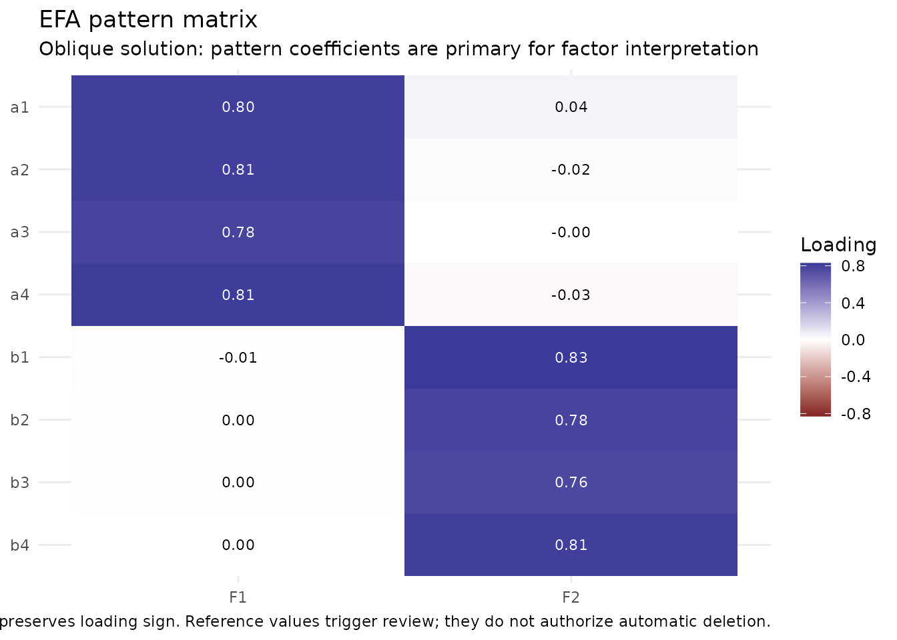
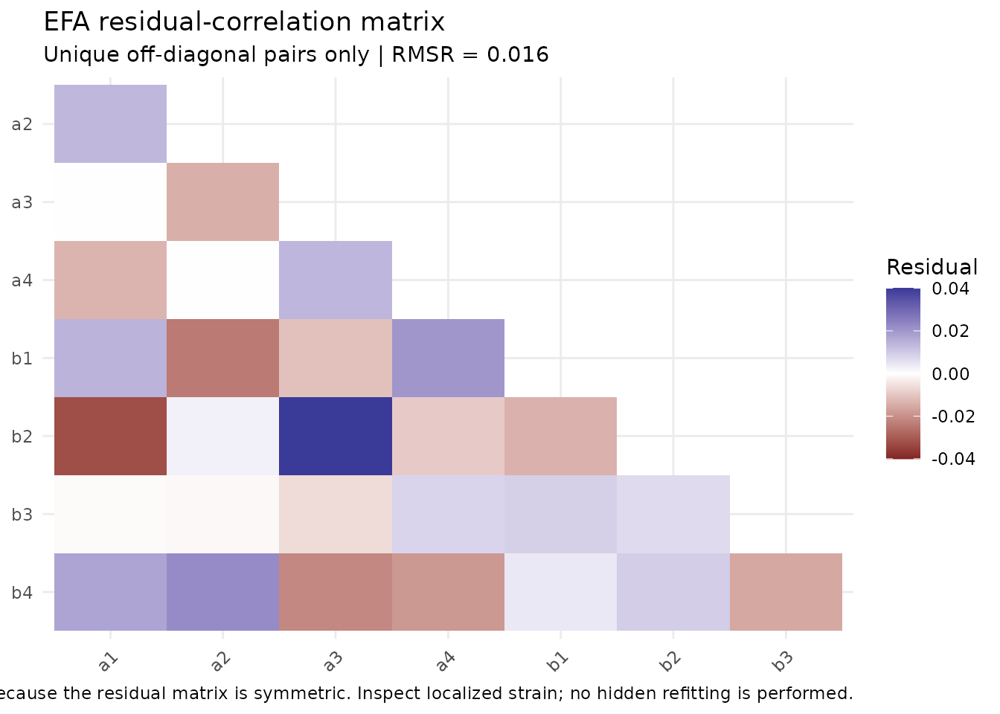

# From item audit to exploratory structure

## Why this workflow is staged

Exploratory factor analysis is not a scale-purification button. Before
interpreting an exploratory factor solution, researchers should know
what items are being analyzed, how they are coded, whether the
correlation model matches the intended measurement level, and how many
dimensions are substantively plausible.

`nomologR` therefore separates three questions:

1.  [`nomo_screen()`](https://juhalt.github.io/nomologR/reference/nomo_screen.md)
    — **What does the item/data set look like?**
2.  [`nomo_factors()`](https://juhalt.github.io/nomologR/reference/nomo_factors.md)
    — **How many latent dimensions deserve investigation?**
3.  [`nomo_efa()`](https://juhalt.github.io/nomologR/reference/nomo_efa.md)
    — **What does a requested exploratory structure look like?**

The handoff is deliberate: no stage silently deletes items, changes the
requested factor count, or treats a numerical reference value as proof.

## A reproducible two-factor example

The example below has two correlated latent variables with four
indicators each. The population structure is intentionally clear so that
the workflow can be inspected against a known data-generating process.

``` r

set.seed(2026)
n <- 400

f1 <- rnorm(n)
f2 <- 0.35 * f1 + sqrt(1 - 0.35^2) * rnorm(n)

dat <- data.frame(
  a1 = .82 * f1 + rnorm(n, sd = .55),
  a2 = .78 * f1 + rnorm(n, sd = .60),
  a3 = .75 * f1 + rnorm(n, sd = .62),
  a4 = .80 * f1 + rnorm(n, sd = .58),
  b1 = .82 * f2 + rnorm(n, sd = .55),
  b2 = .78 * f2 + rnorm(n, sd = .60),
  b3 = .75 * f2 + rnorm(n, sd = .62),
  b4 = .80 * f2 + rnorm(n, sd = .58)
)
```

## Step 1: audit the items

``` r

scr <- nomo_screen(dat)
summary(scr)
```

    ## <summary_nomo_screen>
    ## Cases: 400 | Items: 8 | No review flag: 8 | Review: 0 | Concern: 0
    ## Missingness flags: 0 | Constant: 0 | All missing: 0 | Relationship eligible: 8
    ## 
    ## Integrated item review:
    ## # A tibble: 8 × 7
    ##   item  item_type          attention pct_missing mode_prop corrected_item_rest_r
    ##   <chr> <chr>              <ord>           <dbl>     <dbl>                 <dbl>
    ## 1 a1    numeric_continuous none                0    0.0025                 0.597
    ## 2 a2    numeric_continuous none                0    0.0025                 0.548
    ## 3 a3    numeric_continuous none                0    0.0025                 0.547
    ## 4 a4    numeric_continuous none                0    0.0025                 0.544
    ## 5 b1    numeric_continuous none                0    0.0025                 0.581
    ## 6 b2    numeric_continuous none                0    0.0025                 0.561
    ## 7 b3    numeric_continuous none                0    0.0025                 0.551
    ## 8 b4    numeric_continuous none                0    0.0025                 0.574
    ##   review_metrics
    ##   <chr>         
    ## 1 ""            
    ## 2 ""            
    ## 3 ""            
    ## 4 ""            
    ## 5 ""            
    ## 6 ""            
    ## 7 ""            
    ## 8 ""            
    ## 
    ## `attention` is a review aid, not an automatic retention/deletion decision.

The screening object is descriptive and diagnostic. A flag is a reason
to inspect an item or coding decision, not an instruction to remove an
item.

## Step 2: investigate factor retention

``` r

fac <- nomo_factors(
  dat,
  criterion_set = "core",
  n_iter = 20,
  seed = 2026
)
summary(fac)
```

    ## <summary_nomo_factors>
    ## Cases: 400 | Items: 8 | Correlation: pearson | Criteria: core
    ## 
    ## Parallel-analysis rule sensitivity:
    ## # A tibble: 3 × 3
    ##   rule       n_factors selected
    ##   <chr>          <int> <lgl>   
    ## 1 percentile         2 TRUE    
    ## 2 mean               2 FALSE   
    ## 3 crawford           2 FALSE   
    ## 
    ## Retention evidence:
    ## # A tibble: 4 × 3
    ##   method                     n_factors role         
    ##   <chr>                          <int> <chr>        
    ## 1 Parallel analysis                  2 primary      
    ## 2 MAP (original TR2)                 2 complementary
    ## 3 MAP (revised TR4)                  2 complementary
    ## 4 Empirical Kaiser criterion         2 complementary
    ## 
    ## Criterion-family concordance:
    ## # A tibble: 1 × 3
    ##   n_factors n_families families                                          
    ##       <int>      <int> <chr>                                             
    ## 1         2          3 Parallel analysis; MAP; Empirical Kaiser criterion
    ## 
    ## Supporting adequacy evidence:
    ## # A tibble: 2 × 2
    ##   metric   display                           
    ##   <chr>    <chr>                             
    ## 1 KMO      0.844                             
    ## 2 Bartlett chi-square(28) = 1619.58, p < .001
    ## 
    ## Synthesis:
    ## All 3 available criterion families (4 methods) point to 2 factors. Related methods within a family are grouped before concordance is summarized; this is strong converging evidence for investigating that solution, not proof of dimensionality. 
    ## 
    ## Factor counts are candidates for investigation, not automatic dimensionality verdicts.
    ## Common-factor eigenvalues come from a reduced common-variance matrix; later values can be negative.

Parallel analysis is the primary retention suggestion, with MAP and EKC
providing complementary evidence. When methods disagree, the
disagreement is part of the result rather than something `nomologR`
resolves with a majority-vote rule.

## Step 3: hand the retention result into EFA

``` r

efa <- nomo_efa(
  dat,
  factors = fac
)
summary(efa)
```

    ## nomologR exploratory factor analysis
    ## 400 cases | 8 items | 2 factors (from nomo_factors())
    ## Correlation: pearson | Extraction: minres | Rotation: oblimin
    ## Supporting adequacy: KMO = 0.844 | Bartlett chi-square(28) = 1619.58, p < .001
    ## 
    ## Item-level structural review
    ## # A tibble: 8 × 7
    ##   item  primary_factor primary_loading secondary_factor secondary_loading
    ##   <chr> <chr>                    <dbl> <chr>                        <dbl>
    ## 1 a1    F1                       0.804 F2                        0.0445  
    ## 2 a2    F1                       0.806 F2                       -0.0156  
    ## 3 a3    F1                       0.780 F2                       -0.00173 
    ## 4 a4    F1                       0.814 F2                       -0.0252  
    ## 5 b1    F2                       0.828 F1                       -0.00599 
    ## 6 b2    F2                       0.782 F1                        0.00271 
    ## 7 b3    F2                       0.762 F1                        0.00491 
    ## 8 b4    F2                       0.806 F1                        0.000922
    ## # ℹ 2 more variables: communality <dbl>, attention <chr>
    ## 
    ## No configured numeric EFA review flags were triggered.
    ## 
    ## Factor correlations
    ##       F1    F2
    ## F1 1.000 0.316
    ## F2 0.316 1.000
    ## 
    ## Off-diagonal RMSR: 0.016
    ## 
    ## Largest localized residuals
    ## # A tibble: 5 × 4
    ##   item1 item2 residual abs_residual
    ##   <chr> <chr>    <dbl>        <dbl>
    ## 1 a3    b2      0.0401       0.0401
    ## 2 a1    b2     -0.0324       0.0324
    ## 3 a2    b1     -0.0241       0.0241
    ## 4 a2    b4      0.0223       0.0223
    ## 5 a3    b4     -0.0215       0.0215
    ## 
    ## Interpretation rule: numerical references trigger inspection, not automatic deletion or hidden refitting.

Passing the `nomo_factors` object carries forward the selected item set,
modeling types, correlation model, and missing-data strategy. The
primary parallel-analysis count becomes the **requested** EFA factor
count. If M2 identified neighboring plausible solutions,
[`nomo_efa()`](https://juhalt.github.io/nomologR/reference/nomo_efa.md)
records that context and recommends comparing those solutions rather
than treating the handoff as proof.

## Read the item table as evidence, not a deletion list

``` r

efa$item_summary
```

    ## # A tibble: 8 × 14
    ##   item  primary_factor primary_loading secondary_factor secondary_loading
    ##   <chr> <chr>                    <dbl> <chr>                        <dbl>
    ## 1 a1    F1                       0.804 F2                        0.0445  
    ## 2 a2    F1                       0.806 F2                       -0.0156  
    ## 3 a3    F1                       0.780 F2                       -0.00173 
    ## 4 a4    F1                       0.814 F2                       -0.0252  
    ## 5 b1    F2                       0.828 F1                       -0.00599 
    ## 6 b2    F2                       0.782 F1                        0.00271 
    ## 7 b3    F2                       0.762 F1                        0.00491 
    ## 8 b4    F2                       0.806 F1                        0.000922
    ## # ℹ 9 more variables: loading_gap <dbl>, communality <dbl>, uniqueness <dbl>,
    ## #   complexity <dbl>, weak_primary <lgl>, cross_loading <lgl>,
    ## #   low_communality <lgl>, attention <chr>, explanation <chr>

The item table reports:

- the largest pattern loading;
- the second-largest pattern loading;
- the gap between them;
- communality and uniqueness;
- loading complexity;
- `KEEP`, `REVIEW`, or `STRONG REVIEW`;
- a plain-language explanation for every numerical flag.

`KEEP` means that no configured numerical teaching-reference flag fired.
It does **not** mean that theory, wording, content coverage, redundancy,
or external validity evidence has approved the item.

## Pattern versus structure matrices

With oblique rotation, the pattern matrix contains regression-like
factor coefficients and is the primary matrix for interpreting which
indicators define which factors. The structure matrix contains
item-factor correlations and also reflects correlations among the
factors.

``` r

round(efa$pattern_matrix, 2)
```

    ##       F1    F2
    ## a1  0.80  0.04
    ## a2  0.81 -0.02
    ## a3  0.78  0.00
    ## a4  0.81 -0.03
    ## b1 -0.01  0.83
    ## b2  0.00  0.78
    ## b3  0.00  0.76
    ## b4  0.00  0.81

``` r

round(efa$structure_matrix, 2)
```

    ##      F1   F2
    ## a1 0.82 0.30
    ## a2 0.80 0.24
    ## a3 0.78 0.24
    ## a4 0.81 0.23
    ## b1 0.26 0.83
    ## b2 0.25 0.78
    ## b3 0.25 0.76
    ## b4 0.26 0.81

``` r

round(efa$factor_correlations, 2)
```

    ##      F1   F2
    ## F1 1.00 0.32
    ## F2 0.32 1.00

``` r

plot(efa, type = "pattern")
```



## Residual strain

A plausible loading pattern can still leave localized relationships
unexplained.
[`nomo_efa()`](https://juhalt.github.io/nomologR/reference/nomo_efa.md)
therefore returns the reproduced correlation matrix, the residual
matrix, the off-diagonal RMSR, and ranked residual pairs.

``` r

efa$rmsr
```

    ## [1] 0.01605067

``` r

head(efa$residual_pairs, 10)
```

    ## # A tibble: 10 × 4
    ##    item1 item2 residual abs_residual
    ##    <chr> <chr>    <dbl>        <dbl>
    ##  1 a3    b2      0.0401       0.0401
    ##  2 a1    b2     -0.0324       0.0324
    ##  3 a2    b1     -0.0241       0.0241
    ##  4 a2    b4      0.0223       0.0223
    ##  5 a3    b4     -0.0215       0.0215
    ##  6 a4    b1      0.0202       0.0202
    ##  7 a4    b4     -0.0185       0.0185
    ##  8 a1    b4      0.0174       0.0174
    ##  9 b3    b4     -0.0156       0.0156
    ## 10 a1    b1      0.0144       0.0144

``` r

plot(efa, type = "residuals")
```



Residuals are diagnostic evidence. `nomologR` does not search for a
better model, add correlated residuals, change the factor count, or
remove indicators behind the user’s back.

## Researcher control remains explicit

The default is common-factor MINRES extraction with oblimin rotation.
Researchers may choose another common-factor extraction or rotation, but
those choices remain visible in the result and decision log. For
example:

``` r

efa_varimax <- nomo_efa(
  dat,
  factors = 2,
  rotation = "varimax"
)
```

An orthogonal choice is permitted rather than prohibited, but the output
asks the researcher to justify the assumption that the factors should be
uncorrelated.

For numeric Likert items, declare the intended modeling level rather
than assuming that integer storage proves continuous or ordinal
measurement:

``` r

types <- c(
  q1 = "ordinal",
  q2 = "ordinal",
  q3 = "ordinal",
  q4 = "ordinal"
)

efa_ord <- nomo_efa(
  dat_likert,
  factors = 1,
  types = types
)
```

## What should happen next?

EFA contributes exploratory evidence about latent structure. A
defensible measurement workflow still requires theoretical
interpretation and, where feasible, confirmation on fresh or holdout
data. The next `nomologR` milestone is confirmatory factor analysis.

Methodological treatments that motivate the package’s EFA philosophy
include Fabrigar, Wegener, MacCallum, and Strahan (1999), Watkins
(2018), and later reviews emphasizing common-factor models,
evidence-based retention, and oblique rotation when factor correlations
are plausible.
