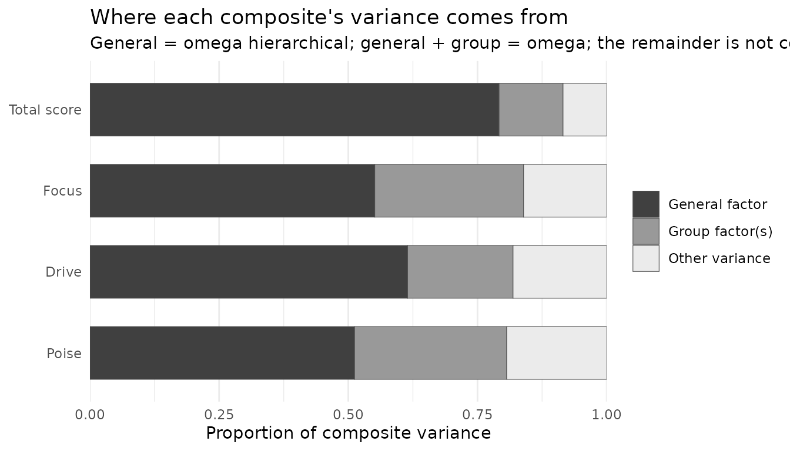

# Total and subscale scores: bifactor and higher-order models

Many published scales report a **total score** and several **subscale
scores**. A correlated-factors CFA can show that the subscales are
distinguishable, but it cannot say whether a total score is defensible,
or how much a subscale score adds once the total is known. Those
questions need a model with a general factor and indices that divide
each score’s variance between the general factor and the subscales.

This article shows how `nomologR` fits and evaluates the two common
models for that purpose, and why model fit alone cannot choose between
them.

## Two ways to model a general factor

- A **higher-order** model has first-order factors, one per subscale,
  whose correlations are explained by a second-order factor. The general
  factor reaches the items only through the first-order factors.
- A **bifactor** model has a general factor measured directly by every
  item, plus a group factor for each subscale. All factors are
  orthogonal, so each item’s variance divides cleanly between the
  general factor, its group factor, and error.

The bifactor model dates to Holzinger and Swineford (1937), and Schmid
and Leiman (1957) showed how to re-express a higher-order solution in
bifactor form. Bifactor models were later rediscovered as a way to
evaluate multidimensional measures (Reise, 2012), with indices for
judging total and subscale scores (Reise, Bonifay, & Haviland, 2013;
Rodriguez, Reise, & Haviland, 2016). The [research
basis](https://juhalt.github.io/nomologR/articles/research-basis.md)
article places these methods in context.

## An example with a general factor

The data below are simulated from a bifactor population: twelve items in
three four-item subscales, with a general factor that every item
reflects and a weaker group factor for each subscale.

``` r

simulate_from <- function(sigma, n, seed) {
  set.seed(seed)
  z <- matrix(rnorm(n * ncol(sigma)), n, ncol(sigma))
  dat <- as.data.frame(z %*% chol(sigma))
  names(dat) <- colnames(sigma)
  dat
}

items <- paste0("x", 1:12)
subscale <- rep(1:3, each = 4)
general_loading <- c(.70, .60, .65, .55, .60, .50, .70, .60, .50, .60, .55, .65)
group_loading <- c(.40, .50, .30, .45, .50, .35, .40, .30, .45, .40, .50, .35)

L <- cbind(
  general_loading,
  sapply(1:3, function(k) ifelse(subscale == k, group_loading, 0))
)
sigma_bifactor <- L %*% t(L)
diag(sigma_bifactor) <- 1
dimnames(sigma_bifactor) <- list(items, items)

dat <- simulate_from(sigma_bifactor, n = 600, seed = 2026)
```

[`nomo_model()`](https://juhalt.github.io/nomologR/reference/nomo_model.md)
writes the syntax for all three structures from the same list of
subscales. The researcher chooses the structure; `nomologR` never
derives one from exploratory results.

``` r

subscales <- list(
  Focus = paste0("x", 1:4),
  Drive = paste0("x", 5:8),
  Poise = paste0("x", 9:12)
)

nomo_model(subscales, structure = "bifactor", general = "G")
#> G =~ NA*x1 + x2 + x3 + x4 + x5 + x6 + x7 + x8 + x9 + x10 + x11 + x12
#> Focus =~ NA*x1 + x2 + x3 + x4
#> Drive =~ NA*x5 + x6 + x7 + x8
#> Poise =~ NA*x9 + x10 + x11 + x12
#> G ~~ 1*G
#> Focus ~~ 1*Focus
#> Drive ~~ 1*Drive
#> Poise ~~ 1*Poise
#> G ~~ 0*Focus + 0*Drive + 0*Poise
#> Focus ~~ 0*Drive + 0*Poise
#> Drive ~~ 0*Poise
```

The bifactor syntax states its identification explicitly: each factor’s
first loading is freed, each factor’s variance is fixed to 1, and every
covariance among factors is fixed to 0. A higher-order model with three
first-order factors carries a note that matters later:

``` r

nomo_model(subscales, structure = "higher_order", general = "G")
#> Focus =~ x1 + x2 + x3 + x4
#> Drive =~ x5 + x6 + x7 + x8
#> Poise =~ x9 + x10 + x11 + x12
#> G =~ NA*Focus + Drive + Poise
#> G ~~ 1*G
#> 
#> Identification notes:
#> - With three first-order factors the second-order part is just identified: this model fits exactly as well as the correlated-factors model, so model fit cannot distinguish the two.
```

``` r

correlated <- nomo_cfa(nomo_model(subscales), data = dat)
higher <- nomo_cfa(nomo_model(subscales, "higher_order"), data = dat)
bifactor <- nomo_cfa(nomo_model(subscales, "bifactor"), data = dat)
```

## How much of each score is general?

[`nomo_hierarchical()`](https://juhalt.github.io/nomologR/reference/nomo_hierarchical.md)
reads the structure from the fitted model and reports the indices:

``` r

h <- nomo_hierarchical(bifactor)
h
#> <nomo_hierarchical>
#> Bifactor model | general factor: G | group factors: Focus, Drive, Poise
#> Estimand: unit-weighted observed composite
#> 
#> Total score
#> # A tibble: 5 × 2
#>   index                       estimate
#>   <chr>                          <dbl>
#> 1 omega_total                    0.915
#> 2 omega_hierarchical             0.792
#> 3 omega_hierarchical_relative    0.865
#> 4 ecv                            0.676
#> 5 puc                            0.727
#> 
#> Subscales
#> # A tibble: 3 × 4
#>   subscale n_items omega_subscale omega_hierarchical_subscale
#>   <chr>      <int>          <dbl>                       <dbl>
#> 1 Focus          4          0.839                       0.288
#> 2 Drive          4          0.819                       0.204
#> 3 Poise          4          0.807                       0.295
#> 
#> Factor scores
#> # A tibble: 4 × 5
#>   factor role    factor_determinacy min_competing_r construct_replicability
#>   <chr>  <chr>                <dbl>           <dbl>                   <dbl>
#> 1 G      general              0.898           0.612                   0.878
#> 2 Focus  group                0.709           0.007                   0.5  
#> 3 Drive  group                0.639          -0.185                   0.403
#> 4 Poise  group                0.699          -0.022                   0.485
#> 
#> Notes
#> - [review] A bifactor model will usually fit at least as well as correlated-factors or higher-order models of the same items, even when it did not generate the data (Reise, 2012), and a higher-order model is a constrained version of it (Yung, Thissen, & McLeod, 1999). Bonifay, Lane, and Reise (2017) call the bifactor model's tendency to show superior goodness of fit in model comparison studies a particular concern, and say that superior fit may be a symptom of overfitting: modeling not only the trends in the data but also unwanted noise. Murray and Johnson (2013) compared these two structures directly and found the comparison biased in favor of the bifactor model: unless there was essentially no unmodelled complexity, their simulation favored the bifactor model even when a higher-order model generated the data. They concluded that which model to adopt should not rely on which is better fitting. Compare the alternatives with nomo_compare() and choose on substantive grounds, not on fit alone.
#> - [review] Factor determinacy is at or below .90 for G, Focus, Drive, Poise. Gorsuch (1983, p. 260) recommended using factor score estimates only above that value. This is his recommendation reported as context, not a rule applied here; the score may still be usable for some purposes.
#> - [review] Two equally valid sets of factor scores could correlate as low as G (0.61), Focus (0.01), Drive (-0.18), Poise (-0.02). Gorsuch (1983, p. 260) suggested this minimum be above .70. A negative value means two researchers scoring the same data could rank people in opposite orders and both be consistent with the model.
#> - [review] Construct replicability H is below .70 for Focus, Drive, Poise. Hancock and Mueller (2001) proposed .70 as a standard; a factor below it is not well defined by its own indicators and is expected to change across studies. Reported as their standard, not applied as a rule.
#> 
#> No index is treated as a pass/fail threshold; see nomo_table(x, "indices").
```

Reading the total score:

- **Omega total** (0.92) is the proportion of total-score variance
  explained by all common factors.
- **Omega hierarchical** (0.79) is the part explained by the general
  factor alone. It is the index that speaks to interpreting the total
  score as a measure of one construct.
- Their ratio (0.86) says how much of the total score’s reliable
  variance is general.
- **ECV** (0.68) is the share of common item variance the general factor
  explains, and **PUC** (0.73) is the share of item correlations
  influenced only by the general factor.

The subscales tell a different story:

``` r

nomo_table(h, "subscales")[, c(
  "subscale", "omega_subscale", "omega_hierarchical_subscale"
)]
#> # A tibble: 3 × 3
#>   subscale omega_subscale omega_hierarchical_subscale
#>   <chr>             <dbl>                       <dbl>
#> 1 Focus             0.839                       0.288
#> 2 Drive             0.819                       0.204
#> 3 Poise             0.807                       0.295
```

Focus has an omega of 0.84, which looks like a reliable subscale. But
its **omega hierarchical subscale** is 0.29: once the general factor is
removed, that is the reliable variance specific to Focus. Only 0.34 of a
Focus score’s reliable variance is specific to Focus; the rest is the
general factor, which the total score already measures. Reise, Bonifay,
and Haviland (2013) frame exactly this question: whether subscale scores
are justified, and how much reliable variance they add after controlling
for the general factor.

The same division is shown for every composite:

``` r

plot(h)
```



`nomologR` does not turn these indices into verdicts. Published
heuristic values exist, but Reise (2012) notes that no benchmark value
of ECV establishes when a general factor is strong enough. Whether a
subscale score is worth reporting depends on its intended use, and the
indices are the evidence for that decision rather than the decision
itself.

## Can you score the factors?

The omega indices describe unit-weighted composites: the sum score a
researcher would actually compute. A different question is how well each
*factor* can be recovered at all. The `factors` table answers it two
ways:

``` r

nomo_table(h, "factors")
#> # A tibble: 4 × 7
#>   factor role    n_items factor_determinacy determinacy_r2 min_competing_r
#>   <chr>  <chr>     <int>              <dbl>          <dbl>           <dbl>
#> 1 G      general      12              0.898          0.806         0.612  
#> 2 Focus  group         4              0.709          0.503         0.00660
#> 3 Drive  group         4              0.639          0.408        -0.185  
#> 4 Poise  group         4              0.699          0.489        -0.0222 
#> # ℹ 1 more variable: construct_replicability <dbl>
```

`factor_determinacy` is the correlation between a factor and its
estimated factor score (Beauducel, 2011; Rodriguez, Reise, & Haviland,
2016). Gorsuch (1983) recommended using factor score estimates only
above .90. `min_competing_r` is the lowest correlation two equally valid
sets of scores could have. When it is negative, two researchers scoring
the same data with equally defensible methods could rank people in
opposite orders, and both would be consistent with the model.

`construct_replicability`, Hancock and Mueller’s (2001) H, is the
proportion of variance in a factor its own indicators could explain if
optimally weighted. They proposed .70 as a standard.

The two indices answer different questions, and the difference is easy
to miss. They are the same quantity when a construct is unidimensional.
Under a bifactor model they are not: determinacy is computed from the
whole reproduced correlation matrix, so a group factor’s score can
borrow the other items to partial out the general factor, while H sees
only that factor’s own loadings and treats the rest of each item as
uncorrelated residual. Rodriguez et al. (2016) state that the two can
differ here and decline to prefer either, so `nomologR` reports both and
names what each one measures.

Neither threshold is applied as a rule. They are reported as their
authors’ recommendations where a value falls below them, in the same way
fixed fit-index cutoffs are treated elsewhere in the package.

## Comparing structures

The three models can be compared with
[`nomo_compare()`](https://juhalt.github.io/nomologR/reference/nomo_compare.md),
which requires a rationale and never selects a model:

``` r

cmp <- nomo_compare(
  correlated, higher, bifactor,
  rationale = "Competing structures for the same twelve items.",
  origin = "a_priori"
)

comparisons <- nomo_table(cmp, "comparisons")[, c(
  "model", "relation", "chisq_diff", "df_diff", "delta_cfi"
)]
comparisons$delta_cfi <- round(comparisons$delta_cfi, 4)
comparisons
#> # A tibble: 2 × 5
#>   model    relation         chisq_diff df_diff delta_cfi
#>   <chr>    <chr>                 <dbl>   <dbl>     <dbl>
#> 1 higher   equivalent             NA        NA    0     
#> 2 bifactor less_constrained       23.0       9    0.0047
```

Two features of this table are structural rather than empirical:

- The higher-order model is **equivalent** to the correlated-factors
  model: both have chi-square = 72.45 on 51 degrees of freedom. With
  three first-order factors, the second-order part is just identified,
  so it imposes no testable constraint. Fit cannot distinguish the two,
  which is what the note on the syntax warned.
- The bifactor model is **less constrained**. A higher-order model is a
  constrained version of the bifactor model (Yung, Thissen, & McLeod,
  1999), so the bifactor model can only fit as well or better.

## Why fit cannot choose the structure

That last point has a consequence. The next data set is simulated from a
**higher-order** population, so the higher-order model is the true one:

``` r

first_order <- c(.70, .65, .60, .75, .70, .60, .65, .70, .55, .70, .65, .60)
second_order <- c(.80, .70, .60)

F <- sapply(1:3, function(k) ifelse(subscale == k, first_order, 0))
phi <- second_order %*% t(second_order)
diag(phi) <- 1
sigma_higher <- F %*% phi %*% t(F)
diag(sigma_higher) <- 1
dimnames(sigma_higher) <- list(items, items)

dat_higher <- simulate_from(sigma_higher, n = 600, seed = 2027)

true_model <- nomo_cfa(nomo_model(subscales, "higher_order"), data = dat_higher)
bifactor_model <- nomo_cfa(nomo_model(subscales, "bifactor"), data = dat_higher)
```

The higher-order model generated these data, yet the bifactor model fits
better: chi-square = 38.14 on 42 degrees of freedom, against 42.48 on 51
for the true model. That is not a sign that the bifactor model is
correct. Its extra parameters absorb sampling noise, and it will usually
fit at least as well as correlated-factors or higher-order models of the
same items (Reise, 2012).

So the choice between structures has to rest on theory: is there a
construct that every item measures directly, with subscale content as a
secondary source? Or is the general construct what the subscales have in
common? Fit comparison can reveal a structure that clearly does not
work, but it cannot make this choice.

## Higher-order models and Schmid-Leiman

[`nomo_hierarchical()`](https://juhalt.github.io/nomologR/reference/nomo_hierarchical.md)
also evaluates higher-order models. There the group sources are the
first-order factors’ disturbances, and the item loadings are the
Schmid-Leiman decomposition of the higher-order solution, which is exact
for a confirmatory model:

``` r

h_higher <- nomo_hierarchical(true_model)
nomo_table(h_higher, "indices")[, c("index", "estimate")]
#> # A tibble: 5 × 2
#>   index                       estimate
#>   <chr>                          <dbl>
#> 1 omega_total                    0.845
#> 2 omega_hierarchical             0.617
#> 3 omega_hierarchical_relative    0.730
#> 4 ecv                            0.481
#> 5 puc                            0.727
head(nomo_table(h_higher, "loadings"), 4)
#> # A tibble: 4 × 6
#>   item  subscale general_loading group_loading communality item_ecv
#>   <chr> <chr>              <dbl>         <dbl>       <dbl>    <dbl>
#> 1 x1    Focus              0.515         0.433       0.453    0.586
#> 2 x2    Focus              0.482         0.405       0.396    0.586
#> 3 x3    Focus              0.477         0.401       0.388    0.586
#> 4 x4    Focus              0.609         0.512       0.633    0.586
```

Each item’s general loading is its first-order loading multiplied by its
factor’s second-order loading. Every item in a subscale therefore has
the same ratio of general to group loading, which is why `item_ecv` is
identical for all four Focus items. That proportionality is the
constraint that distinguishes a higher-order model from a bifactor
model, where each item’s split between general and group variance is
free.

## Ordered indicators

When indicators are declared ordered,
[`nomo_cfa()`](https://juhalt.github.io/nomologR/reference/nomo_cfa.md)
fits the model with WLSMV and
[`nomo_hierarchical()`](https://juhalt.github.io/nomologR/reference/nomo_hierarchical.md)
computes the indices on the latent-response scale. Those omegas are
upper bounds on the reliability of the observed ordinal sum score, and
the output says so. The observed ordinal-scale versions are not
provided.

## What nomologR does not do

- It does not generate a bifactor or higher-order structure from
  exploratory results. The researcher specifies the structure.
- It does not apply pass/fail thresholds to omega hierarchical, ECV, or
  PUC.
- It does not choose between correlated-factors, higher-order, and
  bifactor models, and it discloses that fit comparisons favor the
  bifactor model.
- It evaluates single-group, single-level models, and refuses models
  whose general and group factors are allowed to correlate, because
  variance cannot then be attributed to a source.

Every method used here is listed, with references, by
[`nomo_methods()`](https://juhalt.github.io/nomologR/reference/nomo_methods.md):

``` r

nomo_methods(h)[, c("method", "lineage", "role")]
#> # A tibble: 7 × 3
#>   method                                    lineage      role      
#>   <chr>                                     <chr>        <chr>     
#> 1 Bifactor measurement model                contemporary primary   
#> 2 Omega hierarchical                        contemporary primary   
#> 3 Omega hierarchical subscale               contemporary supporting
#> 4 Explained common variance                 contemporary supporting
#> 5 Factor determinacy                        contemporary supporting
#> 6 Construct replicability (H)               contemporary supporting
#> 7 Percentage of uncontaminated correlations contemporary supporting
```

## References

Holzinger, K. J., & Swineford, F. (1937). The bi-factor method.
*Psychometrika, 2*(1), 41–54. <https://doi.org/10.1007/BF02287965>

Reise, S. P. (2012). The rediscovery of bifactor measurement models.
*Multivariate Behavioral Research, 47*(5), 667–696.
<https://doi.org/10.1080/00273171.2012.715555>

Reise, S. P., Bonifay, W. E., & Haviland, M. G. (2013). Scoring and
modeling psychological measures in the presence of multidimensionality.
*Journal of Personality Assessment, 95*(2), 129–140.
<https://doi.org/10.1080/00223891.2012.725437>

Rodriguez, A., Reise, S. P., & Haviland, M. G. (2016). Evaluating
bifactor models: Calculating and interpreting statistical indices.
*Psychological Methods, 21*(2), 137–150.
<https://doi.org/10.1037/met0000045>

Schmid, J., & Leiman, J. M. (1957). The development of hierarchical
factor solutions. *Psychometrika, 22*(1), 53–61.
<https://doi.org/10.1007/BF02289209>

Yung, Y.-F., Thissen, D., & McLeod, L. D. (1999). On the relationship
between the higher-order factor model and the hierarchical factor model.
*Psychometrika, 64*(2), 113–128. <https://doi.org/10.1007/BF02294531>
