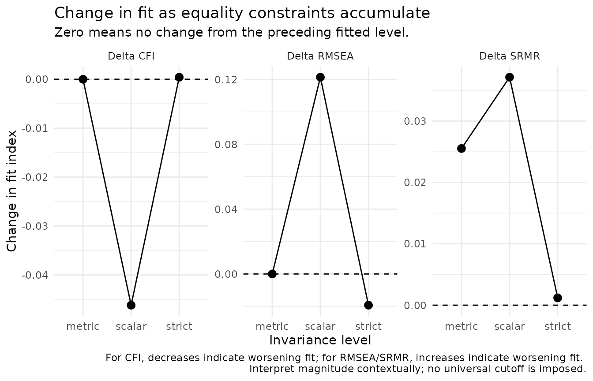
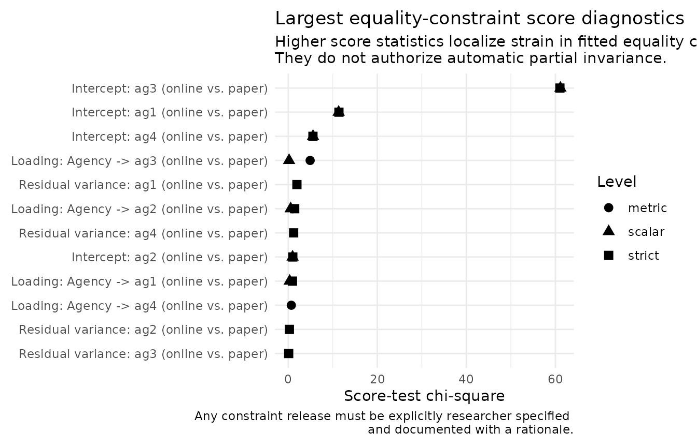
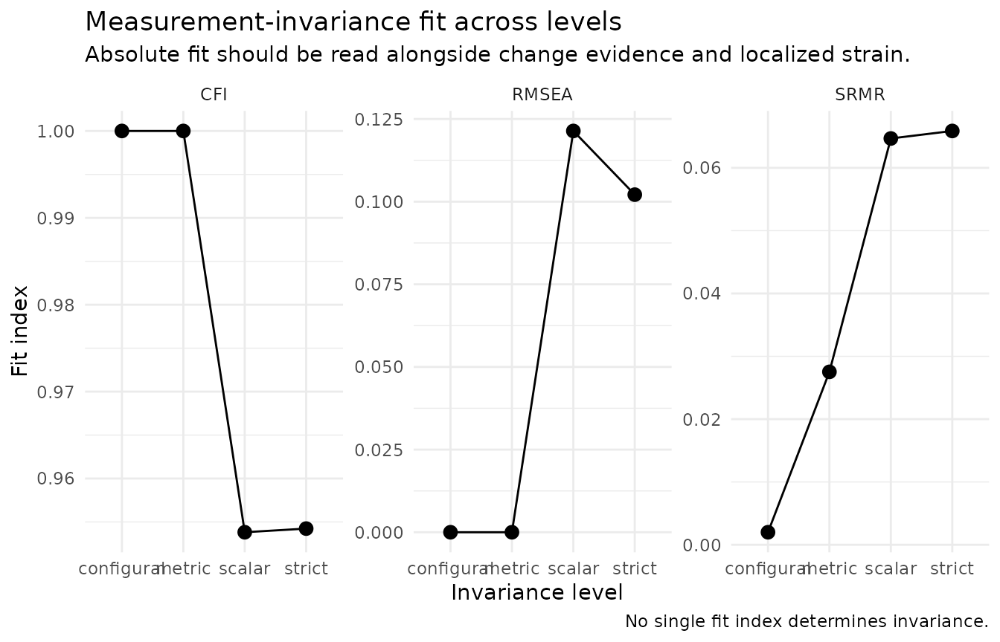

# Measurement Invariance with nomologR

## What invariance is for

Measurement invariance asks whether a construct is measured comparably
across groups or occasions. If it is not, a difference in observed
scores can reflect how an item functions in each group rather than a
difference in the construct itself. `nomologR` treats invariance as
**graded evidence** rather than a sequence of automatic PASS/FAIL
decisions.

Every fitted level retains:

- the generated
  [`semTools::measEq.syntax()`](https://rdrr.io/pkg/semTools/man/measEq.syntax.html)
  object and the exact lavaan syntax;
- the fitted lavaan object;
- absolute fit and change in fit;
- nested-model comparison evidence where available;
- localized equality-constraint diagnostics;
- researcher-specified partial-invariance provenance.

## A teaching example with a known answer

`nomo_demo_network` contains 800 responses collected in two
administration groups, `online` and `paper`. Its population model builds
in two features:

1.  the latent **Agency mean is .25 SD higher** in the `paper` group (a
    real construct difference); and
2.  the **intercept of item `ag3` is .50 higher** in the `paper` group
    (item bias: `ag3` is endorsed more on paper at the same level of
    Agency).

All loadings are equal across groups.

``` r

aggregate(
  cbind(ag1, ag2, ag3, ag4) ~ group,
  data = nomo_demo_network,
  FUN = mean
)
#>    group     ag1      ag2      ag3      ag4
#> 1 online 3.98885 3.971875 3.974900 4.027750
#> 2  paper 4.23735 4.252500 4.640525 4.265525
```

Every item mean is higher in the `paper` group, but `ag3` is higher by
much more. Observed means alone cannot separate the real latent
difference from the item-level bias; that is the job of the invariance
sequence.

## Continuous indicators

``` r

agency_model <- "Agency =~ ag1 + ag2 + ag3 + ag4"

inv <- nomo_invariance(
  agency_model,
  data = nomo_demo_network,
  group = "group"
)

inv
#> <nomo_invariance>
#> Grouping variable: group (2 groups: online, paper)
#> Indicator treatment: continuous
#> Requested: configural -> metric -> scalar -> strict
#> Completed: configural -> metric -> scalar -> strict
#> 
#> # A tibble: 4 × 11
#>   level      status    constraints                     partial_requested   cfi
#>   <chr>      <chr>     <chr>                           <chr>             <dbl>
#> 1 configural estimated none                            ""                1    
#> 2 metric     estimated loadings                        ""                1    
#> 3 scalar     estimated loadings, intercepts            ""                0.954
#> 4 strict     estimated loadings, intercepts, residuals ""                0.954
#>   rmsea    srmr delta_cfi delta_rmsea delta_srmr     lrt_p
#>   <dbl>   <dbl>     <dbl>       <dbl>      <dbl>     <dbl>
#> 1 0     0.00200 NA            NA        NA       NA       
#> 2 0     0.0275   0             0         0.0255   1.46e- 1
#> 3 0.121 0.0647  -0.0462        0.121     0.0371   1.20e-13
#> 4 0.102 0.0659   0.000420     -0.0193    0.00120  4.83e- 1
#> 
#> Localized equality-constraint diagnostics retained: 24
#> 
#> Interpretation rule: fit changes and score diagnostics are evidence, not universal pass/fail rules, not automatic pass/fail decisions, and not automatic parameter-freeing rules.
```

The conventional continuous sequence is:

``` text
configural -> metric -> scalar -> strict
```

``` r

fit <- nomo_table(inv, "fit")
fit[, c("level", "constraints", "cfi", "rmsea", "srmr", "delta_cfi", "delta_rmsea", "lrt_p")]
#> # A tibble: 4 × 8
#>   level      constraints       cfi rmsea    srmr delta_cfi delta_rmsea     lrt_p
#>   <chr>      <chr>           <dbl> <dbl>   <dbl>     <dbl>       <dbl>     <dbl>
#> 1 configural none            1     0     0.00200 NA            NA      NA       
#> 2 metric     loadings        1     0     0.0275   0             0       1.46e- 1
#> 3 scalar     loadings, inte… 0.954 0.121 0.0647  -0.0462        0.121   1.20e-13
#> 4 strict     loadings, inte… 0.954 0.102 0.0659   0.000420     -0.0193  4.83e- 1
```

The configural and metric models fit closely, consistent with equal
loadings. Adding intercept equality at the scalar level changes CFI by
-0.046 and RMSEA by 0.121, and the likelihood-ratio test is very small
(p = 1.2e-13). No single delta-CFI, delta-RMSEA, delta-SRMR, or
chi-square rule is treated as universally decisive; the evidence is read
together, in context.

``` r

plot(inv, type = "change")
```



## Localizing strain

Global change in fit says *that* a set of constraints is strained. Score
diagnostics help locate *where*.

``` r

strain <- nomo_table(inv, "local_strain")
strain[, c("level", "constraint_display", "score_x2", "df", "p_value")]
#> # A tibble: 24 × 5
#>    level  constraint_display                        score_x2    df  p_value
#>    <chr>  <chr>                                        <dbl> <dbl>    <dbl>
#>  1 metric Loading: Agency -> ag3 (online vs. paper)   4.92       1 2.66e- 2
#>  2 metric Loading: Agency -> ag2 (online vs. paper)   1.03       1 3.10e- 1
#>  3 metric Loading: Agency -> ag4 (online vs. paper)   0.690      1 4.06e- 1
#>  4 metric Loading: Agency -> ag1 (online vs. paper)   0.0273     1 8.69e- 1
#>  5 scalar Intercept: ag3 (online vs. paper)          61.1        1 5.33e-15
#>  6 scalar Intercept: ag1 (online vs. paper)          11.3        1 7.68e- 4
#>  7 scalar Intercept: ag4 (online vs. paper)           5.56       1 1.83e- 2
#>  8 scalar Intercept: ag2 (online vs. paper)           0.977      1 3.23e- 1
#>  9 scalar Loading: Agency -> ag2 (online vs. paper)   0.546      1 4.60e- 1
#> 10 scalar Loading: Agency -> ag1 (online vs. paper)   0.317      1 5.74e- 1
#> # ℹ 14 more rows
```

``` r

plot(inv, type = "local_strain")
```



The largest scalar-level diagnostic is **Intercept: ag3 (online
vs. paper)** (score chi-square 61.1), which matches the item bias built
into the data.

Two cautions matter for real research:

- Score diagnostics **never authorize an automatic parameter release**.
  With many constraints, some diagnostics will look notable by chance;
  look at the smaller metric-level values above for an example.
- In real data you do not know the population model. A release chosen
  only because its diagnostic was largest is a post-hoc decision and
  should be reported as one.

## Researcher-controlled partial invariance

``` r

release <- nomo_partial(
  level = "scalar",
  syntax = "ag3 ~ 1",
  rationale = paste(
    "The ag3 wording was expected to read differently on paper forms;",
    "this expectation was documented before the analysis."
  )
)

inv_partial <- nomo_invariance(
  agency_model,
  data = nomo_demo_network,
  group = "group",
  partial = release
)

nomo_table(inv_partial, "partial")
#> # A tibble: 1 × 4
#>   release_id level  syntax  rationale                                           
#>   <chr>      <chr>  <chr>   <chr>                                               
#> 1 P1         scalar ag3 ~ 1 The ag3 wording was expected to read differently on…

fit_partial <- nomo_table(inv_partial, "fit")
fit_partial[, c("level", "partial_requested", "cfi", "rmsea", "delta_cfi", "lrt_p")]
#> # A tibble: 4 × 6
#>   level      partial_requested   cfi rmsea delta_cfi  lrt_p
#>   <chr>      <chr>             <dbl> <dbl>     <dbl>  <dbl>
#> 1 configural ""                    1     0        NA NA    
#> 2 metric     ""                    1     0         0  0.146
#> 3 scalar     "ag3 ~ 1"             1     0         0  0.582
#> 4 strict     "ag3 ~ 1"             1     0         0  0.460
```

With the `ag3` intercept released, the remaining intercept equalities
are consistent with the data, and the latent mean difference can be
interpreted using the three invariant intercepts. The release is carried
forward to the strict level so that a parameter freed at one level is
not silently constrained again later.

`nomologR` records what was released and why. It does not search until a
model meets a preferred cutoff.

## Ordered indicators

Ordered indicators require identification-aware sequences rather than
merely substituting WLSMV for ML.

For four-or-more-category ordered indicators:

``` text
configural -> thresholds -> metric -> scalar -> strict
```

For three-category indicators, threshold equality is part of the metric
step because it is needed for identification. For binary indicators,
threshold, loading, and intercept restrictions cannot be treated as
independent sequential tests under the implemented Wu–Estabrook
approach, so the sequence begins:

``` text
configural -> strong -> strict
```

where `strong` imposes thresholds, loadings, and intercepts together.

The example below uses four five-category items from
`nomo_demo_ordinal`. The two “forms” are assigned by alternating rows
purely to demonstrate the ordered workflow; no non-invariance was built
into these groups.

``` r

ordinal_items <- nomo_demo_ordinal[, c("a1", "a2", "a3", "a4")]
ordinal_items$form <- rep(c("form_1", "form_2"), length.out = nrow(ordinal_items))

inv_ord <- nomo_invariance(
  "A =~ a1 + a2 + a3 + a4",
  data = ordinal_items,
  group = "form",
  ordered = c("a1", "a2", "a3", "a4")
)

nomo_table(inv_ord, "categories")
#> # A tibble: 4 × 2
#>   item  categories
#>   <chr>      <int>
#> 1 a1             5
#> 2 a2             5
#> 3 a3             5
#> 4 a4             5

fit_ord <- nomo_table(inv_ord, "fit")
fit_ord[, c("level", "constraints", "cfi", "rmsea", "delta_cfi")]
#> # A tibble: 5 × 5
#>   level      constraints                                   cfi  rmsea  delta_cfi
#>   <chr>      <chr>                                       <dbl>  <dbl>      <dbl>
#> 1 configural none                                        0.992 0.0743 NA        
#> 2 thresholds thresholds                                  0.997 0.0372  0.00439  
#> 3 metric     thresholds, loadings                        0.997 0.0331  0.0000218
#> 4 scalar     thresholds, loadings, intercepts            0.998 0.0227  0.00150  
#> 5 strict     thresholds, loadings, intercepts, residuals 1     0       0.00193
```

## Tables and figures

``` r

plot(inv, type = "fit")
```



[`nomo_table()`](https://juhalt.github.io/nomologR/reference/nomo_table.md)
returns ordinary tibbles (`"fit"`, `"categories"`, `"partial"`,
`"local_strain"`, `"decision_log"`), and plots are ordinary ggplot
objects, so researchers keep direct control over reporting. The same
evidence flows into
[`nomo_report()`](https://juhalt.github.io/nomologR/reference/nomo_report.md)
when invariance is part of a guided workflow.

## Research basis

Multiple-group factor analysis originates with Jöreskog (1971), and the
configural–metric–scalar–strict hierarchy with Meredith (1993) and
Vandenberg and Lance (2000). A decrease in CFI of .01 became a widely
used rule after Cheung and Rensvold (2002); later work showed that
sensitivity of change-in-fit indices depends on sample size and model
context (Chen, 2007; Putnick & Bornstein, 2016), which is why `nomologR`
reports several indices without a universal cutoff. Ordered-indicator
sequences follow Wu and Estabrook (2016) as implemented in `semTools`
(see also Svetina et al., 2020). Partial invariance follows Byrne,
Shavelson, and Muthén (1989). Full references are in
[`?nomo_invariance`](https://juhalt.github.io/nomologR/reference/nomo_invariance.md)
and the [research
basis](https://juhalt.github.io/nomologR/articles/research-basis.md)
article.
