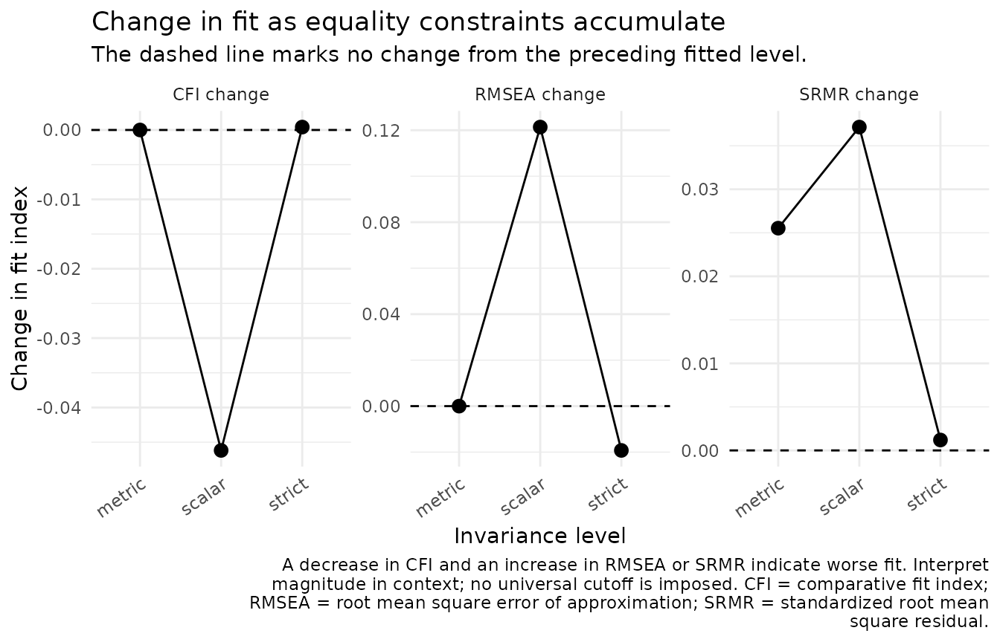
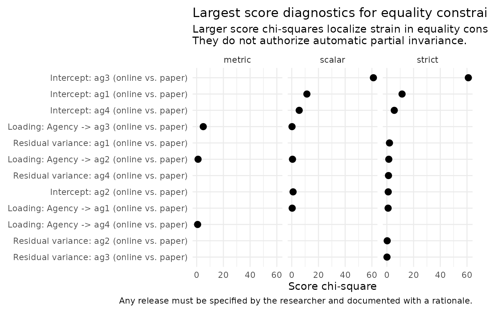
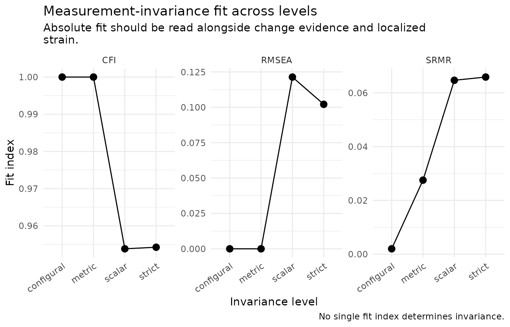

# Measurement Invariance with nomologR

## What invariance is for

Measurement invariance asks whether a construct is measured comparably
across groups or occasions. If it is not, a difference in observed
scores can reflect how an item functions in each group rather than a
difference in the construct itself. `nomologR` treats invariance as
**graded evidence** rather than a sequence of automatic PASS/FAIL
decisions.

Every fitted level retains:

- the generated
  [`semTools::measEq.syntax()`](https://rdrr.io/pkg/semTools/man/measEq.syntax.html)
  object and the exact lavaan syntax;
- the fitted lavaan object;
- absolute fit and change in fit;
- nested-model comparison evidence where available;
- localized equality-constraint diagnostics;
- researcher-specified partial-invariance provenance.

## A teaching example with a known answer

`nomo_demo_network` contains 800 responses collected in two
administration groups, `online` and `paper`. Its population model builds
in two features:

1.  the latent **Agency mean is .25 SD higher** in the `paper` group (a
    real construct difference); and
2.  the **intercept of item `ag3` is .50 higher** in the `paper` group
    (item bias: `ag3` is endorsed more on paper at the same level of
    Agency).

All loadings are equal across groups.

``` r

aggregate(
  cbind(ag1, ag2, ag3, ag4) ~ group,
  data = nomo_demo_network,
  FUN = mean
)
#>    group     ag1      ag2      ag3      ag4
#> 1 online 3.98885 3.971875 3.974900 4.027750
#> 2  paper 4.23735 4.252500 4.640525 4.265525
```

Every item mean is higher in the `paper` group, but `ag3` is higher by
much more. Observed means alone cannot separate the real latent
difference from the item-level bias; that is the job of the invariance
sequence.

## Continuous indicators

``` r

agency_model <- "Agency =~ ag1 + ag2 + ag3 + ag4"

inv <- nomo_invariance(
  agency_model,
  data = nomo_demo_network,
  group = "group"
)

inv
#> <nomo_invariance> Measurement invariance
#> Grouping variable: group (2 groups: online, paper) | Indicators: continuous
#> Requested: configural -> metric -> scalar -> strict
#> Completed: configural -> metric -> scalar -> strict
#> 
#>   Level         CFI  RMSEA   SRMR  CFI change  RMSEA change   LRT p
#>   configural  1.000  0.000  0.002           -             -       -
#>   metric      1.000  0.000  0.028      +0.000        +0.000    .146
#>   scalar      0.954  0.121  0.065      -0.046        +0.121  < .001
#>   strict      0.954  0.102  0.066      +0.000        -0.019    .483
#> Localized equality-constraint diagnostics retained: 24
#> 
#> Fit changes and score diagnostics are evidence. They are not pass/fail rules,
#> and nomologR never frees a parameter because of them.
```

The conventional continuous sequence is:

``` text
configural -> metric -> scalar -> strict
```

``` r

fit <- nomo_table(inv, "fit")
fit[, c("level", "constraints", "cfi", "rmsea", "srmr", "delta_cfi", "delta_rmsea", "lrt_p")]
#> # A tibble: 4 × 8
#>   level      constraints       cfi rmsea    srmr delta_cfi delta_rmsea     lrt_p
#>   <chr>      <chr>           <dbl> <dbl>   <dbl>     <dbl>       <dbl>     <dbl>
#> 1 configural none            1     0     0.00200 NA            NA      NA       
#> 2 metric     loadings        1     0     0.0275   0             0       1.46e- 1
#> 3 scalar     loadings, inte… 0.954 0.121 0.0647  -0.0462        0.121   1.20e-13
#> 4 strict     loadings, inte… 0.954 0.102 0.0659   0.000420     -0.0193  4.83e- 1
```

The configural and metric models fit closely, consistent with equal
loadings. Adding intercept equality at the scalar level changes CFI by
-0.046 and RMSEA by 0.121, and the likelihood-ratio test is very small
(p = 1.2e-13). No single delta-CFI, delta-RMSEA, delta-SRMR, or
chi-square rule is treated as universally decisive; the evidence is read
together, in context.

``` r

plot(inv, type = "change")
```



## Localizing strain

Global change in fit says *that* a set of constraints is strained. Score
diagnostics help locate *where*.

``` r

strain <- nomo_table(inv, "local_strain")
strain[, c("level", "constraint_display", "score_x2", "df", "p_value")]
#> # A tibble: 24 × 5
#>    level  constraint_display                        score_x2    df  p_value
#>    <chr>  <chr>                                        <dbl> <dbl>    <dbl>
#>  1 metric Loading: Agency -> ag3 (online vs. paper)   4.92       1 2.66e- 2
#>  2 metric Loading: Agency -> ag2 (online vs. paper)   1.03       1 3.10e- 1
#>  3 metric Loading: Agency -> ag4 (online vs. paper)   0.690      1 4.06e- 1
#>  4 metric Loading: Agency -> ag1 (online vs. paper)   0.0273     1 8.69e- 1
#>  5 scalar Intercept: ag3 (online vs. paper)          61.1        1 5.33e-15
#>  6 scalar Intercept: ag1 (online vs. paper)          11.3        1 7.68e- 4
#>  7 scalar Intercept: ag4 (online vs. paper)           5.56       1 1.83e- 2
#>  8 scalar Intercept: ag2 (online vs. paper)           0.977      1 3.23e- 1
#>  9 scalar Loading: Agency -> ag2 (online vs. paper)   0.546      1 4.60e- 1
#> 10 scalar Loading: Agency -> ag1 (online vs. paper)   0.317      1 5.74e- 1
#> # ℹ 14 more rows
```

``` r

plot(inv, type = "local_strain")
```



The largest scalar-level diagnostic is **Intercept: ag3 (online
vs. paper)** (score chi-square 61.1), which matches the item bias built
into the data.

Two cautions matter for real research:

- Score diagnostics **never authorize an automatic parameter release**.
  With many constraints, some diagnostics will look notable by chance;
  look at the smaller metric-level values above for an example.
- In real data you do not know the population model. A release chosen
  only because its diagnostic was largest is a post-hoc decision and
  should be reported as one.

## Researcher-controlled partial invariance

``` r

release <- nomo_partial(
  level = "scalar",
  syntax = "ag3 ~ 1",
  rationale = paste(
    "The ag3 wording was expected to read differently on paper forms;",
    "this expectation was documented before the analysis."
  )
)

inv_partial <- nomo_invariance(
  agency_model,
  data = nomo_demo_network,
  group = "group",
  partial = release
)

nomo_table(inv_partial, "partial")
#> # A tibble: 1 × 4
#>   release_id level  syntax  rationale                                           
#>   <chr>      <chr>  <chr>   <chr>                                               
#> 1 P1         scalar ag3 ~ 1 The ag3 wording was expected to read differently on…

fit_partial <- nomo_table(inv_partial, "fit")
fit_partial[, c("level", "partial_requested", "cfi", "rmsea", "delta_cfi", "lrt_p")]
#> # A tibble: 4 × 6
#>   level      partial_requested   cfi rmsea delta_cfi  lrt_p
#>   <chr>      <chr>             <dbl> <dbl>     <dbl>  <dbl>
#> 1 configural ""                    1     0        NA NA    
#> 2 metric     ""                    1     0         0  0.146
#> 3 scalar     "ag3 ~ 1"             1     0         0  0.582
#> 4 strict     "ag3 ~ 1"             1     0         0  0.460
```

With the `ag3` intercept released, the remaining intercept equalities
are consistent with the data, and the latent mean difference can be
interpreted using the three invariant intercepts. The release is carried
forward to the strict level so that a parameter freed at one level is
not silently constrained again later.

`nomologR` records what was released and why. It does not search until a
model meets a preferred cutoff.

## Comparing the groups: known-groups evidence

Once the intercepts are invariant, fully or partially, the groups can be
compared on the construct itself (Byrne, Shavelson, & Muthén, 1989). A
difference that theory predicts between groups that differ on the
construct is known-groups evidence. At each level that holds intercepts
equal,
[`nomo_invariance()`](https://juhalt.github.io/nomologR/reference/nomo_invariance.md)
reports each group’s latent means relative to the reference group. The
reference group’s mean is fixed at 0 and its variance at 1, so each mean
is a difference in the reference group’s latent standard deviations
(Hancock, 2001).

``` r

full_means <- nomo_table(inv, "latent_means")
partial_means <- nomo_table(inv_partial, "latent_means")
full_means[full_means$level == "scalar", c("group", "factor", "estimate", "ci_lower", "ci_upper")]
#> # A tibble: 1 × 5
#>   group factor estimate ci_lower ci_upper
#>   <chr> <chr>     <dbl>    <dbl>    <dbl>
#> 1 paper Agency    0.444    0.286    0.603
partial_means[partial_means$level == "scalar", c("group", "factor", "estimate", "ci_lower", "ci_upper")]
#> # A tibble: 1 × 5
#>   group factor estimate ci_lower ci_upper
#>   <chr> <chr>     <dbl>    <dbl>    <dbl>
#> 1 paper Agency    0.329    0.171    0.487
```

The population difference is .25 SD. Holding the biased `ag3` intercept
equal inflates it to 0.44, because the model reads the item’s extra
endorsement on paper as more Agency. With that intercept released, the
difference is 0.33, 95% CI \[0.17, 0.49\]. So known-groups evidence is
only as good as the invariance beneath it: a group difference computed
before the intercepts are examined can be item bias.

## Ordered indicators

Ordered indicators require identification-aware sequences rather than
merely substituting WLSMV for ML.

For four-or-more-category ordered indicators:

``` text
configural -> thresholds -> metric -> scalar -> strict
```

For three-category indicators, threshold equality is part of the metric
step because it is needed for identification. For binary indicators,
threshold, loading, and intercept restrictions cannot be treated as
independent sequential tests under the implemented Wu–Estabrook
approach, so the sequence begins:

``` text
configural -> strong -> strict
```

where `strong` imposes thresholds, loadings, and intercepts together.

The example below uses four five-category items from
`nomo_demo_ordinal`. The two “forms” are assigned by alternating rows
purely to demonstrate the ordered workflow; no non-invariance was built
into these groups.

``` r

ordinal_items <- nomo_demo_ordinal[, c("a1", "a2", "a3", "a4")]
ordinal_items$form <- rep(c("form_1", "form_2"), length.out = nrow(ordinal_items))

inv_ord <- nomo_invariance(
  "A =~ a1 + a2 + a3 + a4",
  data = ordinal_items,
  group = "form",
  ordered = c("a1", "a2", "a3", "a4")
)

nomo_table(inv_ord, "categories")
#> # A tibble: 4 × 2
#>   item  categories
#>   <chr>      <int>
#> 1 a1             5
#> 2 a2             5
#> 3 a3             5
#> 4 a4             5

fit_ord <- nomo_table(inv_ord, "fit")
fit_ord[, c("level", "constraints", "cfi", "rmsea", "delta_cfi")]
#> # A tibble: 5 × 5
#>   level      constraints                                   cfi  rmsea  delta_cfi
#>   <chr>      <chr>                                       <dbl>  <dbl>      <dbl>
#> 1 configural none                                        0.992 0.0743 NA        
#> 2 thresholds thresholds                                  0.997 0.0372  0.00439  
#> 3 metric     thresholds, loadings                        0.997 0.0331  0.0000218
#> 4 scalar     thresholds, loadings, intercepts            0.998 0.0227  0.00150  
#> 5 strict     thresholds, loadings, intercepts, residuals 1     0       0.00193
```

## Across occasions: longitudinal invariance

The same question arises when the same people answer the same items more
than once. A change in scores is a change in the construct only if the
items relate to it in the same way on each occasion. An item whose
meaning drifts, through practice or an intervention, otherwise shows up
as change (Widaman, Ferrer, & Conger, 2010).
[`nomo_invariance_longitudinal()`](https://juhalt.github.io/nomologR/reference/nomo_invariance_longitudinal.md)
applies the same sequence across occasions instead of groups.

`nomo_demo_longitudinal` has four Wellbeing items answered on three
occasions. The latent mean rises by .30 and then .50 of the first
occasion’s standard deviation, and the intercept of `w3` also rises by
.40 after the first occasion: a drift the analysis should find. The
model is written for one occasion, in the items’ own names, and
`columns` says how an item and an occasion name a column; the default
`"{item}_{occasion}"` matches `w1_t1` to `w4_t3`. Each item’s residuals
are correlated across occasions, because what an item measures besides
the construct is usually stable too.

``` r

long <- nomo_invariance_longitudinal(
  "Wellbeing =~ w1 + w2 + w3 + w4",
  data = nomo_demo_longitudinal,
  occasions = c("t1", "t2", "t3"),
  levels = c("configural", "metric", "scalar")
)
summary(long)
#> <nomo_invariance_longitudinal summary> Measurement invariance across occasions
#> Indicators: continuous | Occasions: t1, t2, t3
#> Levels completed: configural -> metric -> scalar
#> 
#> Identification and sequence
#>   Continuous indicators use the conventional configural, metric, scalar, and
#>   strict sequence.
#> 
#> Fit by level
#>   Level       Constraints           Chi-square  df       p    CFI  RMSEA   SRMR
#>   configural  none                       32.78  39    .748  1.000  0.000  0.020
#>   metric      loadings                   48.13  45    .347  0.999  0.012  0.030
#>   scalar      loadings, intercepts      137.20  51  < .001  0.963  0.058  0.045
#> 
#> Changes from the preceding level
#>   Level   CFI change  RMSEA change  SRMR change  LRT chi-square  df       p
#>   metric      -0.001        +0.012       +0.010           15.35   6    .018
#>   scalar      -0.036        +0.046       +0.015           89.07   6  < .001
#> 
#> Latent change from t1 (its latent SD)
#>   Level   Occasion  Factor     Difference  95% CI             p
#>   scalar  t2        Wellbeing        0.41  [0.31, 0.51]  < .001
#>   scalar  t3        Wellbeing        0.66  [0.54, 0.78]  < .001
#>   Comparable only with invariant intercepts, full or partial.
#> 
#> Largest equality-constraint score diagnostics (diagnostic only)
#>   Level   Constraint                            Score  df       p
#>   scalar  Intercept: w3 (t1 vs. t3)             22.93   1  < .001
#>   scalar  Intercept: w3 (t1 vs. t2)             10.85   1  < .001
#>   scalar  Intercept: w4 (t1 vs. t3)              7.97   1    .005
#>   scalar  Intercept: w1 (t1 vs. t3)              5.47   1    .019
#>   metric  Loading: Wellbeing -> w4 (t1 vs. t3)   4.23   1    .040
#>   metric  Loading: Wellbeing -> w3 (t1 vs. t3)   4.13   1    .042
#>   metric  Loading: Wellbeing -> w1 (t1 vs. t2)   3.52   1    .061
#>   metric  Loading: Wellbeing -> w4 (t1 vs. t2)   3.21   1    .073
#>   scalar  Intercept: w2 (t1 vs. t2)              2.85   1    .091
#>   scalar  Loading: Wellbeing -> w1 (t1 vs. t2)   2.76   1    .097
#> 
#> No single delta-CFI, delta-RMSEA, delta-SRMR, chi-square difference, or score
#> diagnostic is treated as a universal invariance rule.
```

Fit holds up with the loadings equal and drops once the intercepts are
too (CFI change -0.036), and the largest score diagnostics point to the
`w3` intercept. Held equal, that intercept inflates the latent change at
`t3` to 0.66 standard deviations. Releasing it is a documented decision,
as across groups:

``` r

long_partial <- nomo_invariance_longitudinal(
  "Wellbeing =~ w1 + w2 + w3 + w4",
  data = nomo_demo_longitudinal,
  occasions = c("t1", "t2", "t3"),
  levels = c("configural", "metric", "scalar"),
  partial = nomo_partial(
    level = "scalar",
    syntax = "w3 ~ 1",
    rationale = "The score diagnostics point to the w3 intercept."
  )
)
nomo_table(long_partial, "latent_means")[, c("occasion", "estimate", "ci_lower", "ci_upper")]
#> # A tibble: 2 × 4
#>   occasion estimate ci_lower ci_upper
#>   <chr>       <dbl>    <dbl>    <dbl>
#> 1 t2          0.321    0.222    0.421
#> 2 t3          0.549    0.430    0.669
```

The release names the item as in the one-occasion model and frees its
intercept on every occasion. The change is then carried by the other
three items, and its intervals cover the population’s .30 and .50. With
real data the release still needs a reason beyond the diagnostics: here,
something about `w3` that could have changed its meaning between
occasions.

## Tables and figures

``` r

plot(inv, type = "fit")
```



[`nomo_table()`](https://juhalt.github.io/nomologR/reference/nomo_table.md)
returns ordinary tibbles (`"fit"`, `"categories"`, `"partial"`,
`"local_strain"`, `"decision_log"`), and plots are ordinary ggplot
objects, so researchers keep direct control over reporting. The same
evidence flows into
[`nomo_report()`](https://juhalt.github.io/nomologR/reference/nomo_report.md)
when invariance is part of a guided workflow.

## Research basis

Multiple-group factor analysis originates with Jöreskog (1971), and the
configural–metric–scalar–strict hierarchy with Meredith (1993) and
Vandenberg and Lance (2000). A decrease in CFI of .01 became a widely
used rule after Cheung and Rensvold (2002); later work showed that
sensitivity of change-in-fit indices depends on sample size and model
context (Chen, 2007; Putnick & Bornstein, 2016), which is why `nomologR`
reports several indices without a universal cutoff. Ordered-indicator
sequences follow Wu and Estabrook (2016) as implemented in `semTools`
(see also Svetina et al., 2020). Partial invariance follows Byrne,
Shavelson, and Muthén (1989), and latent mean comparisons follow Hancock
(2001). Invariance across occasions follows Widaman, Ferrer, and Conger
(2010), with Liu et al. (2017) for ordered items. Full references are in
[`?nomo_invariance`](https://juhalt.github.io/nomologR/reference/nomo_invariance.md),
[`?nomo_invariance_longitudinal`](https://juhalt.github.io/nomologR/reference/nomo_invariance_longitudinal.md),
and the [research
basis](https://juhalt.github.io/nomologR/articles/research-basis.md)
article.
