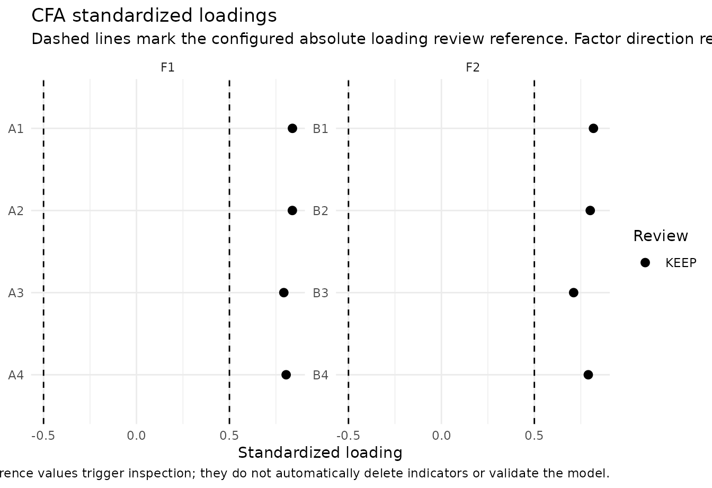
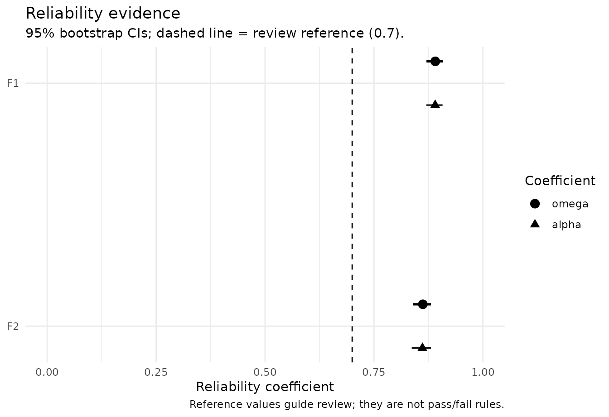
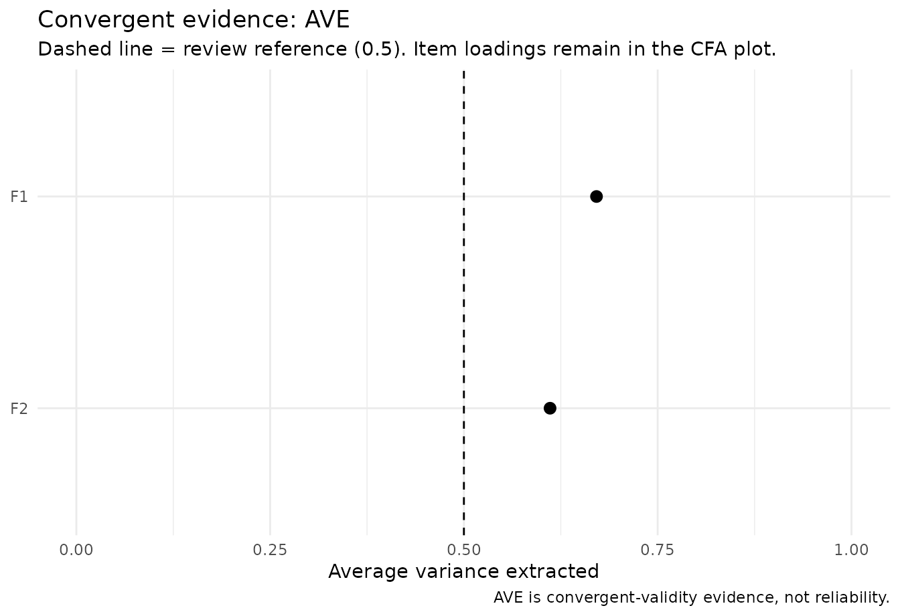
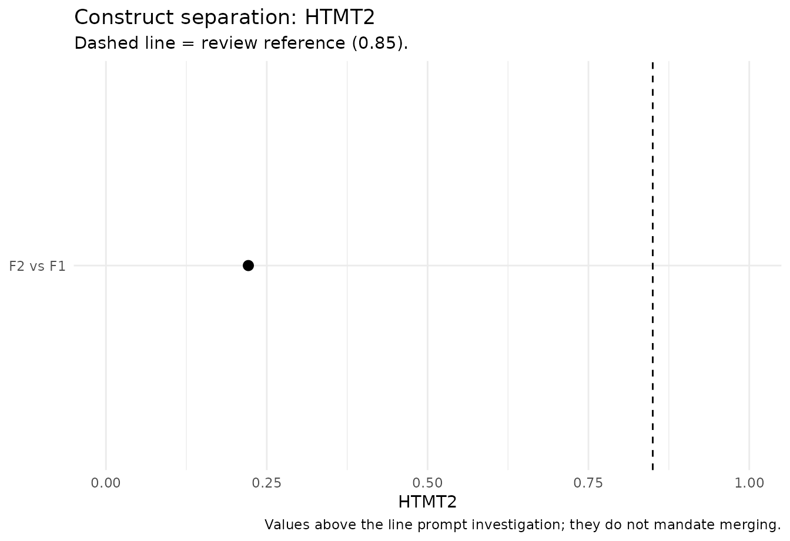
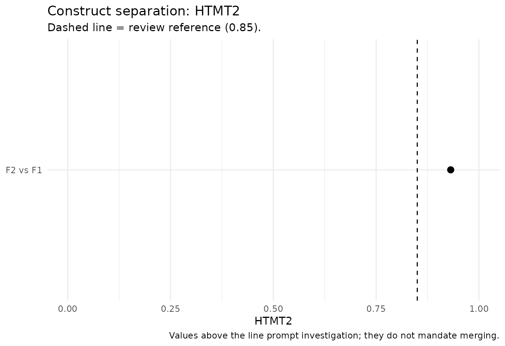

# From CFA to a defensible measurement model

## Why measurement evidence is staged

A confirmatory factor model, a reliability coefficient, and a
discriminant-validity statistic answer different questions. Treating
them as interchangeable checkboxes can produce misleading conclusions.
`nomologR` therefore keeps the workflow staged:

1.  [`nomo_cfa()`](https://juhalt.github.io/nomologR/reference/nomo_cfa.md)
    — **Does the proposed measurement structure reproduce the data
    reasonably, and where is there model strain?**
2.  [`nomo_reliability()`](https://juhalt.github.io/nomologR/reference/nomo_reliability.md)
    — **How consistently does the intended score represent its target
    under that measurement model?**
3.  [`nomo_validity()`](https://juhalt.github.io/nomologR/reference/nomo_validity.md)
    — **Do indicators converge on their intended constructs, and are
    theoretically distinct constructs empirically distinguishable?**

The sequence is evidence-guided rather than pass/fail. A reference value
can trigger inspection, but it never automatically deletes an indicator,
merges constructs, or establishes construct validity.

## A healthy two-factor model

We begin with a known two-factor population in which both factors are
well measured and moderately correlated.

``` r

set.seed(2026)
n <- 500

f1 <- rnorm(n)
f2 <- .30 * f1 + sqrt(1 - .30^2) * rnorm(n)

healthy <- data.frame(
  A1 = .82 * f1 + rnorm(n, sd = .55),
  A2 = .79 * f1 + rnorm(n, sd = .58),
  A3 = .76 * f1 + rnorm(n, sd = .62),
  A4 = .80 * f1 + rnorm(n, sd = .57),
  B1 = .83 * f2 + rnorm(n, sd = .54),
  B2 = .78 * f2 + rnorm(n, sd = .60),
  B3 = .75 * f2 + rnorm(n, sd = .63),
  B4 = .81 * f2 + rnorm(n, sd = .56)
)

model <- '
  F1 =~ A1 + A2 + A3 + A4
  F2 =~ B1 + B2 + B3 + B4
'
```

``` r

cfa <- nomo_cfa(model, data = healthy)

# Modest resampling here keeps vignette build time reasonable.
# Use more resamples for final reporting.
rel <- nomo_reliability(
  cfa,
  ci = "bootstrap",
  ci_boot = 100,
  ci_seed = 2026
)
val <- nomo_validity(cfa, htmt = "both")
```

The compact summaries are intentionally different from the raw engine
output. They surface the evidence most relevant to the user’s next
decision without repeating the same full loading table in several
places.

``` r

summary(rel)
```

    ## nomologR reliability evidence
    ## # A tibble: 2 × 7
    ##   construct block   indicator_type omega                alpha omega_scale signal
    ##   <chr>     <chr>   <chr>          <chr>                <chr> <chr>       <chr> 
    ## 1 F1        overall continuous     0.891 [0.871, 0.908] 0.89… observed_c… info  
    ## 2 F2        overall continuous     0.862 [0.840, 0.881] 0.86… observed_c… info  
    ## Bracketed values are bootstrap confidence intervals.
    ## 
    ## Interpretation rule: omega is primary for the congeneric CFA workflow; alpha is secondary and assumption-dependent. Reliability contributes score-precision evidence, not construct validity.

``` r

summary(val)
```

    ## nomologR convergent/discriminant evidence
    ## 
    ## Convergent evidence by construct
    ## # A tibble: 2 × 7
    ##   construct block     AVE min_abs_loading median_abs_loading n_loading_review
    ##   <chr>     <chr>   <dbl>           <dbl>              <dbl>            <int>
    ## 1 F1        overall 0.671           0.793              0.822                0
    ## 2 F2        overall 0.611           0.711              0.795                0
    ## # ℹ 1 more variable: signal <chr>
    ## 
    ## Construct-separation evidence
    ## # A tibble: 2 × 9
    ##   construct_1 construct_2 block   latent_r latent_r_ci_lower latent_r_ci_upper
    ##   <chr>       <chr>       <chr>      <dbl>             <dbl>             <dbl>
    ## 1 F2          F1          overall   NA                NA                NA    
    ## 2 F1          F2          overall    0.223             0.127             0.318
    ## # ℹ 3 more variables: HTMT2 <dbl>, HTMT <dbl>, signal <chr>
    ## 
    ## Interpretation rule: standardized loadings and AVE address convergent evidence; latent correlations and HTMT-family statistics address construct separation. These are complementary questions, not interchangeable pass/fail tests.

The figures also avoid duplication. Item-level loading evidence belongs
to the CFA; reliability gets a coefficient plot; convergent validity
gets an AVE plot; and construct separation gets an HTMT-family plot.

``` r

plot(cfa, type = "loadings")
```



``` r

plot(rel)
```



``` r

plot(val, type = "ave")
```



``` r

plot(val, type = "discriminant")
```



A healthy result contributes several complementary pieces of evidence.
It does not turn the measurement model into a permanently “validated”
object. Validity remains an accumulating argument tied to construct
interpretation, population, setting, and intended use.

## Good global fit does not guarantee good measurement

This is a critical teaching case. The following one-factor model is
correctly specified, but its indicators are weak measures of the latent
variable.

``` r

set.seed(2027)
n <- 650
f <- rnorm(n)

weak <- data.frame(
  W1 = .30 * f + rnorm(n, sd = .95),
  W2 = .34 * f + rnorm(n, sd = .94),
  W3 = .28 * f + rnorm(n, sd = .96),
  W4 = .32 * f + rnorm(n, sd = .95),
  W5 = .31 * f + rnorm(n, sd = .95)
)

weak_cfa <- nomo_cfa(
  'Weak =~ W1 + W2 + W3 + W4 + W5',
  data = weak
)
weak_rel <- nomo_reliability(weak_cfa)
weak_val <- nomo_validity(weak_cfa, htmt = "none")
```

``` r

weak_cfa$fit_evidence
```

    ## # A tibble: 9 × 7
    ##   metric          value variant        reference direction attention explanation
    ##   <chr>           <dbl> <chr>              <dbl> <chr>     <chr>     <chr>      
    ## 1 chi_square     2.79   chisq              NA    informat… info      Descriptiv…
    ## 2 df             5      df                 NA    informat… info      Descriptiv…
    ## 3 p_value        0.733  pvalue             NA    informat… info      Descriptiv…
    ## 4 CFI            1      cfi                 0.95 higher    info      At or abov…
    ## 5 TLI            1.08   tli                 0.95 higher    info      At or abov…
    ## 6 RMSEA          0      rmsea               0.06 lower     info      At or belo…
    ## 7 RMSEA_CI_lower 0      rmsea.ci.lower     NA    informat… info      Descriptiv…
    ## 8 RMSEA_CI_upper 0.0393 rmsea.ci.upper     NA    informat… info      Descriptiv…
    ## 9 SRMR           0.0152 srmr                0.08 lower     info      At or belo…

Because the one-factor structure is the correct covariance model, global
fit can look quite good. That does **not** imply that the items strongly
represent the construct or that the resulting score is precise.

``` r

summary(weak_rel)
```

    ## nomologR reliability evidence
    ## # A tibble: 1 × 7
    ##   construct block   indicator_type omega alpha omega_scale         signal
    ##   <chr>     <chr>   <chr>          <chr> <chr> <chr>               <chr> 
    ## 1 Weak      overall continuous     0.369 0.363 observed_continuous review
    ## 
    ## Sampling uncertainty was not bootstrapped. For report-ready intervals, rerun with `ci = "bootstrap"`.
    ## 
    ## Interpretation rule: omega is primary for the congeneric CFA workflow; alpha is secondary and assumption-dependent. Reliability contributes score-precision evidence, not construct validity.

``` r

summary(weak_val)
```

    ## nomologR convergent/discriminant evidence
    ## 
    ## Convergent evidence by construct
    ## # A tibble: 1 × 7
    ##   construct block     AVE min_abs_loading median_abs_loading n_loading_review
    ##   <chr>     <chr>   <dbl>           <dbl>              <dbl>            <int>
    ## 1 Weak      overall 0.114             0.2              0.311                5
    ## # ℹ 1 more variable: signal <chr>
    ## 
    ## Construct-separation evidence
    ## No pairwise construct-separation summary is available.
    ## 
    ## Interpretation rule: standardized loadings and AVE address convergent evidence; latent correlations and HTMT-family statistics address construct separation. These are complementary questions, not interchangeable pass/fail tests.

This is why `nomologR` does not collapse measurement quality into a
single global-fit verdict. Weak standardized loadings, low AVE, and weak
model-based reliability remain important even when CFI, RMSEA, or SRMR
look favorable.

## Strong reliability does not guarantee construct separation

The reverse problem is also possible. Two constructs can each be
measured very consistently while remaining difficult to distinguish
empirically.

``` r

set.seed(2028)
n <- 700
f1 <- rnorm(n)
f2 <- .94 * f1 + sqrt(1 - .94^2) * rnorm(n)

overlap <- data.frame(
  A1 = .86 * f1 + rnorm(n, sd = .48),
  A2 = .83 * f1 + rnorm(n, sd = .51),
  A3 = .84 * f1 + rnorm(n, sd = .50),
  B1 = .86 * f2 + rnorm(n, sd = .48),
  B2 = .83 * f2 + rnorm(n, sd = .51),
  B3 = .84 * f2 + rnorm(n, sd = .50)
)

overlap_model <- '
  F1 =~ A1 + A2 + A3
  F2 =~ B1 + B2 + B3
'

overlap_cfa <- nomo_cfa(overlap_model, data = overlap)
overlap_rel <- nomo_reliability(overlap_cfa)
overlap_val <- nomo_validity(overlap_cfa, htmt = "both")
```

``` r

summary(overlap_rel)
```

    ## nomologR reliability evidence
    ## # A tibble: 2 × 7
    ##   construct block   indicator_type omega alpha omega_scale         signal
    ##   <chr>     <chr>   <chr>          <chr> <chr> <chr>               <chr> 
    ## 1 F1        overall continuous     0.893 0.894 observed_continuous info  
    ## 2 F2        overall continuous     0.896 0.895 observed_continuous info  
    ## 
    ## Sampling uncertainty was not bootstrapped. For report-ready intervals, rerun with `ci = "bootstrap"`.
    ## 
    ## Interpretation rule: omega is primary for the congeneric CFA workflow; alpha is secondary and assumption-dependent. Reliability contributes score-precision evidence, not construct validity.

``` r

summary(overlap_val)
```

    ## nomologR convergent/discriminant evidence
    ## 
    ## Convergent evidence by construct
    ## # A tibble: 2 × 7
    ##   construct block     AVE min_abs_loading median_abs_loading n_loading_review
    ##   <chr>     <chr>   <dbl>           <dbl>              <dbl>            <int>
    ## 1 F1        overall 0.737           0.837              0.865                0
    ## 2 F2        overall 0.742           0.848              0.851                0
    ## # ℹ 1 more variable: signal <chr>
    ## 
    ## Construct-separation evidence
    ## # A tibble: 2 × 9
    ##   construct_1 construct_2 block   latent_r latent_r_ci_lower latent_r_ci_upper
    ##   <chr>       <chr>       <chr>      <dbl>             <dbl>             <dbl>
    ## 1 F2          F1          overall   NA                NA                NA    
    ## 2 F1          F2          overall    0.933             0.912             0.954
    ## # ℹ 3 more variables: HTMT2 <dbl>, HTMT <dbl>, signal <chr>
    ## 
    ## Interpretation rule: standardized loadings and AVE address convergent evidence; latent correlations and HTMT-family statistics address construct separation. These are complementary questions, not interchangeable pass/fail tests.

Here, strong omega and AVE do not erase a high latent correlation or
HTMT2 value. The package therefore recommends investigating theoretical
distinctiveness, item content, cross-construct overlap, and the intended
construct boundary. It does not automatically merge factors or delete
indicators.

``` r

plot(overlap_val, type = "discriminant")
```



## Ordered indicators: keep the score scale explicit

For ordered Likert-type indicators,
[`nomo_cfa()`](https://juhalt.github.io/nomologR/reference/nomo_cfa.md)
uses an ordered-data CFA workflow when the indicators are declared
ordered.
[`nomo_reliability()`](https://juhalt.github.io/nomologR/reference/nomo_reliability.md)
then distinguishes the observed ordinal-score reliability estimand from
the hypothetical latent-response scale.

``` r

set.seed(2029)
n <- 500
f <- rnorm(n)
z <- data.frame(
  I1 = .82 * f + rnorm(n, sd = .60),
  I2 = .79 * f + rnorm(n, sd = .62),
  I3 = .76 * f + rnorm(n, sd = .65),
  I4 = .80 * f + rnorm(n, sd = .60)
)

ordinal <- as.data.frame(lapply(z, function(x) {
  ordered(cut(x, breaks = c(-Inf, -.8, -.25, .25, .8, Inf), labels = 1:5))
}))

ordinal_cfa <- nomo_cfa(
  'F =~ I1 + I2 + I3 + I4',
  data = ordinal,
  ordered = names(ordinal)
)
ordinal_rel <- nomo_reliability(
  ordinal_cfa,
  ordinal_scale = TRUE,
  include_alpha = TRUE
)
summary(ordinal_rel)
```

    ## nomologR reliability evidence
    ## # A tibble: 1 × 7
    ##   construct block   indicator_type omega alpha omega_scale      signal
    ##   <chr>     <chr>   <chr>          <chr> <chr> <chr>            <chr> 
    ## 1 F         overall ordered        0.829 NA    observed_ordinal info  
    ## 
    ## Secondary alpha unavailable for:
    ## # A tibble: 1 × 4
    ##   construct indicator_type score_scale     
    ##   <chr>     <chr>          <chr>           
    ## 1 F         ordered        observed_ordinal
    ##   reason                                                                        
    ##   <chr>                                                                         
    ## 1 Observed-scale alpha is not computed from an ordered-indicator CFA. Current s…
    ## 
    ## Sampling uncertainty was not bootstrapped. For report-ready intervals, rerun with `ci = "bootstrap"`.
    ## 
    ## Interpretation rule: omega is primary for the congeneric CFA workflow; alpha is secondary and assumption-dependent. Reliability contributes score-precision evidence, not construct validity.

Observed-scale omega is available for the practical ordinal composite.
Observed-scale alpha is deliberately reported as unavailable in this
ordered-CFA estimand rather than silently replacing it with a different
definition. The point is not to maximize the number of coefficients
reported; it is to keep the score and estimand clear.

## Reading the evidence as an argument

A useful measurement conclusion is rarely “all cutoffs passed.” A
stronger conclusion identifies what each analysis contributes and what
remains uncertain. The workflow is therefore designed around four
questions:

- **Structure:** Is the hypothesized factor model a reasonable
  representation of the data?
- **Precision:** Is the intended score sufficiently reliable for its
  use, conditional on that model?
- **Convergence:** Do indicators substantially represent the intended
  construct?
- **Separation:** Are constructs that theory distinguishes also
  distinguishable empirically?

The resulting decision logs preserve observations, references,
recommendations, and researcher decisions without automatically changing
the scale or model.

## Research basis

The reliability workflow follows the literature recommending model-based
omega for congeneric measurement and cautioning against mechanical use
of coefficient alpha, including Dunn, Baguley, and Brunsden (2014),
Flora (2020), and Bell, Chalmers, and Flora (2024). Ordered-score
reliability follows the distinction emphasized by Green and Yang (2009)
and implemented in `semTools`.

The validity workflow treats AVE as convergent evidence rather than
reliability, following Fornell and Larcker (1981). For construct
separation, HTMT-family evidence is prioritized because simulation
research shows that older criteria can miss overlap (Henseler, Ringle, &
Sarstedt, 2015). HTMT2 is emphasized for congeneric measurement because
it relaxes the original HTMT tau-equivalence assumption (Roemer,
Schuberth, & Henseler, 2021). Fornell-Larcker output remains available
only as optional historical/ supporting information.
