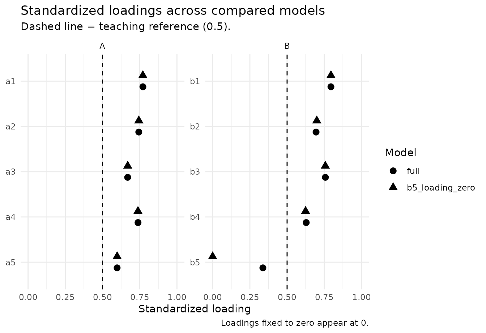

# From CFA to a defensible measurement model

## Why measurement evidence is staged

A confirmatory factor model, a reliability coefficient, and a
discriminant-validity statistic answer different questions. Treating
them as interchangeable checkboxes can produce misleading conclusions.
`nomologR` therefore keeps the workflow staged:

1.  [`nomo_cfa()`](https://juhalt.github.io/nomologR/reference/nomo_cfa.md)
    — **Does the proposed measurement structure reproduce the data
    reasonably, and where is there model strain?**
2.  [`nomo_reliability()`](https://juhalt.github.io/nomologR/reference/nomo_reliability.md)
    — **How consistently does the intended score represent its target
    under that measurement model?**
3.  [`nomo_validity()`](https://juhalt.github.io/nomologR/reference/nomo_validity.md)
    — **Do indicators converge on their intended constructs, and are
    theoretically distinct constructs empirically distinguishable?**

The sequence is evidence-guided rather than pass/fail. A reference value
can trigger inspection, but it never automatically deletes an indicator,
merges constructs, or establishes construct validity.

## A healthy two-factor model

We begin with a known two-factor population in which both factors are
well measured and moderately correlated.

``` r

set.seed(2026)
n <- 500

f1 <- rnorm(n)
f2 <- .30 * f1 + sqrt(1 - .30^2) * rnorm(n)

healthy <- data.frame(
  A1 = .82 * f1 + rnorm(n, sd = .55),
  A2 = .79 * f1 + rnorm(n, sd = .58),
  A3 = .76 * f1 + rnorm(n, sd = .62),
  A4 = .80 * f1 + rnorm(n, sd = .57),
  B1 = .83 * f2 + rnorm(n, sd = .54),
  B2 = .78 * f2 + rnorm(n, sd = .60),
  B3 = .75 * f2 + rnorm(n, sd = .63),
  B4 = .81 * f2 + rnorm(n, sd = .56)
)

model <- '
  F1 =~ A1 + A2 + A3 + A4
  F2 =~ B1 + B2 + B3 + B4
'
```

``` r

cfa <- nomo_cfa(model, data = healthy)

# Modest resampling here keeps vignette build time reasonable.
# Use more resamples for final reporting.
rel <- nomo_reliability(
  cfa,
  ci = "bootstrap",
  ci_boot = 100,
  ci_seed = 2026
)
val <- nomo_validity(cfa, htmt = "both")
```

The compact summaries are intentionally different from the raw engine
output. They surface the evidence most relevant to the user’s next
decision without repeating the same full loading table in several
places.

``` r

summary(rel)
```

    ## nomologR reliability evidence
    ## # A tibble: 2 × 7
    ##   construct block   indicator_type omega                alpha omega_scale signal
    ##   <chr>     <chr>   <chr>          <chr>                <chr> <chr>       <chr> 
    ## 1 F1        overall continuous     0.891 [0.871, 0.908] 0.89… observed_c… info  
    ## 2 F2        overall continuous     0.862 [0.840, 0.881] 0.86… observed_c… info  
    ## Bracketed values are bootstrap confidence intervals.
    ## 
    ## Interpretation rule: omega is primary for the congeneric CFA workflow; alpha is secondary and assumption-dependent. Reliability contributes score-precision evidence, not construct validity.

``` r

summary(val)
```

    ## nomologR convergent/discriminant evidence
    ## 
    ## Convergent evidence by construct
    ## # A tibble: 2 × 7
    ##   construct block     AVE min_abs_loading median_abs_loading n_loading_review
    ##   <chr>     <chr>   <dbl>           <dbl>              <dbl>            <int>
    ## 1 F1        overall 0.671           0.793              0.822                0
    ## 2 F2        overall 0.611           0.711              0.795                0
    ## # ℹ 1 more variable: signal <chr>
    ## 
    ## Construct-separation evidence
    ## # A tibble: 2 × 9
    ##   construct_1 construct_2 block   latent_r latent_r_ci_lower latent_r_ci_upper
    ##   <chr>       <chr>       <chr>      <dbl>             <dbl>             <dbl>
    ## 1 F2          F1          overall   NA                NA                NA    
    ## 2 F1          F2          overall    0.223             0.127             0.318
    ## # ℹ 3 more variables: HTMT2 <dbl>, HTMT <dbl>, signal <chr>
    ## 
    ## Interpretation rule: standardized loadings and AVE address convergent evidence; latent correlations and HTMT-family statistics address construct separation. These are complementary questions, not interchangeable pass/fail tests.

The figures also avoid duplication. Item-level loading evidence belongs
to the CFA; reliability gets a coefficient plot; convergent validity
gets an AVE plot; and construct separation gets an HTMT-family plot.

``` r

plot(cfa, type = "loadings")
```


``` r

plot(rel)
```


``` r

plot(val, type = "ave")
```


``` r

plot(val, type = "discriminant")
```


A healthy result contributes several complementary pieces of evidence.
It does not turn the measurement model into a permanently “validated”
object. Validity remains an accumulating argument tied to construct
interpretation, population, setting, and intended use.

## Good global fit does not guarantee good measurement

This is a critical teaching case. The following one-factor model is
correctly specified, but its indicators are weak measures of the latent
variable.

``` r

set.seed(2027)
n <- 650
f <- rnorm(n)

weak <- data.frame(
  W1 = .30 * f + rnorm(n, sd = .95),
  W2 = .34 * f + rnorm(n, sd = .94),
  W3 = .28 * f + rnorm(n, sd = .96),
  W4 = .32 * f + rnorm(n, sd = .95),
  W5 = .31 * f + rnorm(n, sd = .95)
)

weak_cfa <- nomo_cfa(
  'Weak =~ W1 + W2 + W3 + W4 + W5',
  data = weak
)
weak_rel <- nomo_reliability(weak_cfa)
weak_val <- nomo_validity(weak_cfa, htmt = "none")
```

``` r

weak_cfa$fit_evidence
```

    ## # A tibble: 9 × 7
    ##   metric          value variant        reference direction attention explanation
    ##   <chr>           <dbl> <chr>              <dbl> <chr>     <chr>     <chr>      
    ## 1 chi_square     2.79   chisq              NA    informat… info      Descriptiv…
    ## 2 df             5      df                 NA    informat… info      Descriptiv…
    ## 3 p_value        0.733  pvalue             NA    informat… info      Descriptiv…
    ## 4 CFI            1      cfi                 0.95 higher    info      At or abov…
    ## 5 TLI            1.08   tli                 0.95 higher    info      At or abov…
    ## 6 RMSEA          0      rmsea               0.06 lower     info      At or belo…
    ## 7 RMSEA_CI_lower 0      rmsea.ci.lower     NA    informat… info      Descriptiv…
    ## 8 RMSEA_CI_upper 0.0393 rmsea.ci.upper     NA    informat… info      Descriptiv…
    ## 9 SRMR           0.0152 srmr                0.08 lower     info      At or belo…

Because the one-factor structure is the correct covariance model, global
fit can look quite good. That does **not** imply that the items strongly
represent the construct or that the resulting score is precise.

``` r

summary(weak_rel)
```

    ## nomologR reliability evidence
    ## # A tibble: 1 × 7
    ##   construct block   indicator_type omega alpha omega_scale         signal
    ##   <chr>     <chr>   <chr>          <chr> <chr> <chr>               <chr> 
    ## 1 Weak      overall continuous     0.369 0.363 observed_continuous review
    ## 
    ## Sampling uncertainty was not bootstrapped. For report-ready intervals, rerun with `ci = "bootstrap"`.
    ## 
    ## Interpretation rule: omega is primary for the congeneric CFA workflow; alpha is secondary and assumption-dependent. Reliability contributes score-precision evidence, not construct validity.

``` r

summary(weak_val)
```

    ## nomologR convergent/discriminant evidence
    ## 
    ## Convergent evidence by construct
    ## # A tibble: 1 × 7
    ##   construct block     AVE min_abs_loading median_abs_loading n_loading_review
    ##   <chr>     <chr>   <dbl>           <dbl>              <dbl>            <int>
    ## 1 Weak      overall 0.114             0.2              0.311                5
    ## # ℹ 1 more variable: signal <chr>
    ## 
    ## Construct-separation evidence
    ## No pairwise construct-separation summary is available.
    ## 
    ## Interpretation rule: standardized loadings and AVE address convergent evidence; latent correlations and HTMT-family statistics address construct separation. These are complementary questions, not interchangeable pass/fail tests.

This is why `nomologR` does not collapse measurement quality into a
single global-fit verdict. Weak standardized loadings, low AVE, and weak
model-based reliability remain important even when CFI, RMSEA, or SRMR
look favorable.

## Strong reliability does not guarantee construct separation

The reverse problem is also possible. Two constructs can each be
measured very consistently while remaining difficult to distinguish
empirically.

``` r

set.seed(2028)
n <- 700
f1 <- rnorm(n)
f2 <- .94 * f1 + sqrt(1 - .94^2) * rnorm(n)

overlap <- data.frame(
  A1 = .86 * f1 + rnorm(n, sd = .48),
  A2 = .83 * f1 + rnorm(n, sd = .51),
  A3 = .84 * f1 + rnorm(n, sd = .50),
  B1 = .86 * f2 + rnorm(n, sd = .48),
  B2 = .83 * f2 + rnorm(n, sd = .51),
  B3 = .84 * f2 + rnorm(n, sd = .50)
)

overlap_model <- '
  F1 =~ A1 + A2 + A3
  F2 =~ B1 + B2 + B3
'

overlap_cfa <- nomo_cfa(overlap_model, data = overlap)
overlap_rel <- nomo_reliability(overlap_cfa)
overlap_val <- nomo_validity(overlap_cfa, htmt = "both")
```

``` r

summary(overlap_rel)
```

    ## nomologR reliability evidence
    ## # A tibble: 2 × 7
    ##   construct block   indicator_type omega alpha omega_scale         signal
    ##   <chr>     <chr>   <chr>          <chr> <chr> <chr>               <chr> 
    ## 1 F1        overall continuous     0.893 0.894 observed_continuous info  
    ## 2 F2        overall continuous     0.896 0.895 observed_continuous info  
    ## 
    ## Sampling uncertainty was not bootstrapped. For report-ready intervals, rerun with `ci = "bootstrap"`.
    ## 
    ## Interpretation rule: omega is primary for the congeneric CFA workflow; alpha is secondary and assumption-dependent. Reliability contributes score-precision evidence, not construct validity.

``` r

summary(overlap_val)
```

    ## nomologR convergent/discriminant evidence
    ## 
    ## Convergent evidence by construct
    ## # A tibble: 2 × 7
    ##   construct block     AVE min_abs_loading median_abs_loading n_loading_review
    ##   <chr>     <chr>   <dbl>           <dbl>              <dbl>            <int>
    ## 1 F1        overall 0.737           0.837              0.865                0
    ## 2 F2        overall 0.742           0.848              0.851                0
    ## # ℹ 1 more variable: signal <chr>
    ## 
    ## Construct-separation evidence
    ## # A tibble: 2 × 9
    ##   construct_1 construct_2 block   latent_r latent_r_ci_lower latent_r_ci_upper
    ##   <chr>       <chr>       <chr>      <dbl>             <dbl>             <dbl>
    ## 1 F2          F1          overall   NA                NA                NA    
    ## 2 F1          F2          overall    0.933             0.912             0.954
    ## # ℹ 3 more variables: HTMT2 <dbl>, HTMT <dbl>, signal <chr>
    ## 
    ## Interpretation rule: standardized loadings and AVE address convergent evidence; latent correlations and HTMT-family statistics address construct separation. These are complementary questions, not interchangeable pass/fail tests.

Here, strong omega and AVE do not erase a high latent correlation or
HTMT2 value. The package therefore recommends investigating theoretical
distinctiveness, item content, cross-construct overlap, and the intended
construct boundary. It does not automatically merge factors or delete
indicators.

``` r

plot(overlap_val, type = "discriminant")
```


## Ordered indicators: keep the score scale explicit

For ordered Likert-type indicators,
[`nomo_cfa()`](https://juhalt.github.io/nomologR/reference/nomo_cfa.md)
uses an ordered-data CFA workflow when the indicators are declared
ordered.
[`nomo_reliability()`](https://juhalt.github.io/nomologR/reference/nomo_reliability.md)
then distinguishes the observed ordinal-score reliability estimand from
the hypothetical latent-response scale.

``` r

set.seed(2029)
n <- 500
f <- rnorm(n)
z <- data.frame(
  I1 = .82 * f + rnorm(n, sd = .60),
  I2 = .79 * f + rnorm(n, sd = .62),
  I3 = .76 * f + rnorm(n, sd = .65),
  I4 = .80 * f + rnorm(n, sd = .60)
)

ordinal <- as.data.frame(lapply(z, function(x) {
  ordered(cut(x, breaks = c(-Inf, -.8, -.25, .25, .8, Inf), labels = 1:5))
}))

ordinal_cfa <- nomo_cfa(
  'F =~ I1 + I2 + I3 + I4',
  data = ordinal,
  ordered = names(ordinal)
)
ordinal_rel <- nomo_reliability(
  ordinal_cfa,
  ordinal_scale = TRUE,
  include_alpha = TRUE
)
summary(ordinal_rel)
```

    ## nomologR reliability evidence
    ## # A tibble: 1 × 7
    ##   construct block   indicator_type omega alpha omega_scale      signal
    ##   <chr>     <chr>   <chr>          <chr> <chr> <chr>            <chr> 
    ## 1 F         overall ordered        0.829 NA    observed_ordinal info  
    ## 
    ## Secondary alpha unavailable for:
    ## # A tibble: 1 × 4
    ##   construct indicator_type score_scale     
    ##   <chr>     <chr>          <chr>           
    ## 1 F         ordered        observed_ordinal
    ##   reason                                                                        
    ##   <chr>                                                                         
    ## 1 Observed-scale alpha is not computed from an ordered-indicator CFA. Current s…
    ## 
    ## Sampling uncertainty was not bootstrapped. For report-ready intervals, rerun with `ci = "bootstrap"`.
    ## 
    ## Interpretation rule: omega is primary for the congeneric CFA workflow; alpha is secondary and assumption-dependent. Reliability contributes score-precision evidence, not construct validity.

Observed-scale omega is available for the practical ordinal composite.
Observed-scale alpha is deliberately reported as unavailable in this
ordered-CFA estimand rather than silently replacing it with a different
definition. The point is not to maximize the number of coefficients
reported; it is to keep the score and estimand clear.

## Continuing the exploratory example

The [exploratory
walkthrough](https://juhalt.github.io/nomologR/articles/exploratory-workflow.md)
flagged a cross-loading item (`a5`) and a weak item (`b5`) in
`nomo_demo_continuous`. Suppose the researcher prespecifies the intended
two-factor simple structure with all ten items and fits it as a CFA:

``` r

demo_model <- nomo_model(list(
  A = c("a1", "a2", "a3", "a4", "a5"),
  B = c("b1", "b2", "b3", "b4", "b5")
))

demo_cfa <- nomo_cfa(demo_model, data = nomo_demo_continuous)
demo_cfa$fit_evidence
```

    ## # A tibble: 9 × 7
    ##   metric              value variant    reference direction attention explanation
    ##   <chr>               <dbl> <chr>          <dbl> <chr>     <chr>     <chr>      
    ## 1 chi_square     75.8       chisq          NA    informat… info      Descriptiv…
    ## 2 df             34         df             NA    informat… info      Descriptiv…
    ## 3 p_value         0.0000500 pvalue         NA    informat… info      Descriptiv…
    ## 4 CFI             0.973     cfi             0.95 higher    info      At or abov…
    ## 5 TLI             0.965     tli             0.95 higher    info      At or abov…
    ## 6 RMSEA           0.0510    rmsea           0.06 lower     info      At or belo…
    ## 7 RMSEA_CI_lower  0.0356    rmsea.ci.…     NA    informat… info      Descriptiv…
    ## 8 RMSEA_CI_upper  0.0665    rmsea.ci.…     NA    informat… info      Descriptiv…
    ## 9 SRMR            0.0519    srmr            0.08 lower     info      At or belo…

``` r

head(demo_cfa$top_modification_indices, 5)
```

    ## # A tibble: 5 × 8
    ##   lhs   op    rhs      mi     epc sepc.lv sepc.all sepc.nox
    ##   <chr> <chr> <chr> <dbl>   <dbl>   <dbl>    <dbl>    <dbl>
    ## 1 B     =~    a5    48.3   0.488   0.377     0.365    0.365
    ## 2 B     =~    a1     9.41 -0.183  -0.141    -0.145   -0.145
    ## 3 a5    ~~    b3     7.57  0.0812  0.0812    0.150    0.150
    ## 4 a5    ~~    b1     4.78  0.0610  0.0610    0.125    0.125
    ## 5 a3    ~~    a4     4.64  0.0732  0.0732    0.133    0.133

Three lessons carry over from the exploratory stage:

- **Modification indices are quarantined.** The largest index points
  toward the cross-loading that the data-generating model contains, but
  `nomologR` does not add it. Allowing a cross-loading, revising the
  item, or evaluating a model without it is a theoretical decision;
  freeing parameters because an index is large is capitalization on
  chance (MacCallum, Roznowski, & Necowitz, 1992).
- **The same sample is not independent confirmation.** This CFA uses the
  data that suggested the structure.
  [`nomo_split()`](https://juhalt.github.io/nomologR/reference/nomo_split.md)
  or a new sample provides a stronger test.
- **Missing data are handled explicitly.** By default lavaan uses
  complete cases here; `missing = "fiml"` requests full-information
  maximum likelihood for continuous indicators, and the decision is
  recorded. Whether the results depend on that choice is a separate
  question, taken up
  [below](#does-a-result-depend-on-how-missing-data-were-handled).

## Comparing models with a recorded rationale

[`nomo_compare()`](https://juhalt.github.io/nomologR/reference/nomo_compare.md)
evaluates competing measurement models side by side. It requires a
rationale, checks whether the models are nested, reports the difference
test that matches the estimator when they are, and never selects a model
automatically.

### A cross-loading suggested by the results

The largest modification index above pointed to a loading of `a5` on
factor B. Because that idea came from the results rather than from
theory stated in advance, the comparison is labeled post hoc:

``` r

cross_cfa <- nomo_cfa(
  "A =~ a1 + a2 + a3 + a4 + a5\nB =~ b1 + b2 + b3 + b4 + b5 + a5",
  data = nomo_demo_continuous
)

cross_comparison <- nomo_compare(
  simple_structure = demo_cfa,
  cross_loading = cross_cfa,
  rationale = "The largest modification index suggested that a5 also reflects factor B.",
  origin = "post_hoc"
)
cross_comparison
```

    ## <nomo_compare>
    ## Models: 2 | Reference: simple_structure | Estimator: ML | Cases: 473 | Origin: post-hoc
    ## Rationale: The largest modification index suggested that a5 also reflects factor B.
    ## 
    ## Compared with `simple_structure`:
    ##   - cross_loading (nested, less constrained): chi-square difference = 48.72, df = 1, p < .001; dCFI +0.027, dRMSEA -0.051; dAIC -46.7
    ## 
    ## No model was selected automatically. Use summary() for interpretations and measurement evidence.

Estimating the cross-loading reduces misfit (chi-square difference =
48.7, df = 1, p \< .001; CFI changes by +0.027). That is exactly the
feature built into these simulated data, but with real data the evidence
alone does not settle the question. Does the wording of `a5` plausibly
reflect both constructs? Because the comparison is post hoc, the
decision log records it as such and recommends confirming the retained
model in independent data.

### Is a weak item needed?

`b5` loads weakly on B. Dropping `b5` from the model changes the data
being modeled, so a model without the column cannot be tested against
the full model. Instead, keep `b5` and fix its loading to zero:

``` r

b5_zero_cfa <- nomo_cfa(
  "A =~ a1 + a2 + a3 + a4 + a5\nB =~ b1 + b2 + b3 + b4 + 0*b5",
  data = nomo_demo_continuous
)

b5_comparison <- nomo_compare(
  full = demo_cfa,
  b5_loading_zero = b5_zero_cfa,
  rationale = paste(
    "Evaluate whether the weakly loading item b5 contributes to factor B",
    "before deciding whether to keep it."
  )
)
summary(b5_comparison)
```

    ## nomologR measurement-model comparison
    ## Rationale: Evaluate whether the weakly loading item b5 contributes to factor B before deciding whether to keep it.
    ## Origin: a-priori | Reference model: full
    ## 
    ## Model fit and information criteria
    ## # A tibble: 2 × 11
    ##   model            npar    df chisq   cfi   tli rmsea  srmr    aic    bic
    ##   <chr>           <dbl> <dbl> <dbl> <dbl> <dbl> <dbl> <dbl>  <dbl>  <dbl>
    ## 1 full               21    34  75.8 0.973 0.965 0.051 0.052 11981  12068.
    ## 2 b5_loading_zero    20    35 123.  0.944 0.928 0.073 0.093 12026. 12109.
    ##   fixed_zero_loadings
    ##                 <int>
    ## 1                   0
    ## 2                   1
    ## 
    ## Comparisons with the reference model
    ## # A tibble: 1 × 12
    ##   model           relation         nesting_check method   chisq_diff df_diff
    ##   <chr>           <chr>            <chr>         <chr>         <dbl>   <dbl>
    ## 1 b5_loading_zero more_constrained nested        standard       46.9       1
    ##   p_value delta_cfi delta_rmsea delta_srmr delta_aic delta_bic
    ##     <dbl>     <dbl>       <dbl>      <dbl>     <dbl>     <dbl>
    ## 1       0    -0.029       0.022      0.042      44.9      40.8
    ## 
    ## Interpretation
    ## - `b5_loading_zero` is nested within `full` and has 1 more degree(s) of freedom (additional constraints). Chi-Squared Difference Test: chi-square difference = 46.91, df = 1, p < .001. A small p-value indicates that the extra constraints are not fully consistent with the data; with large samples, even small misspecifications produce small p-values. Change in fit (`b5_loading_zero` minus `full`): CFI -0.029, TLI -0.036, RMSEA +0.022, SRMR +0.042. AIC +44.9 and BIC +40.8 (`b5_loading_zero` minus `full`); lower values favor a model for these data, and only differences are interpretable. No model is selected automatically; read this evidence with theory and the recorded rationale.
    ## 
    ## Standardized loadings by model
    ## # A tibble: 10 × 4
    ##    factor item   full b5_loading_zero
    ##    <chr>  <chr> <dbl>           <dbl>
    ##  1 A      a1    0.771           0.771
    ##  2 A      a2    0.744           0.744
    ##  3 A      a3    0.669           0.669
    ##  4 A      a4    0.738           0.738
    ##  5 A      a5    0.598           0.598
    ##  6 B      b1    0.794           0.795
    ##  7 B      b2    0.695           0.699
    ##  8 B      b3    0.757           0.757
    ##  9 B      b4    0.628           0.624
    ## 10 B      b5    0.337           0    
    ## 
    ## Measurement evidence by model
    ## # A tibble: 14 × 4
    ##    model           construct metric estimate
    ##    <chr>           <chr>     <chr>     <dbl>
    ##  1 full            A         omega     0.835
    ##  2 full            B         omega     0.784
    ##  3 full            A         alpha     0.827
    ##  4 full            B         alpha     0.771
    ##  5 full            A         AVE       0.497
    ##  6 full            B         AVE       0.434
    ##  7 full            B vs A    HTMT2     0.533
    ##  8 b5_loading_zero A         omega     0.835
    ##  9 b5_loading_zero B         omega     0.622
    ## 10 b5_loading_zero A         alpha     0.827
    ## 11 b5_loading_zero B         alpha     0.771
    ## 12 b5_loading_zero A         AVE       0.497
    ## 13 b5_loading_zero B         AVE       0.521
    ## 14 b5_loading_zero B vs A    HTMT2     0.533
    ## Notes:
    ## - Loading(s) fixed to zero for b5 keep those item(s) in this composite; the coefficient does not describe a shortened scale.
    ## 
    ## No model was selected automatically. Difference tests, changes in fit, information criteria, and measurement evidence answer different questions; read them together with theory and the recorded rationale.

Fixing the loading to zero worsens fit (chi-square difference = 46.9, df
= 1, p \< .001), so `b5` is statistically related to B. Its standardized
loading, however, is only 0.34. With 473 cases, even a weak relation is
detectable; statistical detectability is not the same as an adequate
indicator. The decision still depends on whether `b5` covers content the
construct needs.

``` r

plot(b5_comparison, type = "loadings")
```



The summary’s measurement evidence carries a note: omega for B in the
zero-loading model still includes `b5` in the composite, so it does not
describe a shortened four-item scale. To see that scale’s reliability,
fit the model without `b5`. Because the two models contain different
observed variables,
[`nomo_compare()`](https://juhalt.github.io/nomologR/reference/nomo_compare.md)
reports this comparison descriptively, without a difference test or
information criteria:

``` r

shortened_cfa <- nomo_cfa(
  "A =~ a1 + a2 + a3 + a4 + a5\nB =~ b1 + b2 + b3 + b4",
  data = nomo_demo_continuous
)

shortened <- nomo_compare(
  full = demo_cfa,
  four_item_b = shortened_cfa,
  rationale = "Describe the reliability of a four-item B scale alongside the full scale."
)

nomo_table(shortened, "comparisons")[, c("model", "relation", "test_available", "ic_available")]
```

    ## # A tibble: 1 × 4
    ##   model       relation            test_available ic_available
    ##   <chr>       <chr>               <lgl>          <lgl>       
    ## 1 four_item_b different_variables FALSE          FALSE

``` r

omega_rows <- nomo_table(shortened, "evidence")
omega_rows[omega_rows$metric == "omega", c("model", "construct", "estimate")]
```

    ## # A tibble: 4 × 3
    ##   model       construct estimate
    ##   <chr>       <chr>        <dbl>
    ## 1 full        A            0.835
    ## 2 full        B            0.784
    ## 3 four_item_b A            0.835
    ## 4 four_item_b B            0.812

Together these results separate three questions that are easy to blur:
whether an item is statistically related to its factor, whether it is a
strong indicator, and how the score’s reliability changes without it.
None of them alone decides whether the item stays.

## Does a result depend on how missing data were handled?

`demo_cfa` used lavaan’s default, listwise deletion, which analyses only
the cases observed on every item.
[`nomo_missing()`](https://juhalt.github.io/nomologR/reference/nomo_missing.md)
refits the same model under alternative strategies and reports what
changes. For continuous indicators it compares listwise deletion with
full-information maximum likelihood (FIML), which uses every observed
response:

``` r

demo_missing <- nomo_missing(demo_cfa, data = nomo_demo_continuous)
demo_missing
```

    ## <nomo_missing>
    ## Missing-data sensitivity for a nomo_cfa | reference: FIML | fitted with: Listwise deletion
    ## 27 of 500 cases incomplete (5.4%) in 3 pattern(s); lowest covariance coverage 0.946 (a2, b3)
    ## 
    ## Strategies
    ## # A tibble: 2 × 8
    ##   label             lavaan_missing requires role       available n_used
    ##   <chr>             <chr>          <chr>    <chr>      <lgl>      <dbl>
    ## 1 Listwise deletion listwise       MCAR     comparison TRUE         473
    ## 2 FIML              ml             MAR      reference  TRUE         500
    ##   converged admissible
    ##   <lgl>     <lgl>     
    ## 1 TRUE      TRUE      
    ## 2 TRUE      TRUE      
    ## 
    ## Largest differences from the reference, in reference standard errors
    ## # A tibble: 5 × 5
    ##   parameter strategy          estimate reference difference_in_se
    ##   <chr>     <chr>                <dbl>     <dbl>            <dbl>
    ## 1 A ~~ B    Listwise deletion    0.499     0.48              0.45
    ## 2 B =~ b5   Listwise deletion    0.337     0.353            -0.37
    ## 3 A =~ a5   Listwise deletion    0.598     0.59              0.23
    ## 4 A =~ a3   Listwise deletion    0.669     0.675            -0.21
    ## 5 B =~ b3   Listwise deletion    0.757     0.762            -0.17
    ## 
    ## Whether data are missing at random cannot be tested from these data; see nomo_table(x, "decision_log").

The two strategies make different assumptions. Listwise deletion
requires data missing completely at random (MCAR). FIML requires the
weaker condition that data are missing at random (MAR), meaning that
whether a value is missing may depend on other observed values but not
on the missing value itself. In Enders and Bandalos’s (2001)
simulations, all of these methods were unbiased under MCAR, and FIML was
the most efficient. Under MAR, FIML alone remained unbiased across the
parameters they examined.

The missing values in `nomo_demo_continuous` were introduced completely
at random, so theory predicts agreement, and that is what the comparison
shows. Listwise deletion discards 27 cases. No estimate moves by as much
as half a standard error. That is the size Schafer and Graham (2002)
treat as practically important for bias, because beyond it confidence
intervals noticeably lose coverage. Reliability barely moves either:

``` r

nomo_table(demo_missing, "reliability")
```

    ## # A tibble: 8 × 8
    ##   construct block   metric strategy role  estimate reference_estimate difference
    ##   <chr>     <chr>   <chr>  <chr>    <chr>    <dbl>              <dbl>      <dbl>
    ## 1 A         overall omega  listwise comp…    0.835              0.835  -0.000589
    ## 2 A         overall omega  ml       refe…    0.835              0.835  NA       
    ## 3 B         overall omega  listwise comp…    0.784              0.785  -0.00151 
    ## 4 B         overall omega  ml       refe…    0.785              0.785  NA       
    ## 5 A         overall alpha  listwise comp…    0.827              0.828  -0.000358
    ## 6 A         overall alpha  ml       refe…    0.828              0.828  NA       
    ## 7 B         overall alpha  listwise comp…    0.771              0.775  -0.00328 
    ## 8 B         overall alpha  ml       refe…    0.775              0.775  NA

### When the strategies disagree

Differences appear when data are missing at random but not completely at
random. In this simulation the population factor correlation is .50.
Most cases with high scores on factor A are missing every B item, so
whether B is missing depends on the observed A items:

``` r

set.seed(32)
n <- 4000
f <- matrix(rnorm(n * 2), n, 2) %*% chol(matrix(c(1, .5, .5, 1), 2))
items <- cbind(
  f[, 1] %o% rep(.7, 4) + matrix(rnorm(n * 4, sd = sqrt(1 - .7^2)), n),
  f[, 2] %o% rep(.7, 4) + matrix(rnorm(n * 4, sd = sqrt(1 - .7^2)), n)
)
mar_data <- as.data.frame(items)
names(mar_data) <- c(paste0("a", 1:4), paste0("b", 1:4))

high_a <- rowMeans(mar_data[, paste0("a", 1:4)]) > 0
drop <- high_a & runif(n) < .90
mar_data[drop, paste0("b", 1:4)] <- NA

mar_model <- "A =~ a1 + a2 + a3 + a4\nB =~ b1 + b2 + b3 + b4"
mar_missing <- nomo_missing(
  nomo_cfa(mar_model, data = mar_data),
  data = mar_data,
  reliability = FALSE
)

mar_estimates <- nomo_table(mar_missing, "estimates")
mar_estimates[mar_estimates$type == "factor_correlation",
              c("strategy", "estimate", "se", "difference_in_se")]
```

    ## # A tibble: 2 × 4
    ##   strategy estimate     se difference_in_se
    ##   <chr>       <dbl>  <dbl>            <dbl>
    ## 1 listwise    0.411 0.0264            -2.01
    ## 2 ml          0.467 0.0280            NA

FIML’s estimate, 0.467, is 1.2 of its standard errors from the
population value, within sampling error. Listwise deletion’s, 0.411, is
3.4 standard errors below it. The complete cases under-represent high
scorers on A, and that restricted range attenuates the correlation. The
decision log flags the difference and says what it can and cannot mean:

``` r

mar_log <- nomo_table(mar_missing, "decision_log")
mar_log$recommendation[mar_log$metric == "estimate_difference"]
```

    ## [1] "If the data are MAR and the model is correct, FIML is consistent and this difference estimates the bias listwise deletion introduces; Schafer and Graham (2002) treat a bias of this size as practically important. Listwise deletion analyses 1789 fewer cases than the fullest strategy (44.7%), and the more cases a strategy discards, the larger the differences that sampling variability alone produces. Report which strategy the results rest on and why."

The flag carries two qualifications:

- The difference estimates listwise deletion’s bias only if the data are
  MAR and the model is correct, because only then is FIML consistent.
- The two strategies analyze different cases, so part of any difference
  is sampling variability. The more cases listwise deletion discards,
  the larger that part becomes.

### What the comparison cannot tell you

Whether data are MAR cannot, in general, be tested from the data at hand
(Schafer & Graham, 2002). Agreement between strategies therefore shows
only that a result does not depend on the choice between them. It does
not show that either strategy is unbiased: when data are missing not at
random, neither is guaranteed to be. The strategy belongs in the
analysis plan, decided in advance, and
[`nomo_missing()`](https://juhalt.github.io/nomologR/reference/nomo_missing.md)
reports how much the results depend on it.

For ordered indicators estimated with WLSMV, lavaan does not offer FIML,
so
[`nomo_missing()`](https://juhalt.github.io/nomologR/reference/nomo_missing.md)
compares listwise with pairwise deletion. Both require MCAR, so a
difference between them shows that the result depends on the choice, but
it cannot be attributed to either strategy.

Mean substitution is not offered. Replacing each missing value with the
item mean shrinks variances and distorts covariances. Schafer and Graham
(2002) show that even under MCAR it narrows confidence intervals: with a
quarter of values missing, a nominal 95% interval for a mean covers the
true value only about 86% of the time. Multiple imputation, which
Schafer and Graham recommend alongside maximum likelihood, is a
candidate for a later release.

## Reading the evidence as an argument

A useful measurement conclusion is rarely “all cutoffs passed.” A
stronger conclusion identifies what each analysis contributes and what
remains uncertain. The workflow is therefore designed around four
questions:

- **Structure:** Is the hypothesized factor model a reasonable
  representation of the data?
- **Precision:** Is the intended score sufficiently reliable for its
  use, conditional on that model?
- **Convergence:** Do indicators substantially represent the intended
  construct?
- **Separation:** Are constructs that theory distinguishes also
  distinguishable empirically?

The resulting decision logs preserve observations, references,
recommendations, and researcher decisions without automatically changing
the scale or model.

## Research basis

The reliability workflow follows the literature recommending model-based
omega for congeneric measurement and cautioning against mechanical use
of coefficient alpha, including Dunn, Baguley, and Brunsden (2014),
Flora (2020), and Bell, Chalmers, and Flora (2024). Ordered-score
reliability follows the distinction emphasized by Green and Yang (2009)
and implemented in `semTools`.

The validity workflow treats AVE as convergent evidence rather than
reliability, following Fornell and Larcker (1981). For construct
separation, HTMT-family evidence is prioritized because simulation
research shows that older criteria can miss overlap (Henseler, Ringle, &
Sarstedt, 2015). HTMT2 is emphasized for congeneric measurement because
it relaxes the original HTMT tau-equivalence assumption (Roemer,
Schuberth, & Henseler, 2021). Fornell-Larcker output remains available
only as optional historical/ supporting information.

The missing-data comparison follows Enders and Bandalos (2001), whose
simulations compared FIML with listwise and pairwise deletion under MCAR
and MAR, and Schafer and Graham (2002), who review the older methods and
explain why MAR cannot be tested from the data at hand.

The [research
basis](https://juhalt.github.io/nomologR/articles/research-basis.md)
article places each of these methods between historical and contemporary
practice, and
`nomo_methods(stage = c("cfa", "compare", "reliability", "validity"))`
returns the same information as a table, with full references.
