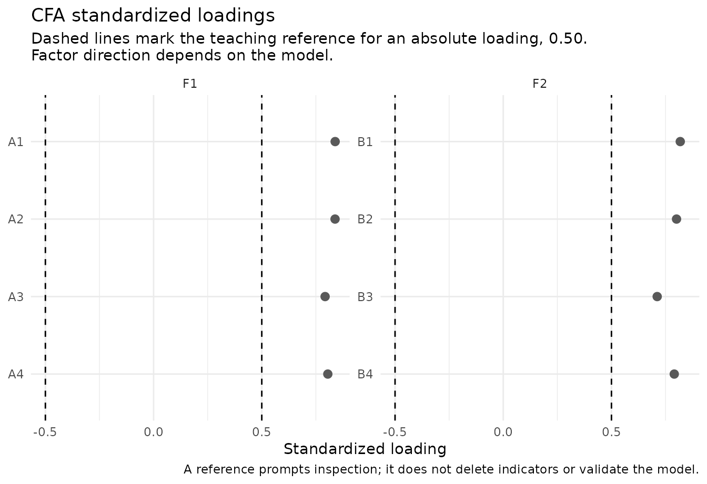
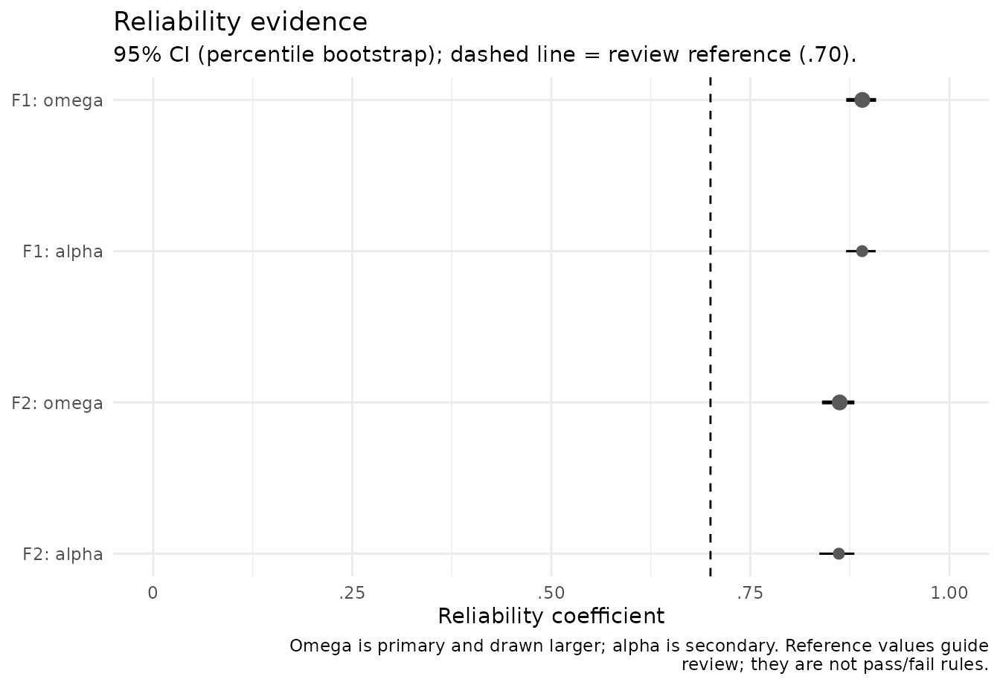
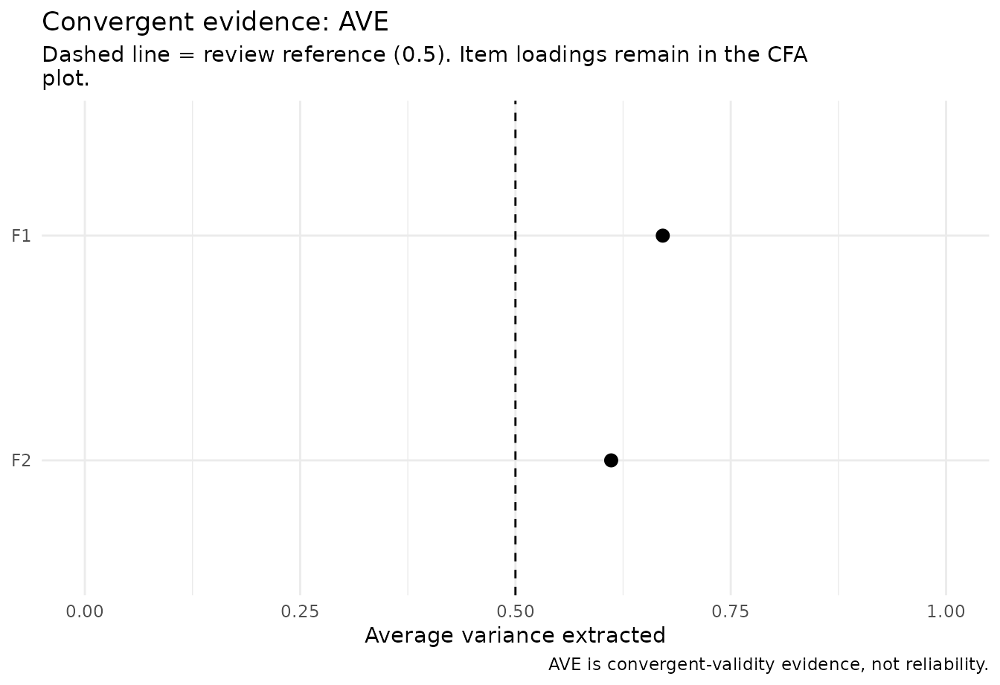
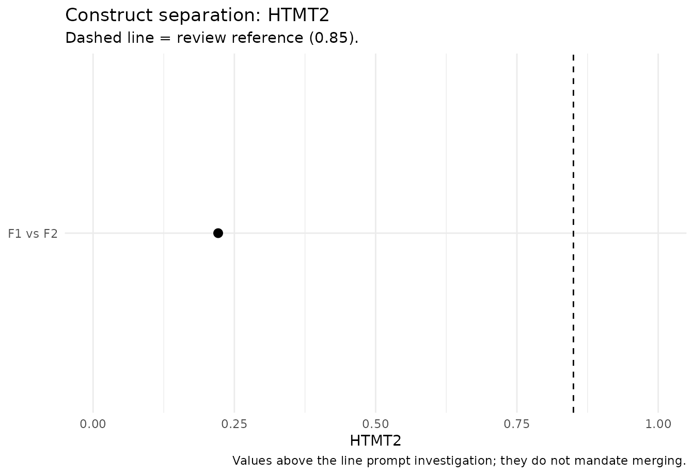
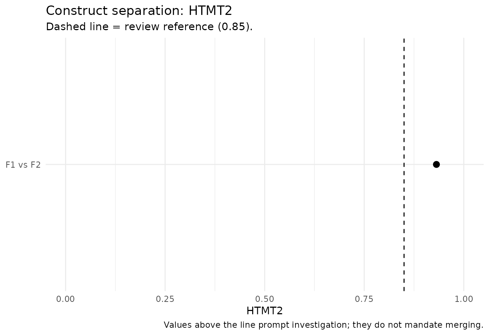
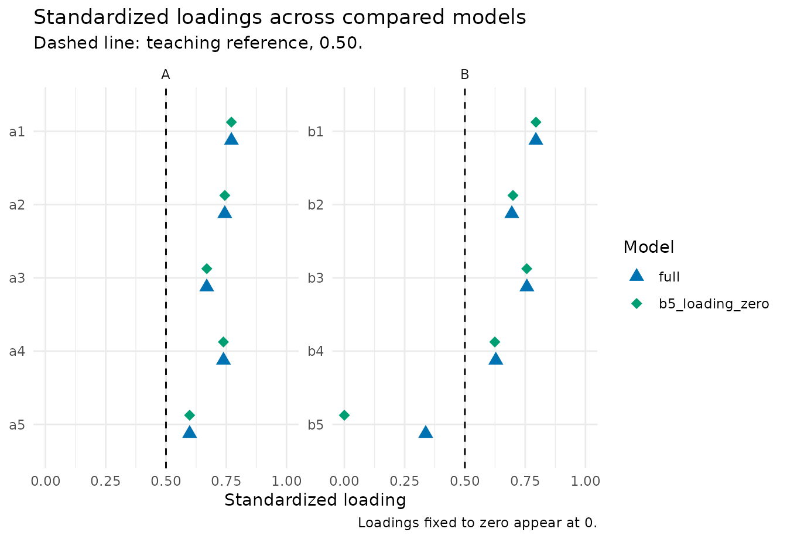

# From CFA to a defensible measurement model

## Why measurement evidence is staged

A confirmatory factor model, a reliability coefficient, and a
discriminant-validity statistic answer different questions. Treating
them as interchangeable checkboxes can produce misleading conclusions.
`nomologR` therefore keeps the workflow staged:

1.  [`nomo_cfa()`](https://juhalt.github.io/nomologR/reference/nomo_cfa.md)
    — **Does the proposed measurement structure reproduce the data
    reasonably, and where is there model strain?**
2.  [`nomo_reliability()`](https://juhalt.github.io/nomologR/reference/nomo_reliability.md)
    — **How consistently does the intended score represent its target
    under that measurement model?**
3.  [`nomo_validity()`](https://juhalt.github.io/nomologR/reference/nomo_validity.md)
    — **Do indicators converge on their intended constructs, and are
    theoretically distinct constructs empirically distinguishable?**

The sequence is evidence-guided rather than pass/fail. A reference value
can trigger inspection, but it never automatically deletes an indicator,
merges constructs, or establishes construct validity.

## A healthy two-factor model

We begin with a known two-factor population in which both factors are
well measured and moderately correlated.

``` r

set.seed(2026)
n <- 500

f1 <- rnorm(n)
f2 <- .30 * f1 + sqrt(1 - .30^2) * rnorm(n)

healthy <- data.frame(
  A1 = .82 * f1 + rnorm(n, sd = .55),
  A2 = .79 * f1 + rnorm(n, sd = .58),
  A3 = .76 * f1 + rnorm(n, sd = .62),
  A4 = .80 * f1 + rnorm(n, sd = .57),
  B1 = .83 * f2 + rnorm(n, sd = .54),
  B2 = .78 * f2 + rnorm(n, sd = .60),
  B3 = .75 * f2 + rnorm(n, sd = .63),
  B4 = .81 * f2 + rnorm(n, sd = .56)
)

model <- '
  F1 =~ A1 + A2 + A3 + A4
  F2 =~ B1 + B2 + B3 + B4
'
```

``` r

cfa <- nomo_cfa(model, data = healthy)

# Modest resampling here keeps vignette build time reasonable.
# Use more resamples for final reporting.
rel <- nomo_reliability(
  cfa,
  ci = "bootstrap",
  ci_boot = 100,
  ci_seed = 2026
)
val <- nomo_validity(cfa, htmt = "both")
```

The compact summaries are intentionally different from the raw engine
output. They surface the evidence most relevant to the user’s next
decision without repeating the same full loading table in several
places.

``` r

summary(rel)
```

    ## <nomo_reliability summary> Reliability
    ## Constructs: 2 | Review reference: .70
    ## 
    ## Coefficients
    ##   Construct  Indicators  Omega  95% CI      Alpha  95% CI
    ##   F1         continuous    .89  [.87, .91]    .89  [.87, .91]
    ##   F2         continuous    .86  [.84, .88]    .86  [.84, .88]
    ## 
    ## What these columns mean
    ##   CI -- Percentile bootstrap confidence interval.
    ## 
    ## Omega is primary for the congeneric CFA workflow; alpha is secondary and
    ## assumption-dependent. Reliability contributes score-precision evidence, not
    ## construct validity.
    ## 
    ## See x$decision_log for the reasoning behind each coefficient.

``` r

summary(val)
```

    ## <nomo_validity summary> Convergent and discriminant evidence
    ## Constructs: 2 | AVE reference: .50 | HTMT reference: 0.85
    ## Convergent flags: none (2 constructs) | Separation flags: none (1 pair)
    ## 
    ## Convergent evidence by construct
    ##   Construct  AVE  Min |loading|  Median |loading|  Loadings flagged
    ##   F1         .67           0.79              0.82                 0
    ##   F2         .61           0.71              0.80                 0
    ## 
    ## Construct separation
    ##   Construct 1  Construct 2  Latent r  95% CI      HTMT2  HTMT
    ##   F1           F2                .22  [.13, .32]   0.22  0.23
    ## 
    ## What these columns mean
    ##   AVE -- Average variance extracted, the mean share of its indicators'
    ##       variance a construct explains.
    ##   |loading| -- Absolute standardized loading.
    ##   Latent r -- Correlation between two constructs in the CFA.
    ##   CI -- Confidence interval, as lavaan computes it.
    ##   HTMT2 -- Heterotrait-monotrait ratio with geometric means (Roemer et al.,
    ##       2021).
    ##   HTMT -- Heterotrait-monotrait ratio (Henseler et al., 2015).
    ## 
    ## Standardized loadings and AVE address convergent evidence; latent correlations
    ## and HTMT-family statistics address construct separation. These are
    ## complementary questions, not interchangeable pass/fail tests.
    ## 
    ## See nomo_table(x, "discriminant") for every value and x$decision_log for the
    ## reasoning behind each flag.

The figures also avoid duplication. Item-level loading evidence belongs
to the CFA; reliability gets a coefficient plot; convergent validity
gets an AVE plot; and construct separation gets an HTMT-family plot.

``` r

plot(cfa, type = "loadings")
```



``` r

plot(rel)
```



``` r

plot(val, type = "ave")
```



``` r

plot(val, type = "discriminant")
```



A healthy result contributes several complementary pieces of evidence.
It does not turn the measurement model into a permanently “validated”
object. Validity remains an accumulating argument tied to construct
interpretation, population, setting, and intended use.

## Good global fit does not guarantee good measurement

This is a critical teaching case. The following one-factor model is
correctly specified, but its indicators are weak measures of the latent
variable.

``` r

set.seed(2027)
n <- 650
f <- rnorm(n)

weak <- data.frame(
  W1 = .30 * f + rnorm(n, sd = .95),
  W2 = .34 * f + rnorm(n, sd = .94),
  W3 = .28 * f + rnorm(n, sd = .96),
  W4 = .32 * f + rnorm(n, sd = .95),
  W5 = .31 * f + rnorm(n, sd = .95)
)

weak_cfa <- nomo_cfa(
  'Weak =~ W1 + W2 + W3 + W4 + W5',
  data = weak
)
weak_rel <- nomo_reliability(weak_cfa)
weak_val <- nomo_validity(weak_cfa, htmt = "none")
```

``` r

weak_cfa$fit_evidence
```

    ## # A tibble: 9 × 7
    ##   metric          value variant        reference direction attention explanation
    ##   <chr>           <dbl> <chr>              <dbl> <chr>     <chr>     <chr>      
    ## 1 chi_square     2.79   chisq              NA    informat… info      Descriptiv…
    ## 2 df             5      df                 NA    informat… info      Descriptiv…
    ## 3 p_value        0.733  pvalue             NA    informat… info      Descriptiv…
    ## 4 CFI            1      cfi                 0.95 higher    info      At or abov…
    ## 5 TLI            1.08   tli                 0.95 higher    info      At or abov…
    ## 6 RMSEA          0      rmsea               0.06 lower     info      At or belo…
    ## 7 RMSEA_CI_lower 0      rmsea.ci.lower     NA    informat… info      Descriptiv…
    ## 8 RMSEA_CI_upper 0.0393 rmsea.ci.upper     NA    informat… info      Descriptiv…
    ## 9 SRMR           0.0152 srmr                0.08 lower     info      At or belo…

Because the one-factor structure is the correct covariance model, global
fit can look quite good. That does **not** imply that the items strongly
represent the construct or that the resulting score is precise.

``` r

summary(weak_rel)
```

    ## <nomo_reliability summary> Reliability
    ## Constructs: 1 | Review reference: .70
    ## 
    ## Coefficients
    ##   Construct  Indicators  Omega  Alpha  Flag
    ##   Weak       continuous    .37    .36  Review
    ## 
    ## Flagged
    ##   - Weak (Review): Omega .37 is below the review reference .70. Inspect score
    ##     purpose, indicator quality, dimensionality, and CFA evidence before
    ##     changing the scale.
    ##   - Weak (Review): Alpha .36 is below the review reference .70. Inspect score
    ##     purpose, indicator quality, dimensionality, and CFA evidence before
    ##     changing the scale.
    ## 
    ## Sampling uncertainty was not bootstrapped. For report-ready intervals, rerun
    ## with `ci = "bootstrap"`.
    ## Omega is primary for the congeneric CFA workflow; alpha is secondary and
    ## assumption-dependent. Reliability contributes score-precision evidence, not
    ## construct validity.
    ## 
    ## See x$decision_log for the reasoning behind each coefficient.

``` r

summary(weak_val)
```

    ## <nomo_validity summary> Convergent and discriminant evidence
    ## Constructs: 1 | AVE reference: .50 | HTMT reference: 0.85
    ## Convergent flags: 1 review, 0 concern (1 construct)
    ## Separation flags: not applicable (one construct)
    ## 
    ## Convergent evidence by construct
    ##   Construct  AVE  Min |loading|  Median |loading|  Loadings flagged  Flag
    ##   Weak       .11           0.20              0.31                 5  Review
    ## 
    ## Construct separation
    ##   No pairwise construct-separation summary is available.
    ## 
    ## Flagged
    ##   - W1 (Review): Standardized loading 0.20 is below the review reference 0.50
    ##     in absolute value; inspect item content, precision, and model
    ##     specification.
    ##   - W2 (Review): Standardized loading 0.31 is below the review reference 0.50
    ##     in absolute value; inspect item content, precision, and model
    ##     specification.
    ##   - W3 (Review): Standardized loading 0.27 is below the review reference 0.50
    ##     in absolute value; inspect item content, precision, and model
    ##     specification.
    ##   - W4 (Review): Standardized loading 0.499 is below the review reference 0.50
    ##     in absolute value; inspect item content, precision, and model
    ##     specification.
    ##   - W5 (Review): Standardized loading 0.34 is below the review reference 0.50
    ##     in absolute value; inspect item content, precision, and model
    ##     specification.
    ##   - Weak (Review): AVE (.11) is below the configured convergent-evidence
    ##     reference (.50). Inspect standardized loadings, indicator-specific error,
    ##     and content coverage; do not automatically delete items.
    ## 
    ## What these columns mean
    ##   AVE -- Average variance extracted, the mean share of its indicators'
    ##       variance a construct explains.
    ##   |loading| -- Absolute standardized loading.
    ##   HTMT2 -- Heterotrait-monotrait ratio with geometric means (Roemer et al.,
    ##       2021).
    ##   HTMT -- Heterotrait-monotrait ratio (Henseler et al., 2015).
    ## 
    ## Standardized loadings and AVE address convergent evidence; latent correlations
    ## and HTMT-family statistics address construct separation. These are
    ## complementary questions, not interchangeable pass/fail tests.
    ## 
    ## See nomo_table(x, "discriminant") for every value and x$decision_log for the
    ## reasoning behind each flag.

This is why `nomologR` does not collapse measurement quality into a
single global-fit verdict. Weak standardized loadings, low AVE, and weak
model-based reliability remain important even when CFI, RMSEA, or SRMR
look favorable.

## Strong reliability does not guarantee construct separation

The reverse problem is also possible. Two constructs can each be
measured very consistently while remaining difficult to distinguish
empirically.

``` r

set.seed(2028)
n <- 700
f1 <- rnorm(n)
f2 <- .94 * f1 + sqrt(1 - .94^2) * rnorm(n)

overlap <- data.frame(
  A1 = .86 * f1 + rnorm(n, sd = .48),
  A2 = .83 * f1 + rnorm(n, sd = .51),
  A3 = .84 * f1 + rnorm(n, sd = .50),
  B1 = .86 * f2 + rnorm(n, sd = .48),
  B2 = .83 * f2 + rnorm(n, sd = .51),
  B3 = .84 * f2 + rnorm(n, sd = .50)
)

overlap_model <- '
  F1 =~ A1 + A2 + A3
  F2 =~ B1 + B2 + B3
'

overlap_cfa <- nomo_cfa(overlap_model, data = overlap)
overlap_rel <- nomo_reliability(overlap_cfa)
overlap_val <- nomo_validity(overlap_cfa, htmt = "both")
```

``` r

summary(overlap_rel)
```

    ## <nomo_reliability summary> Reliability
    ## Constructs: 2 | Review reference: .70
    ## 
    ## Coefficients
    ##   Construct  Indicators  Omega  Alpha
    ##   F1         continuous    .89    .89
    ##   F2         continuous    .90    .89
    ## 
    ## Sampling uncertainty was not bootstrapped. For report-ready intervals, rerun
    ## with `ci = "bootstrap"`.
    ## Omega is primary for the congeneric CFA workflow; alpha is secondary and
    ## assumption-dependent. Reliability contributes score-precision evidence, not
    ## construct validity.
    ## 
    ## See x$decision_log for the reasoning behind each coefficient.

``` r

summary(overlap_val)
```

    ## <nomo_validity summary> Convergent and discriminant evidence
    ## Constructs: 2 | AVE reference: .50 | HTMT reference: 0.85
    ## Convergent flags: none (2 constructs)
    ## Separation flags: 1 review, 0 concern (1 pair)
    ## 
    ## Convergent evidence by construct
    ##   Construct  AVE  Min |loading|  Median |loading|  Loadings flagged
    ##   F1         .74           0.84              0.87                 0
    ##   F2         .74           0.85              0.85                 0
    ## 
    ## Construct separation
    ##   Construct 1  Construct 2  Latent r  95% CI      HTMT2  HTMT  Flag
    ##   F1           F2                .93  [.91, .95]   0.93  0.93  Review
    ## 
    ## Flagged
    ##   - F1 vs. F2 (Review): HTMT2 (0.93) exceeds the configured review reference
    ##     (0.85). This raises a construct-separation concern; inspect theoretical
    ##     distinctiveness, item content, cross-construct overlap, and latent
    ##     correlations rather than automatically merging or deleting constructs.
    ##   - F1 vs. F2 (Review): HTMT (0.93) exceeds the configured review reference
    ##     (0.85). This raises a construct-separation concern; inspect theoretical
    ##     distinctiveness, item content, cross-construct overlap, and latent
    ##     correlations rather than automatically merging or deleting constructs.
    ## 
    ## What these columns mean
    ##   AVE -- Average variance extracted, the mean share of its indicators'
    ##       variance a construct explains.
    ##   |loading| -- Absolute standardized loading.
    ##   Latent r -- Correlation between two constructs in the CFA.
    ##   CI -- Confidence interval, as lavaan computes it.
    ##   HTMT2 -- Heterotrait-monotrait ratio with geometric means (Roemer et al.,
    ##       2021).
    ##   HTMT -- Heterotrait-monotrait ratio (Henseler et al., 2015).
    ## 
    ## Standardized loadings and AVE address convergent evidence; latent correlations
    ## and HTMT-family statistics address construct separation. These are
    ## complementary questions, not interchangeable pass/fail tests.
    ## 
    ## See nomo_table(x, "discriminant") for every value and x$decision_log for the
    ## reasoning behind each flag.

Here, strong omega and AVE do not erase a high latent correlation or
HTMT2 value. The package therefore recommends investigating theoretical
distinctiveness, item content, cross-construct overlap, and the intended
construct boundary. It does not automatically merge factors or delete
indicators.

``` r

plot(overlap_val, type = "discriminant")
```



## Ordered indicators: keep the score scale explicit

For ordered Likert-type indicators,
[`nomo_cfa()`](https://juhalt.github.io/nomologR/reference/nomo_cfa.md)
uses an ordered-data CFA workflow when the indicators are declared
ordered.
[`nomo_reliability()`](https://juhalt.github.io/nomologR/reference/nomo_reliability.md)
then distinguishes the observed ordinal-score reliability estimand from
the hypothetical latent-response scale.

``` r

set.seed(2029)
n <- 500
f <- rnorm(n)
z <- data.frame(
  I1 = .82 * f + rnorm(n, sd = .60),
  I2 = .79 * f + rnorm(n, sd = .62),
  I3 = .76 * f + rnorm(n, sd = .65),
  I4 = .80 * f + rnorm(n, sd = .60)
)

ordinal <- as.data.frame(lapply(z, function(x) {
  ordered(cut(x, breaks = c(-Inf, -.8, -.25, .25, .8, Inf), labels = 1:5))
}))

ordinal_cfa <- nomo_cfa(
  'F =~ I1 + I2 + I3 + I4',
  data = ordinal,
  ordered = names(ordinal)
)
ordinal_rel <- nomo_reliability(
  ordinal_cfa,
  ordinal_scale = TRUE,
  include_alpha = TRUE
)
summary(ordinal_rel)
```

    ## <nomo_reliability summary> Reliability
    ## Constructs: 1 | Review reference: .70
    ## 
    ## Coefficients
    ##   Construct  Indicators  Omega  Omega scale
    ##   F          ordered       .83  observed ordinal
    ## 
    ## Alpha not computed
    ##   - F (ordered indicators, observed ordinal scale): Observed-scale alpha is
    ##     not computed from an ordered-indicator CFA. Current semTools intentionally
    ##     disallows ord.scale = TRUE with tau-equivalent alpha for ordered
    ##     composites because that is a different scoring analysis from model-based
    ##     ordinal reliability. Use the observed-scale omega estimate as the primary
    ##     reliability evidence; calculate observed-score alpha separately only when
    ##     that estimand is substantively required.
    ## 
    ## Sampling uncertainty was not bootstrapped. For report-ready intervals, rerun
    ## with `ci = "bootstrap"`.
    ## Omega is primary for the congeneric CFA workflow; alpha is secondary and
    ## assumption-dependent. Reliability contributes score-precision evidence, not
    ## construct validity.
    ## 
    ## See x$decision_log for the reasoning behind each coefficient.

Observed-scale omega is available for the practical ordinal composite.
Observed-scale alpha is deliberately reported as unavailable in this
ordered-CFA estimand rather than silently replacing it with a different
definition. The point is not to maximize the number of coefficients
reported; it is to keep the score and estimand clear.

## Continuing the exploratory example

The [exploratory
walkthrough](https://juhalt.github.io/nomologR/articles/exploratory-workflow.md)
flagged a cross-loading item (`a5`) and a weak item (`b5`) in
`nomo_demo_continuous`. Suppose the researcher prespecifies the intended
two-factor simple structure with all ten items and fits it as a CFA:

``` r

demo_model <- nomo_model(list(
  A = c("a1", "a2", "a3", "a4", "a5"),
  B = c("b1", "b2", "b3", "b4", "b5")
))

demo_cfa <- nomo_cfa(demo_model, data = nomo_demo_continuous)
demo_cfa$fit_evidence
```

    ## # A tibble: 9 × 7
    ##   metric              value variant    reference direction attention explanation
    ##   <chr>               <dbl> <chr>          <dbl> <chr>     <chr>     <chr>      
    ## 1 chi_square     75.8       chisq          NA    informat… info      Descriptiv…
    ## 2 df             34         df             NA    informat… info      Descriptiv…
    ## 3 p_value         0.0000500 pvalue         NA    informat… info      Descriptiv…
    ## 4 CFI             0.973     cfi             0.95 higher    info      At or abov…
    ## 5 TLI             0.965     tli             0.95 higher    info      At or abov…
    ## 6 RMSEA           0.0510    rmsea           0.06 lower     info      At or belo…
    ## 7 RMSEA_CI_lower  0.0356    rmsea.ci.…     NA    informat… info      Descriptiv…
    ## 8 RMSEA_CI_upper  0.0665    rmsea.ci.…     NA    informat… info      Descriptiv…
    ## 9 SRMR            0.0519    srmr            0.08 lower     info      At or belo…

``` r

head(demo_cfa$top_modification_indices, 5)
```

    ## # A tibble: 5 × 8
    ##   lhs   op    rhs      mi     epc sepc.lv sepc.all sepc.nox
    ##   <chr> <chr> <chr> <dbl>   <dbl>   <dbl>    <dbl>    <dbl>
    ## 1 B     =~    a5    48.3   0.488   0.377     0.365    0.365
    ## 2 B     =~    a1     9.41 -0.183  -0.141    -0.145   -0.145
    ## 3 a5    ~~    b3     7.57  0.0812  0.0812    0.150    0.150
    ## 4 a5    ~~    b1     4.78  0.0610  0.0610    0.125    0.125
    ## 5 a3    ~~    a4     4.64  0.0732  0.0732    0.133    0.133

Three lessons carry over from the exploratory stage:

- **Modification indices are quarantined.** The largest index points
  toward the cross-loading that the data-generating model contains, but
  `nomologR` does not add it. Allowing a cross-loading, revising the
  item, or evaluating a model without it is a theoretical decision;
  freeing parameters because an index is large is capitalization on
  chance (MacCallum et al., 1992).
- **The same sample is not independent confirmation.** This CFA uses the
  data that suggested the structure.
  [`nomo_split()`](https://juhalt.github.io/nomologR/reference/nomo_split.md)
  or a new sample provides a stronger test.
- **Missing data are handled explicitly.** By default lavaan uses
  complete cases here; `missing = "fiml"` requests full-information
  maximum likelihood for continuous indicators, and the decision is
  recorded. Whether the results depend on that choice is a separate
  question, taken up
  [below](#does-a-result-depend-on-how-missing-data-were-handled).

## Comparing models with a recorded rationale

[`nomo_compare()`](https://juhalt.github.io/nomologR/reference/nomo_compare.md)
evaluates competing measurement models side by side. It requires a
rationale, checks whether the models are nested, reports the difference
test that matches the estimator when they are, and never selects a model
automatically.

### A cross-loading suggested by the results

The largest modification index above pointed to a loading of `a5` on
factor B. Because that idea came from the results rather than from
theory stated in advance, the comparison is labeled post hoc:

``` r

cross_cfa <- nomo_cfa(
  "A =~ a1 + a2 + a3 + a4 + a5\nB =~ b1 + b2 + b3 + b4 + b5 + a5",
  data = nomo_demo_continuous
)

cross_comparison <- nomo_compare(
  simple_structure = demo_cfa,
  cross_loading = cross_cfa,
  rationale = "The largest modification index suggested that a5 also reflects factor B.",
  origin = "post_hoc"
)
cross_comparison
```

    ## <nomo_compare> Measurement-model comparison
    ## Models: 2 | Reference: simple_structure | Estimator: ML
    ## Cases: 473 of 500 used | Origin: post hoc
    ## Rationale: The largest modification index suggested that a5 also reflects
    ## factor B.
    ## 
    ## Compared with simple_structure
    ##   - cross_loading (nested, less constrained): Delta chi-square(1) = 48.72,
    ##     p < .001; CFI change +.027, RMSEA change -0.051; AIC change -46.72
    ## 
    ## Flagged
    ##   - Origin (Review): The comparison was specified after seeing results (for
    ##     example, prompted by modification indices or residuals).
    ## 
    ## ML = maximum likelihood; CFI = comparative fit index; RMSEA = root mean square
    ## error of approximation; AIC = Akaike information criterion.
    ## 
    ## No model was selected automatically; read the comparison with theory and the
    ## recorded rationale.
    ## 
    ## See summary(x) for the interpretations and measurement evidence and
    ## nomo_table(x, "comparisons") for every test.

Estimating the cross-loading reduces misfit (Delta chi-square(1) =
48.72, *p* \< .001; CFI change +.027). That is exactly the feature built
into these simulated data, but with real data the evidence alone does
not settle the question. Does the wording of `a5` plausibly reflect both
constructs? Because the comparison is post hoc, the decision log records
it as such and recommends confirming the retained model in independent
data.

### Is a weak item needed?

`b5` loads weakly on B. Dropping `b5` from the model changes the data
being modeled, so a model without the column cannot be tested against
the full model. Instead, keep `b5` and fix its loading to zero:

``` r

b5_zero_cfa <- nomo_cfa(
  "A =~ a1 + a2 + a3 + a4 + a5\nB =~ b1 + b2 + b3 + b4 + 0*b5",
  data = nomo_demo_continuous
)

b5_comparison <- nomo_compare(
  full = demo_cfa,
  b5_loading_zero = b5_zero_cfa,
  rationale = paste(
    "Evaluate whether the weakly loading item b5 contributes to factor B",
    "before deciding whether to keep it."
  )
)
summary(b5_comparison)
```

    ## <nomo_compare summary> Measurement-model comparison
    ## Rationale: Evaluate whether the weakly loading item b5 contributes to factor B
    ## before deciding whether to keep it.
    ## Reference: full | Estimator: ML | Cases: 473 of 500 used | Origin: a priori
    ## 
    ## Model fit
    ##   Model            Chi-square  df       p   CFI    TLI  RMSEA   SRMR  Parameters
    ##   full                  75.83  34  < .001  .973  0.965  0.051  0.052          21
    ##   b5_loading_zero      122.75  35  < .001  .944  0.928  0.073  0.093          20
    ## 
    ## Information criteria
    ##   Model                 AIC       BIC  Loadings fixed to zero
    ##   full             11981.02  12068.36                       0
    ##   b5_loading_zero  12025.93  12109.11                       1
    ## 
    ## Difference tests against the reference model
    ##   Model            Delta chi-square  df       p  Relation
    ##   b5_loading_zero             46.91   1  < .001  nested, more constrained
    ## 
    ## Changes in fit (model minus reference)
    ##   Model              CFI     TLI   RMSEA    SRMR     AIC     BIC
    ##   b5_loading_zero  -.029  -0.036  +0.022  +0.042  +44.91  +40.75
    ## 
    ## Interpretation
    ##   - `b5_loading_zero` is nested within `full` and has 1 more degree of freedom
    ##     (additional constraints). Delta chi-square(1) = 46.91, p < .001. A small p
    ##     value indicates that the extra constraints are not fully consistent with
    ##     the data; with large samples, even small misspecifications produce small p
    ##     values. Change in fit (`b5_loading_zero` minus `full`): CFI -.029, TLI
    ##     -0.036, RMSEA +0.022, SRMR +0.042. AIC +44.91 and BIC +40.75
    ##     (`b5_loading_zero` minus `full`); lower values favor a model for these
    ##     data, and only differences are interpretable. No model is selected
    ##     automatically; read this evidence with theory and the recorded rationale.
    ## 
    ## Standardized loadings by model
    ##   Factor  Indicator  full  b5_loading_zero
    ##   A       a1         0.77             0.77
    ##   A       a2         0.74             0.74
    ##   A       a3         0.67             0.67
    ##   A       a4         0.74             0.74
    ##   A       a5         0.60             0.60
    ##   B       b1         0.79             0.79
    ##   B       b2         0.69             0.70
    ##   B       b3         0.76             0.76
    ##   B       b4         0.63             0.62
    ##   B       b5         0.34             0.00
    ## 
    ## Measurement evidence by model
    ##   Construct  Metric  full  b5_loading_zero
    ##   A          omega    .83              .83
    ##   B          omega    .78              .62
    ##   A          alpha    .83              .83
    ##   B          alpha    .77              .77
    ##   A          AVE      .50              .50
    ##   B          AVE      .43              .52
    ##   A vs. B    HTMT2   0.53             0.53
    ##   - b5_loading_zero: The loading fixed to zero for b5 keeps that item in this
    ##     composite; the coefficient does not describe a shortened scale.
    ## 
    ## What these columns mean
    ##   ML -- Maximum likelihood.
    ##   CFI -- Comparative fit index.
    ##   TLI -- Tucker-Lewis index.
    ##   RMSEA -- Root mean square error of approximation.
    ##   SRMR -- Standardized root mean square residual.
    ##   df -- Degrees of freedom.
    ##   AIC -- Akaike information criterion.
    ##   BIC -- Bayesian information criterion.
    ##   AVE -- Average variance extracted.
    ##   HTMT2 -- Heterotrait-monotrait ratio of correlations, geometric-mean
    ##       version.
    ## 
    ## No model was selected automatically. Difference tests, changes in fit,
    ## information criteria, and measurement evidence answer different questions;
    ## read them together with theory and the recorded rationale.
    ## 
    ## See nomo_table(x, "decision_log") for the decision log and x$fits for each
    ## model's own analysis.

Fixing the loading to zero worsens fit (Delta chi-square(1) = 46.91, *p*
\< .001), so `b5` is statistically related to B. Its standardized
loading, however, is only 0.34. With 473 cases, even a weak relation is
detectable; statistical detectability is not the same as an adequate
indicator. The decision still depends on whether `b5` covers content the
construct needs.

``` r

plot(b5_comparison, type = "loadings")
```



The summary’s measurement evidence carries a note: omega for B in the
zero-loading model still includes `b5` in the composite, so it does not
describe a shortened four-item scale. To see that scale’s reliability,
fit the model without `b5`. Because the two models contain different
observed variables,
[`nomo_compare()`](https://juhalt.github.io/nomologR/reference/nomo_compare.md)
reports this comparison descriptively, without a difference test or
information criteria:

``` r

shortened_cfa <- nomo_cfa(
  "A =~ a1 + a2 + a3 + a4 + a5\nB =~ b1 + b2 + b3 + b4",
  data = nomo_demo_continuous
)

shortened <- nomo_compare(
  full = demo_cfa,
  four_item_b = shortened_cfa,
  rationale = "Describe the reliability of a four-item B scale alongside the full scale."
)

nomo_table(shortened, "comparisons")[, c("model", "relation", "test_available", "ic_available")]
```

    ## # A tibble: 1 × 4
    ##   model       relation            test_available ic_available
    ##   <chr>       <chr>               <lgl>          <lgl>       
    ## 1 four_item_b different_variables FALSE          FALSE

``` r

omega_rows <- nomo_table(shortened, "evidence")
omega_rows[omega_rows$metric == "omega", c("model", "construct", "estimate")]
```

    ## # A tibble: 4 × 3
    ##   model       construct estimate
    ##   <chr>       <chr>        <dbl>
    ## 1 full        A            0.835
    ## 2 full        B            0.784
    ## 3 four_item_b A            0.835
    ## 4 four_item_b B            0.812

Together these results separate three questions that are easy to blur:
whether an item is statistically related to its factor, whether it is a
strong indicator, and how the score’s reliability changes without it.
None of them alone decides whether the item stays.

### Every cross-loading at once: ESEM

The comparison above freed one cross-loading because the results pointed
to it. Exploratory structural equation modeling (ESEM) estimates all of
them, in a model that still gives fit and standard errors (Asparouhov &
Muthén, 2009). With an a priori structure, Marsh et al. (2014) recommend
target rotation: each item loads freely on its own factor, and its
cross-loadings are rotated towards zero without being fixed there.
[`nomo_esem()`](https://juhalt.github.io/nomologR/reference/nomo_esem.md)
fits the ESEM beside the CFA of the same model:

``` r

esem <- nomo_esem(demo_model, data = nomo_demo_continuous)
summary(esem)
```

    ## <nomo_esem summary> ESEM beside its CFA
    ## Asparouhov and Muthén (2009); Marsh et al. (2014).
    ## Rotation: target | Cases: 473 of 500 used | Factors: 2
    ## 
    ## Fit
    ##   Model  Chi-square  df       p    CFI    TLI  RMSEA   SRMR
    ##   ESEM        20.60  26    .762  1.000  1.006  0.000  0.015
    ##   CFA         75.83  34  < .001   .973  0.965  0.051  0.052
    ##   CFA vs. ESEM: Delta chi-square(8) = 55.24, p < .001.
    ## 
    ## ESEM loadings (standardized), with the CFA's main loading
    ##   Item     A      B   CFA
    ##   a1    0.84  -0.10  0.77
    ##   a2    0.73   0.02  0.74
    ##   a3    0.68  -0.02  0.67
    ##   a4    0.78  -0.07  0.74
    ##   a5    0.43   0.32  0.60
    ##   b1    0.04   0.77  0.79
    ##   b2    0.01   0.69  0.69
    ##   b3    0.00   0.76  0.76
    ##   b4    0.00   0.63  0.63
    ##   b5    0.06   0.30  0.34
    ## 
    ## Factor correlations
    ##   Factors   ESEM  CFA  Difference
    ##   A with B   .48  .50        -.02
    ## 
    ## Flagged
    ##   - Cases (Review): 473 of 500 input cases were used; 27 cases were not used
    ##     by the fitted models. Confirm that case loss follows the intended
    ##     missing-data strategy; `missing = "fiml"` uses incomplete cases with
    ##     continuous indicators.
    ##   - ESEM vs. CFA (Review): ESEM: TLI 1.006, RMSEA 0.000. CFA: TLI 0.965, RMSEA
    ##     0.051. Fixing the cross-loadings at zero: Delta chi-square(8) = 55.24,
    ##     p < .001. The largest change in a factor correlation, ESEM minus CFA, is
    ##     -.02. ESEM fits better even on indices that penalize its extra parameters.
    ##     Where its factor correlations are lower, the CFA's zero cross-loadings are
    ##     inflating them; Marsh et al. (2014) then prefer the ESEM, or a CFA with
    ##     the cross-loadings the items' content supports.
    ##   - a5 (Review): Cross-loadings at or above 0.30: a5 on B, 0.32. Read the
    ##     item's content for both factors. A cross-loading is evidence about the
    ##     item, not an instruction to remove it.
    ##   - b5 (Review): Main loadings below 0.40: b5 on B, 0.30. Inspect the item's
    ##     content and its cross-loadings together.
    ## 
    ## What these columns mean
    ##   ESEM -- Exploratory structural equation modeling.
    ##   CFA -- Confirmatory factor analysis.
    ##   CFI -- Comparative fit index.
    ##   TLI -- Tucker-Lewis index.
    ##   RMSEA -- Root mean square error of approximation.
    ##   SRMR -- Standardized root mean square residual.
    ##   df -- Degrees of freedom.
    ## 
    ## Cross-loadings are estimated, not fixed at zero. The comparison is evidence
    ## for choosing a model, not a verdict.
    ## 
    ## See nomo_table(x, "loadings") for each loading's standard error and p value
    ## and nomo_table(x, "decision_log") for the decision log.

The ESEM fits better even on TLI and RMSEA, which penalize its extra
parameters (TLI 1.006 vs. 0.965, RMSEA 0.000 vs. 0.051). Without being
told where to look, its loadings show both features built into these
data: `a5` cross-loads on B, and `b5` is weak. The factor correlation
barely moves (.48 vs. .50), so here the zero cross-loadings cost the CFA
fit without distorting the relation between the factors. When items of
related constructs share many small cross-loadings, the CFA pushes them
into the factor correlations instead, and a lower ESEM correlation is
the evidence Marsh et al. (2014) weigh in preferring it. The solution
depends on the rotation, and whether `a5` belongs to both constructs is
still a question about its content.

## Does a result depend on how missing data were handled?

`demo_cfa` used lavaan’s default, listwise deletion, which analyzes only
the cases observed on every item.
[`nomo_missing()`](https://juhalt.github.io/nomologR/reference/nomo_missing.md)
refits the same model under alternative strategies and reports what
changes. For continuous indicators it compares listwise deletion with
full-information maximum likelihood (FIML), which uses every observed
response:

``` r

demo_missing <- nomo_missing(demo_cfa, data = nomo_demo_continuous)
demo_missing
```

    ## <nomo_missing> Missing-data sensitivity
    ## Model: CFA | Reference: FIML | Fitted with: Listwise deletion
    ## Cases: 27 of 500 incomplete (5.4%) | Patterns: 3
    ## Lowest covariance coverage: .95 (a2, b3)
    ## 
    ## Strategies
    ##   Strategy           lavaan    Needs  Role          N  Converged  Admissible
    ##   Listwise deletion  listwise  MCAR   comparison  473  yes        yes
    ##   FIML               ml        MAR    reference   500  yes        yes
    ## 
    ## Largest differences from the reference (standardized estimates)
    ##   Parameter  Strategy           Estimate  Reference  Difference (SE)
    ##   A ~~ B     Listwise deletion      .499       .480            +0.45
    ##   B =~ b5    Listwise deletion     0.337      0.353            -0.37
    ##   A =~ a5    Listwise deletion     0.598      0.590            +0.23
    ##   A =~ a3    Listwise deletion     0.669      0.675            -0.21
    ##   B =~ b3    Listwise deletion     0.757      0.762            -0.17
    ## 
    ## What these terms mean
    ##   CFA -- Confirmatory factor analysis.
    ##   FIML -- Full-information maximum likelihood.
    ##   Needs -- What the strategy requires of the missing data: MCAR, missing
    ##       completely at random, or MAR, missing at random; -- where no requirement
    ##       is stated for the method lavaan used.
    ##   N -- Cases the strategy analyzed.
    ##   Covariance coverage -- Proportion of cases with both variables of a pair
    ##       observed; the lowest pair is shown.
    ##   Difference (SE) -- The estimate minus the reference strategy's estimate, in
    ##       the reference standard error (SE); beyond half of one is flagged for
    ##       review.
    ## 
    ## Whether data are missing at random cannot be tested from these data, and
    ## agreement between strategies does not show that either is unbiased.
    ## 
    ## See summary(x) for every difference and each recommendation and
    ## nomo_table(x, "decision_log") for every recorded decision.

The two strategies make different assumptions. Listwise deletion
requires data missing completely at random (MCAR). FIML requires the
weaker condition that data are missing at random (MAR), meaning that
whether a value is missing may depend on other observed values but not
on the missing value itself. In Enders and Bandalos’s (2001)
simulations, all of these methods were unbiased under MCAR, and FIML was
the most efficient. Under MAR, FIML alone remained unbiased across the
parameters they examined.

The missing values in `nomo_demo_continuous` were introduced completely
at random, so theory predicts agreement, and that is what the comparison
shows. Listwise deletion discards 27 cases. No estimate moves by as much
as half a standard error. That is the size Schafer and Graham (2002)
treat as practically important for bias, because beyond it confidence
intervals noticeably lose coverage. Reliability barely moves either:

``` r

nomo_table(demo_missing, "reliability")
```

    ## # A tibble: 8 × 8
    ##   construct block   metric strategy role  estimate reference_estimate difference
    ##   <chr>     <chr>   <chr>  <chr>    <chr>    <dbl>              <dbl>      <dbl>
    ## 1 A         overall omega  listwise comp…    0.835              0.835  -0.000589
    ## 2 A         overall omega  ml       refe…    0.835              0.835  NA       
    ## 3 B         overall omega  listwise comp…    0.784              0.785  -0.00151 
    ## 4 B         overall omega  ml       refe…    0.785              0.785  NA       
    ## 5 A         overall alpha  listwise comp…    0.827              0.828  -0.000358
    ## 6 A         overall alpha  ml       refe…    0.828              0.828  NA       
    ## 7 B         overall alpha  listwise comp…    0.771              0.775  -0.00328 
    ## 8 B         overall alpha  ml       refe…    0.775              0.775  NA

### When the strategies disagree

Differences appear when data are missing at random but not completely at
random. In this simulation the population factor correlation is .50.
Most cases with high scores on factor A are missing every B item, so
whether B is missing depends on the observed A items:

``` r

set.seed(32)
n <- 4000
f <- matrix(rnorm(n * 2), n, 2) %*% chol(matrix(c(1, .5, .5, 1), 2))
items <- cbind(
  f[, 1] %o% rep(.7, 4) + matrix(rnorm(n * 4, sd = sqrt(1 - .7^2)), n),
  f[, 2] %o% rep(.7, 4) + matrix(rnorm(n * 4, sd = sqrt(1 - .7^2)), n)
)
mar_data <- as.data.frame(items)
names(mar_data) <- c(paste0("a", 1:4), paste0("b", 1:4))

high_a <- rowMeans(mar_data[, paste0("a", 1:4)]) > 0
drop <- high_a & runif(n) < .90
mar_data[drop, paste0("b", 1:4)] <- NA

mar_model <- "A =~ a1 + a2 + a3 + a4\nB =~ b1 + b2 + b3 + b4"
mar_missing <- nomo_missing(
  nomo_cfa(mar_model, data = mar_data),
  data = mar_data,
  reliability = FALSE
)

mar_estimates <- nomo_table(mar_missing, "estimates")
mar_estimates[mar_estimates$type == "factor_correlation",
              c("strategy", "estimate", "se", "difference_in_se")]
```

    ## # A tibble: 2 × 4
    ##   strategy estimate     se difference_in_se
    ##   <chr>       <dbl>  <dbl>            <dbl>
    ## 1 listwise    0.411 0.0264            -2.01
    ## 2 ml          0.467 0.0280            NA

FIML’s estimate, .47, is 1.18 of its standard errors from the population
value, within sampling error. Listwise deletion’s, .41, is 3.38 standard
errors below it. The complete cases under-represent high scorers on A,
and that restricted range attenuates the correlation. The decision log
flags the difference and says what it can and cannot mean:

``` r

mar_log <- nomo_table(mar_missing, "decision_log")
mar_log$recommendation[mar_log$metric == "estimate_difference"]
```

    ## [1] "If the data are MAR and the model is correct, FIML is consistent and this difference estimates the bias listwise deletion introduces, together with sampling variability. Half a standard error is the size of bias Schafer and Graham (2002) treat as practically important; applied to a difference within one sample it is a reference for review, which sampling variability alone can exceed when data are MCAR. Listwise deletion analyzes 1789 fewer cases than the fullest strategy (44.7%), and the more cases a strategy discards, the larger the differences that sampling variability alone produces. Report which strategy the results rest on and why."

The flag carries two qualifications:

- The difference estimates listwise deletion’s bias only if the data are
  MAR and the model is correct, because only then is FIML consistent.
- The two strategies analyze different cases, so part of any difference
  is sampling variability. The more cases listwise deletion discards,
  the larger that part becomes.

### What the comparison cannot tell you

Whether data are MAR cannot, in general, be tested from the data at hand
(Schafer & Graham, 2002). Agreement between strategies therefore shows
only that a result does not depend on the choice between them. It does
not show that either strategy is unbiased: when data are missing not at
random, neither is guaranteed to be. The strategy belongs in the
analysis plan, decided in advance, and
[`nomo_missing()`](https://juhalt.github.io/nomologR/reference/nomo_missing.md)
reports how much the results depend on it.

For ordered indicators estimated with WLSMV, lavaan does not offer FIML,
so
[`nomo_missing()`](https://juhalt.github.io/nomologR/reference/nomo_missing.md)
compares listwise with pairwise deletion. Both require MCAR, so a
difference between them shows that the result depends on the choice, but
it cannot be attributed to either strategy.

Mean substitution is not offered. Replacing each missing value with the
item mean shrinks variances and distorts covariances. Schafer and Graham
(2002) show that even under MCAR it narrows confidence intervals: with a
quarter of values missing, a nominal 95% interval for a mean covers the
true value only about 86% of the time. Multiple imputation, which
Schafer and Graham recommend alongside maximum likelihood, is a
candidate for a later release.

## Stability across occasions

Internal consistency describes one administration. When the same people
answer the measure again, a test-retest reliability describes how stable
their scores are.
[`nomo_retest()`](https://juhalt.github.io/nomologR/reference/nomo_retest.md)
follows Koo and Li’s (2016) recommendation for test-retest data: a
two-way mixed-effects intraclass correlation with absolute agreement,
ICC(A,1), with its interval. Scores that shift between occasions do not
agree, however well they rank people. The consistency form, ICC(C,1), is
reported beside it.

``` r

set.seed(2026)
true_agency <- stats::rnorm(150)
panel <- data.frame(
  agency_t1 = 3 + true_agency + stats::rnorm(150, sd = .45),
  agency_t2 = 3.3 + true_agency + stats::rnorm(150, sd = .45)
)
rt <- nomo_retest(panel, scores = list(Agency = c("agency_t1", "agency_t2")),
                  interval = "two weeks")
summary(rt)
```

    ## <nomo_retest summary> Test-retest reliability
    ## McGraw and Wong (1996); Koo and Li (2016).
    ## Composites: 1 | Cases: 150 | Interval: two weeks
    ## 
    ## Reliability across occasions
    ##   Composite    n  ICC(A,1)  95% CI      Koo and Li  Pooled SD   SEM   SDC
    ##   Agency     150       .84  [.75, .89]  good             1.17  0.45  1.25
    ## 
    ## Consistency and change
    ##   Composite  ICC(C,1)  95% CI      Mean change  95% CI
    ##   Agency          .85  [.80, .89]        +0.24  [0.13, 0.34]
    ## 
    ## Reliable change, first to last occasion
    ##   - Agency: 10 up, 1 down, and 139 within measurement error, of 150 people.
    ## 
    ## Flagged
    ##   - Agency (Review): `Agency` changed by +0.24 on average from `agency_t1` to
    ##     `agency_t2`, 95% CI [0.13, 0.34]. Scores shifted systematically, as
    ##     practice or real change would make them. ICC(A,1) counts the shift as
    ##     disagreement and ICC(C,1) does not; ICC(C,1) is .85 here. The SEM leaves
    ##     the shift out, so the shift counts toward each person's change when
    ##     reliable change is classified.
    ## 
    ## What these columns mean
    ##   n -- Cases with a score on every occasion.
    ##   ICC(A,1) -- Intraclass correlation from a two-way mixed-effects model,
    ##       absolute agreement, single measurement.
    ##   ICC(C,1) -- The same with consistency, which ignores a shift in the mean
    ##       between occasions.
    ##   CI -- Confidence interval.
    ##   Koo and Li -- Their description of the ICC(A,1) interval: poor below .50,
    ##       moderate to .75, good to .90, excellent above.
    ##   Pooled SD -- Standard deviation of the scores pooled over occasions, not of
    ##       the change.
    ##   SEM -- Standard error of measurement, the square root of the residual mean
    ##       square (Weir, 2005).
    ##   SDC -- Smallest detectable change, 1.96 x sqrt(2) x SEM (Weir, 2005).
    ## 
    ## Reference ranges describe the interval; they are not a pass or a fail. A
    ## reliable change is larger than measurement error, which does not make it a
    ## meaningful one.
    ## 
    ## See nomo_table(x, "reliable_change") for each person's change.

These scores were simulated to rise by 0.30 between occasions, and in
this sample they rose by 0.24. That rise is why ICC(A,1) is below
ICC(C,1), and the summary flags it.

Koo and Li read the reliability range from the interval rather than the
estimate: poor below .50, moderate to .75, good to .90, and excellent
above. The standard error of measurement, the square root of the
residual mean square, leaves that rise out and gives the smallest
detectable change, 1.96 × √2 × SEM (Weir, 2005). A person whose score
changed by more than that changed reliably, in Jacobson and Truax’s
(1991) sense, which is not the same as meaningfully.

## Method variance from a marker variable

When every measure comes from the same self-report, some of what the
items share may be the method rather than the constructs (Podsakoff et
al., 2003). A marker variable is a measure theoretically unrelated to
the constructs that taps the biases the measurement context invites,
such as social desirability or common scale anchors. What it shares with
them is taken to be method variance (Lindell & Whitney, 2001; Williams
et al., 2010).

[`nomo_method_variance()`](https://juhalt.github.io/nomologR/reference/nomo_method_variance.md)
follows Williams et al.’s (2010) comprehensive CFA marker technique:

- **Model comparisons** test whether the marker carries method variance,
  whether its effects are equal across items, and whether it biases the
  substantive correlations.
- **A reliability decomposition** says how much of each factor’s
  reliability the method accounts for.
- **Sensitivity models** fix the method loadings at the ends of their
  intervals farther from zero.

Here, two constructs and a three-item marker are simulated sharing a
method factor that loads 0.30 on every item:

``` r

set.seed(2010)
n <- 600

A <- rnorm(n)
B <- .40 * A + sqrt(1 - .40^2) * rnorm(n)
M <- rnorm(n)
method <- rnorm(n)

# An item is its factor, the method factor, and an error that leaves it with
# unit variance.
item <- function(factor, loading) {
  loading * factor + .30 * method + rnorm(n, sd = sqrt(1 - loading^2 - .30^2))
}

survey <- data.frame(
  a1 = item(A, .70), a2 = item(A, .70), a3 = item(A, .60), a4 = item(A, .60),
  b1 = item(B, .70), b2 = item(B, .60), b3 = item(B, .60), b4 = item(B, .50),
  m1 = item(M, .70), m2 = item(M, .70), m3 = item(M, .60)
)

mv <- nomo_method_variance(
  "A =~ a1 + a2 + a3 + a4\nB =~ b1 + b2 + b3 + b4",
  data = survey, marker = c("m1", "m2", "m3")
)
mv
```

    ## <nomo_method_variance> Marker-based method variance
    ## Williams, Hartman, and Cavazotte (2010).
    ## Marker: m1, m2, m3 | Cases: 600 | Estimator: ML
    ## Retained: Method-C | Comparisons at alpha = .05
    ## 
    ## Model comparisons
    ##   Comparison             Question                  Delta chi-square  df     p
    ##   Baseline vs. Method-C  Method variance present?              9.87   1  .002
    ##   Method-C vs. Method-U  Method effects equal?                 4.16   7  .762
    ##   Method-C vs. Method-R  Correlations biased?                  0.03   1  .863
    ## 
    ## Reliability decomposition
    ##   Factor  Total  Substantive  Method  Method share
    ##   A         .80          .79     .01          1.6%
    ##   B         .77          .76     .01          1.8%
    ## 
    ## Substantive correlations
    ##   Factors    CFA  Baseline  Method-C  Method-S(.05)  Method-S(.01)
    ##   A with B  .465      .465      .458           .459           .460
    ## 
    ## Flagged
    ##   - Baseline vs. Method-C (Review): Marker-based method variance is present
    ##     (Delta chi-square(1) = 9.87, p = .002).
    ## 
    ## Models
    ##   CFA -- Confirmatory factor analysis of the substantive factors and the
    ##       marker, all correlated, with no method loadings; it gives the marker's
    ##       loadings and error variances.
    ##   Baseline -- The marker uncorrelated with the substantive factors, its
    ##       loadings and error variances fixed at their CFA values.
    ##   Method-C -- Baseline plus equal marker loadings on every substantive item.
    ##   Method-U -- Baseline plus marker loadings free to differ.
    ##   Method-R -- The retained model with the substantive correlations fixed at
    ##       their Baseline values.
    ##   Method-S(.05), Method-S(.01) -- The retained method loadings fixed at the
    ##       ends of their 95% and 99% intervals farther from zero.
    ## 
    ## df = degrees of freedom; ML = maximum likelihood.
    ## 
    ## The results describe the method variance this marker captures; they are not
    ## corrected estimates, and other sources of method variance may remain.
    ## 
    ## See summary(x) for each model's fit and the method loadings and
    ## nomo_table(x, "decision_log") for every recorded decision.

The marker detects the method variance, and the effects are consistent
with being equal, so Method-C is retained. The correlation between A and
B barely moves, and the sensitivity models do not change it.

The technique has a limit worth teaching. In simulations it did not find
method variance that was absent when the marker was ideal. With a
nonideal marker it sometimes did, and with either kind it did not
recover the substantive correlations accurately (Richardson et al.,
2009). The results describe the method variance this marker captures.
They are not corrected estimates, and a marker chosen only because it is
unrelated, such as a demographic, may capture no method variance at all.

## Planning the sample size

Two questions about sample size have different answers. The first is
whether the overall fit test can tell good fit from mediocre. MacCallum
et al. (1996) answered it with power for tests of RMSEA, which depends
mostly on the model’s degrees of freedom:

``` r

nomo_power_rmsea(nomo_model(list(A = paste0("a", 1:4), B = paste0("b", 1:4))))
```

    ## <nomo_power> Power of the test of close fit
    ## MacCallum, Browne, and Sugawara (1996).
    ## df: 19 | RMSEA: null 0.050, alternative 0.080 | alpha = .05
    ## Smallest N for power .80: 453
    ## 
    ## Power by sample size
    ##     N  Power
    ##   453   .801
    ## 
    ## RMSEA = root mean square error of approximation; df = degrees of freedom;
    ## N = sample size.
    ## 
    ## This is power for the overall fit test, not for any one parameter;
    ## nomo_power_simulate() gives that.
    ## 
    ## See nomo_table(x, "power") for the power at each sample size.

The second is whether the parameters you care about will be estimated
well enough, and detected. Muthén and Muthén (2002) answered it by
simulation: generate data from the model you expect, fit the model you
will use, and see how the estimates behave at each sample size. They
suggest the N at which parameter and standard-error biases stay within
10%, coverage stays between .91 and .98, and power for the key parameter
reaches .80.

``` r

population <- "
  A =~ 0.7*a1 + 0.7*a2 + 0.6*a3 + 0.5*a4
  B =~ 0.7*b1 + 0.6*b2 + 0.6*b3 + 0.5*b4
  A ~~ 0.3*B
"
nomo_power_simulate(population, n = c(100, 150, 200, 300), reps = 500,
                    focus = "A~~B", seed = 2026)
```

Wolf et al. (2013) found that the N a model needs ranges widely with its
structure, so no rule of thumb, such as 200 cases or ten per parameter,
replaces the simulation.

## Reading the evidence as an argument

A useful measurement conclusion is rarely “all cutoffs passed.” A
stronger conclusion identifies what each analysis contributes and what
remains uncertain. The workflow is therefore designed around four
questions:

- **Structure:** Is the hypothesized factor model a reasonable
  representation of the data?
- **Precision:** Is the intended score sufficiently reliable for its
  use, conditional on that model?
- **Convergence:** Do indicators substantially represent the intended
  construct?
- **Separation:** Are constructs that theory distinguishes also
  distinguishable empirically?

The resulting decision logs preserve observations, references,
recommendations, and researcher decisions without automatically changing
the scale or model.

## Research basis

The reliability workflow follows the literature recommending model-based
omega for congeneric measurement and cautioning against mechanical use
of coefficient alpha, including Dunn et al. (2014), Flora (2020), and
Bell et al. (2024). Ordered-score reliability follows the distinction
emphasized by Green and Yang (2009) and implemented in `semTools`.

The validity workflow treats AVE as convergent evidence rather than
reliability, following Fornell and Larcker (1981). For construct
separation, HTMT-family evidence is prioritized because simulation
research shows that older criteria can miss overlap (Henseler et al.,
2015). HTMT2 is emphasized for congeneric measurement because it relaxes
the original HTMT tau-equivalence assumption (Roemer et al., 2021).
Fornell-Larcker output remains available only as optional historical/
supporting information.

ESEM follows Asparouhov and Muthén (2009), with the target rotation
Marsh et al. (2014) recommend for an a priori structure (Browne, 2001).

Method variance follows Williams et al.’s (2010) comprehensive CFA
marker technique, building on Lindell and Whitney (2001), with the
limits Richardson et al. (2009) and Podsakoff et al. (2012) describe.

Test-retest reliability follows Koo and Li (2016) and the intraclass
correlations defined by Shrout and Fleiss (1979) and McGraw and Wong
(1996). Measurement error and reliable change follow Weir (2005) and
Jacobson and Truax (1991).

The missing-data comparison follows Enders and Bandalos (2001), whose
simulations compared FIML with listwise and pairwise deletion under MCAR
and MAR, and Schafer and Graham (2002), who review the older methods and
explain why MAR cannot be tested from the data at hand.

The [research
basis](https://juhalt.github.io/nomologR/articles/research-basis.md)
article places each of these methods between historical and contemporary
practice, and
`nomo_methods(stage = c("cfa", "compare", "reliability", "validity"))`
returns the same information as a table, with full references.
