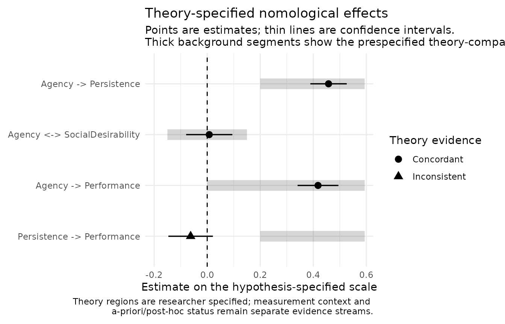
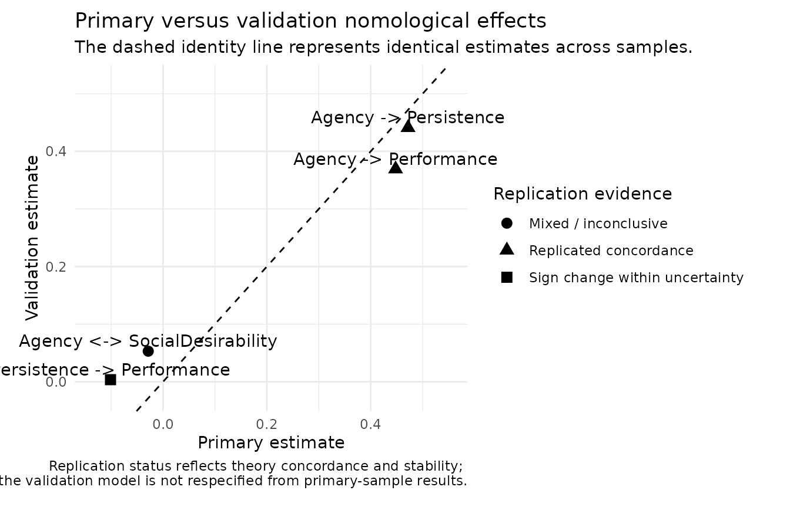

# Theory-Specified Nomological Networks with nomologR

## Why theory comes before the network

`nomologR` treats nomological evidence as a test of **explicit
theoretical predictions**, not as a search for statistically significant
relationships.

The intended sequence is:

1.  establish a defensible measurement model;
2.  specify the expected relations before inspecting the structural
    results;
3.  fit the full model;
4.  compare estimates and uncertainty with the prespecified theoretical
    region;
5.  distinguish theory strain, imprecision, measurement problems, and
    post-hoc exploration.

## The teaching study

`nomo_demo_network` simulates a validation study of an **Agency**
measure. Two related constructs were also measured — **Persistence** and
**Social desirability** — along with an observed **Performance**
outcome.

The population model is known (see
[`?nomo_demo_network`](https://juhalt.github.io/nomologR/reference/nomo_demo_network.md)):

- Agency predicts Persistence (standardized coefficient .45);
- Agency predicts Performance (.40);
- Persistence has **no** direct effect on Performance once Agency is
  accounted for (0);
- Agency and Social desirability are unrelated (0).

In real research you would not know these values. They are shown here so
you can see how `nomologR` evidence behaves when a prediction is right,
when it is wrong, and when it is about a negligible relation.

## Specify theory before looking at results

``` r

h <- nomo_hypotheses(
  "Agency -> Persistence" = positive(min = .20),
  "Agency <-> SocialDesirability" = negligible(within = c(-.15, .15)),
  "Agency -> Performance" = positive(),
  "Persistence -> Performance" = positive(min = .20)
)

h
#> <nomo_hypotheses>
#> 4 theory-specified relation(s)
#> 
#> # A tibble: 4 × 6
#>   id    relation                      prediction region        scale       
#>   <chr> <chr>                         <chr>      <chr>         <chr>       
#> 1 H1    Agency -> Persistence         positive   [0.2, +Inf)   standardized
#> 2 H2    Agency <-> SocialDesirability negligible [-0.15, 0.15] standardized
#> 3 H3    Agency -> Performance         positive   (0, +Inf)     standardized
#> 4 H4    Persistence -> Performance    positive   [0.2, +Inf)   standardized
#>   origin  
#>   <chr>   
#> 1 a_priori
#> 2 a_priori
#> 3 a_priori
#> 4 a_priori
```

`A -> B` means a directed structural path. `A <-> B` means an
association without asserting causal direction.

The fourth prediction is plausible-sounding — persistent people perform
better — but it is **not** true in the population model. It is included
on purpose.

The negligible-effect region of ±.15 for Social desirability is a
**researcher-specified smallest effect size of interest (SESOI)**. It
must be justified by theory or study design before the analysis;
`nomologR` never invents one. A bare
[`negligible()`](https://juhalt.github.io/nomologR/reference/nomo_expectations.md)
records a theoretical expectation, but `nomologR` will refuse to treat
`p > .05` as confirmation of negligibility.

## Fit the latent network

``` r

model <- nomo_model(list(
  Agency = c("ag1", "ag2", "ag3", "ag4"),
  Persistence = c("pe1", "pe2", "pe3", "pe4"),
  SocialDesirability = c("sd1", "sd2", "sd3")
))

net <- nomo_network(
  model,
  data = nomo_demo_network,
  hypotheses = h
)

net
#> <nomo_network>
#> Primary sample: N = 800 | Converged: TRUE
#> Theory relations: 4 | Added transparently to model: 3
#> Measurement context: INFO | no configured measurement-context review signal was triggered
#> 
#> # A tibble: 4 × 9
#>   id    relation                      prediction theoretical_region estimate
#>   <chr> <chr>                         <chr>      <chr>                 <dbl>
#> 1 H1    Agency -> Persistence         positive   [0.2, +Inf)         0.458  
#> 2 H2    Agency <-> SocialDesirability negligible [-0.15, 0.15]       0.00773
#> 3 H3    Agency -> Performance         positive   (0, +Inf)           0.418  
#> 4 H4    Persistence -> Performance    positive   [0.2, +Inf)        -0.0624 
#>   ci_lower ci_upper concordance  confirmatory_status
#>      <dbl>    <dbl> <chr>        <chr>              
#> 1   0.389    0.526  Concordant   A priori           
#> 2  -0.0794   0.0948 Concordant   A priori           
#> 3   0.341    0.495  Concordant   A priori           
#> 4  -0.146    0.0215 Inconsistent A priori           
#> 
#> Interpretation rule: theory concordance, uncertainty, measurement quality, and replication are distinct evidence streams. Statistical significance alone is not a validity verdict.
nomo_table(net, "fit")
#> # A tibble: 1 × 7
#>   chisq    df pvalue   cfi   tli  rmsea   srmr
#>   <dbl> <dbl>  <dbl> <dbl> <dbl>  <dbl>  <dbl>
#> 1  61.6    51  0.147 0.997 0.996 0.0161 0.0205
```

The measurement model supplies only the factor definitions.
Theory-specified paths absent from that model are added transparently,
and the exact fitted syntax and unchanged `lavaan` fit remain available
in the returned object.

## Read relation-level evidence

``` r

evidence <- nomo_table(net, "hypotheses")
evidence[, c(
  "id", "relation", "theoretical_region", "estimate",
  "ci_lower", "ci_upper", "equivalence_supported", "concordance"
)]
#> # A tibble: 4 × 8
#>   id    relation                   theoretical_region estimate ci_lower ci_upper
#>   <chr> <chr>                      <chr>                 <dbl>    <dbl>    <dbl>
#> 1 H1    Agency -> Persistence      [0.2, +Inf)         0.458     0.389    0.526 
#> 2 H2    Agency <-> SocialDesirabi… [-0.15, 0.15]       0.00773  -0.0794   0.0948
#> 3 H3    Agency -> Performance      (0, +Inf)           0.418     0.341    0.495 
#> 4 H4    Persistence -> Performance [0.2, +Inf)        -0.0624   -0.146    0.0215
#> # ℹ 2 more variables: equivalence_supported <lgl>, concordance <chr>
```

Reading each row:

- **H1** (`Agency -> Persistence`): estimate 0.46, interval \[0.39,
  0.53\], classified **concordant** with the prediction of at least .20.
- **H2** (`Agency <-> SocialDesirability`): estimate 0.01. The 90%
  equivalence interval \[-0.07, 0.08\] lies inside the ±.15 region, so
  the negligible prediction is supported by equivalence evidence — not
  merely by a non-significant p-value.
- **H3** (`Agency -> Performance`): estimate 0.42, classified
  **concordant**.
- **H4** (`Persistence -> Performance`): estimate -0.06, interval
  \[-0.15, 0.02\], classified **inconsistent** with the predicted
  region.

Every relation also retains its standard error, p-value, evidence scope,
a-priori versus post-hoc provenance, and a measurement-context flag. The
goal is not to produce a single “validity score.”

## A marginal association is not a structural prediction

Why might a researcher have expected H4? Look at the simple correlation
between a Persistence composite and Performance:

``` r

persistence_mean <- rowMeans(nomo_demo_network[, c("pe1", "pe2", "pe3", "pe4")])
cor(persistence_mean, nomo_demo_network$Performance)
#> [1] 0.1180501
```

The marginal correlation is positive, because both Persistence and
Performance depend on Agency. The theory-specified path asks a different
question: does Persistence predict Performance *given* Agency? It does
not. Treating a table of observed correlations as the nomological
network would have produced the wrong conclusion.

## Negligible predictions and equivalence evidence

For:

``` r

negligible(within = c(-.15, .15))
#> $prediction
#> [1] "negligible"
#> 
#> $lower
#> [1] -0.15
#> 
#> $upper
#> [1] 0.15
#> 
#> $lower_inclusive
#> [1] TRUE
#> 
#> $upper_inclusive
#> [1] TRUE
#> 
#> $scale
#> [1] "standardized"
#> 
#> $origin
#> [1] "a_priori"
#> 
#> $magnitude_specified
#> [1] TRUE
#> 
#> $confirmable
#> [1] TRUE
#> 
#> attr(,"class")
#> [1] "nomo_expectation" "list"
```

the researcher has supplied a quantitative negligible-effect region.
With the default `equivalence_alpha = .05`,
[`nomo_network()`](https://juhalt.github.io/nomologR/reference/nomo_network.md)
evaluates a 90% equivalence confidence interval, corresponding to the
two one-sided tests procedure. This is intentionally different from
declaring a relation negligible because an ordinary null-hypothesis test
was not significant.

## Criterion and predictive evidence

`Performance` is an observed variable, while Agency is latent. The
evidence table labels such relations explicitly:

``` r

evidence[, c("id", "relation", "evidence_scope")]
#> # A tibble: 4 × 3
#>   id    relation                      evidence_scope            
#>   <chr> <chr>                         <chr>                     
#> 1 H1    Agency -> Persistence         latent_structural         
#> 2 H2    Agency <-> SocialDesirability latent_association        
#> 3 H3    Agency -> Performance         latent_to_observed_outcome
#> 4 H4    Persistence -> Performance    latent_to_observed_outcome
```

Observed outcomes keep their observed-variable estimand; `nomologR` does
not silently insert measurement-error corrections.

## Measurement context

``` r

nomo_table(net, "measurement")
#> # A tibble: 1 × 8
#>   attention converged latent_constructs loading_review_flags
#>   <chr>     <lgl>                 <int>                <int>
#> 1 info      TRUE                      3                    0
#> # ℹ 4 more variables: negative_variance_flags <int>,
#> #   global_fit_review_flags <int>, engine_warning_count <int>,
#> #   observation <chr>
```

A relation can look inconsistent with theory because the estimated
relationship truly differs from the prediction, or because weak
measurement, improper solutions, poor fit, or large uncertainty limit
what the structural result can say. The measurement context stays beside
the theory evidence so the two are not confused.

## Calibration and validation

An internal split can be created explicitly:

``` r

s <- nomo_split(nomo_demo_network, validation_prop = .40, seed = 2026)

net_rep <- nomo_network(
  model,
  data = s,
  hypotheses = h
)

replication <- nomo_table(net_rep, "replication")
replication[, c(
  "id", "relation", "primary_estimate", "validation_estimate",
  "validation_concordance", "replication_status"
)]
#> # A tibble: 4 × 6
#>   id    relation     primary_estimate validation_estimate validation_concordance
#>   <chr> <chr>                   <dbl>               <dbl> <chr>                 
#> 1 H1    Agency -> P…           0.472              0.441   concordant            
#> 2 H2    Agency <-> …          -0.0285             0.0531  directionally_concord…
#> 3 H3    Agency -> P…           0.448              0.369   concordant            
#> 4 H4    Persistence…          -0.101              0.00364 direction_concordant_…
#> # ℹ 1 more variable: replication_status <chr>
```

The calibration and validation subsets receive the **same prespecified
fitted model**; `nomologR` does not respecify the validation model to
rescue a primary result. Reading the statuses:

- H1 and H3 are **replicated_concordance** and
  **replicated_concordance**.
- H2 is **mixed_or_inconclusive**: with only 320 validation cases, the
  equivalence interval is too wide to confirm negligibility. Splitting a
  sample buys independence at the cost of precision.
- H4 is **sign_change_within_uncertainty**. The population path is zero,
  and the two point estimates happen to differ in sign. Here neither
  sample’s confidence interval excludes zero, so the sign change is
  attributed to sampling uncertainty rather than to a substantive
  discrepancy.

A change in sign between samples needs care. Estimates scattered around
a null relation differ in sign about half the time, so `nomologR` does
not call a sign change a **reversal** from the point estimates. It reads
the 95 percent confidence intervals:

| Status | Intervals | Meaning |
|----|----|----|
| `sign_reversal` | Both exclude zero, on opposite sides | Each sample on its own supports a different direction |
| `direction_not_replicated` | Exactly one excludes zero | The other sample does not support that direction, nor establish the opposite |
| `sign_change_within_uncertainty` | Neither excludes zero | Neither sample distinguishes the relation from zero |

None of these turns a non-significant path into evidence of *no*
relation. That claim needs a `negligible(within = ...)` prediction with
an equivalence region, the kind of prediction H2 makes (Lakens, Scheel,
& Isager, 2018).

External validation data can instead be supplied with
`validation_data =`, which is generally stronger evidence than an
internal split.

## Figures

``` r

plot(net, type = "effects")
```



``` r

plot(net_rep, type = "replication")
```



These are evidence summaries, not automated theory verdicts.

## Interpretation rule

`nomologR` keeps **measurement evidence, theory concordance,
uncertainty, replication, and researcher provenance visible at the same
time**. A supported prediction strengthens the validity argument for a
particular interpretation of scores; an unsupported one is information
about the theory, the measure, or both.

## Research basis

The nomological network as the core of construct validity comes from
Cronbach and Meehl (1955), and convergent and discriminant correlation
patterns from Campbell and Fiske (1959). Contemporary practice separates
the measurement model from structural relations (Anderson & Gerbing,
1988), treats validity as an argument about score interpretation
(Messick, 1995), evaluates negligible predictions with equivalence
procedures (Schuirmann, 1987; Lakens, Scheel, & Isager, 2018), and
distinguishes prespecified from post-hoc predictions (Nosek et al.,
2018). Full references are in
[`?nomo_network`](https://juhalt.github.io/nomologR/reference/nomo_network.md)
and the [research
basis](https://juhalt.github.io/nomologR/articles/research-basis.md)
article.
